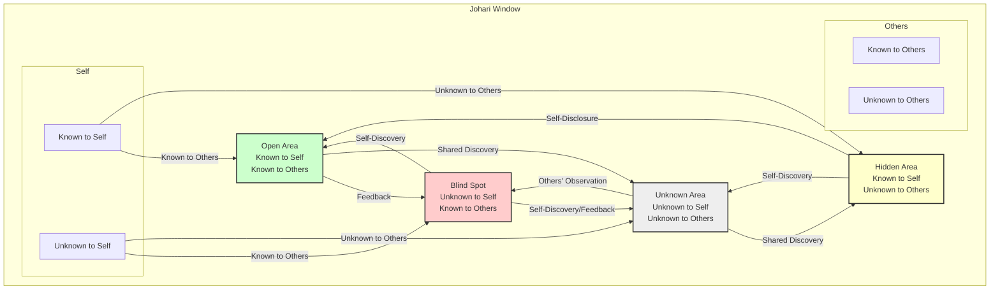
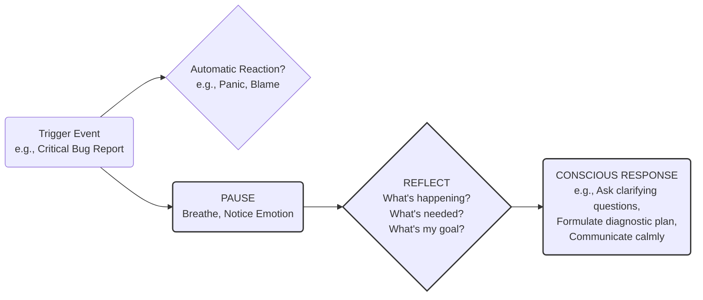
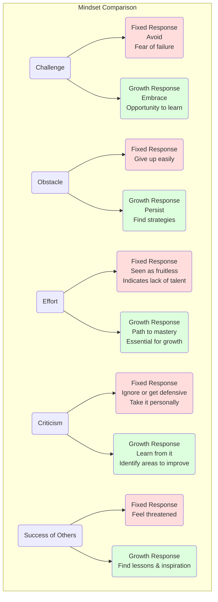

# Part I: Foundational Pillars of Senior Engineering Effectiveness

## Chapter 1: Mastering Self-Awareness: The Engineer's Inner Compass

_"Knowing yourself is the beginning of all wisdom."_ - Aristotle

Welcome to the foundational chapter of your journey towards mastering the soft skills that define true senior engineering. Before we delve into collaboration, influence, or leadership, we must start with the bedrock upon which all these skills are built: **Self-Awareness**. Think of it as your personal instrumentation, your inner compass. Just as you wouldn't navigate a complex system deployment without robust monitoring and metrics, you cannot effectively navigate the complex human dynamics of senior engineering without a deep understanding of your own internal landscape.

For many engineers, the focus is external – the code, the system, the problem. Self-awareness turns the lens inward. It's the conscious knowledge of one's own character, feelings, motives, and desires. It's about understanding _how_ you operate, _why_ you react the way you do, and _what_ impact you have on others and the systems you build. As a senior engineer, your influence extends far beyond your keyboard. Your behaviours, communication style, and emotional responses ripple through your team, affecting morale, productivity, and technical outcomes. Mastering self-awareness isn't navel-gazing; it's a strategic imperative for effectiveness and leadership.

This chapter will guide you through the essential components of self-awareness for engineers: understanding your unique profile, recognizing your patterns, seeking external perspectives, and cultivating a mindset geared towards continuous growth.

### Understanding Your Strengths, Weaknesses, and Biases

Every engineer brings a unique toolkit to the table. Self-awareness begins with an honest inventory of that toolkit – identifying not just the tools you possess, but also their condition and when best to use them (or not).

**Strengths:** These are the skills, talents, and character traits where you naturally excel or have developed significant proficiency. They can be technical (e.g., distributed systems design, database optimization, specific language mastery) or non-technical (e.g., clear communication, problem decomposition, mentoring junior developers).

- **Why it Matters for Seniors:** Knowing your strengths allows you to:
  - **Maximize Impact:** Lean into areas where you can provide the most value.
  - **Build Credibility:** Become the go-to person for specific challenges.
  - **Delegate Effectively:** Understand what tasks are best suited for you versus others.
  - **Mentor Strategically:** Share your expertise consciously.

**Weaknesses:** These are areas where you are less proficient or struggle. They might be skills you haven't developed, blind spots in your knowledge, or behavioural tendencies that hinder effectiveness (e.g., impatience, difficulty estimating, avoiding conflict).

- **Why it Matters for Seniors:** Identifying weaknesses helps you to:
  - **Mitigate Risks:** Avoid situations where your weaknesses could jeopardize a project or team dynamic.
  - **Seek Support:** Know when to ask for help or pair with someone who has complementary skills.
  - **Target Development:** Focus your learning and growth efforts effectively.
  - **Demonstrate Humility:** Acknowledge areas for improvement, building trust.

**Biases:** These are cognitive shortcuts, assumptions, or tendencies in judgment that can lead to inaccurate perceptions or decisions. Everyone has biases; the key is to become aware of them. Common biases in engineering include:

- **Confirmation Bias:** Seeking or interpreting information that confirms pre-existing beliefs (e.g., only looking for evidence that supports your preferred technical solution).
- **Anchoring Bias:** Over-relying on the first piece of information encountered (e.g., sticking too closely to initial time estimates).
- **Availability Heuristic:** Overestimating the importance of information that is easily recalled (e.g., favouring a technology simply because you used it recently).
- **Dunning-Kruger Effect:** The tendency for individuals with low competence in a specific area to overestimate their ability, while highly competent individuals may underestimate theirs.
- **Implicit Bias:** Unconscious associations and attitudes towards certain groups of people.

- **Why it Matters for Seniors:** Recognizing biases is crucial for:
  - **Objective Decision-Making:** Evaluating technical options, candidates, or solutions fairly.
  - **Inclusive Collaboration:** Avoiding assumptions about colleagues based on stereotypes.
  - **Accurate Problem Diagnosis:** Considering all possibilities, not just the familiar ones.
  - **Fair Assessment:** Evaluating team members' contributions or interview candidates without undue influence.

**The Johari Window:** A useful model for understanding self-awareness in relation to others is the Johari Window. It divides self-knowledge into four quadrants:



_Diagram 1.1: The Johari Window. Effective self-awareness involves expanding the 'Open Area' by seeking feedback (reducing the 'Blind Spot') and appropriate self-disclosure (reducing the 'Hidden Area')._

**How to Identify:**

- **Reflection:** Regularly analyze your performance, decisions, and interactions. What went well? What didn't? Why?
- **Feedback:** Actively solicit feedback from peers, managers, and mentees (more on this later).
- **Assessments:** Use tools like strengths finders (e.g., CliftonStrengths) or reflect on performance review feedback.
- **Bias Awareness:** Learn about common cognitive biases and consciously look for them in your thinking.

### Identifying Your Communication Style and Its Impact

How you communicate – verbally, in writing, and non-verbally – dramatically affects your ability to collaborate, influence, and lead. Your default style might be effective in some contexts but detrimental in others.

**Common Communication Styles:** While models vary, consider these general categories:

1.  **Assertive:** Clearly and respectfully expressing your needs, opinions, and boundaries without violating the rights of others. Focuses on collaboration and finding mutual solutions. _(Often the ideal for senior engineers)_.
2.  **Aggressive:** Expressing needs and opinions at the expense of others. Can involve blaming, intimidation, or dominating conversations.
3.  **Passive:** Failing to express your needs, opinions, or boundaries. Often involves avoiding conflict, deferring excessively, or remaining silent.
4.  **Passive-Aggressive:** Indirectly expressing negative feelings or aggression. Can manifest as sarcasm, subtle sabotage, procrastination, or complaining _about_ rather than _to_ someone.
5.  **Analytical/Technical:** Focused heavily on data, logic, and technical details. Can sometimes be perceived as dry, overly complex, or dismissive of emotional/relational aspects if not balanced.
6.  **Relational/Empathetic:** Focused on building rapport, understanding feelings, and maintaining harmony. Can sometimes struggle with directness or delivering difficult technical feedback if not balanced.

- **Why it Matters for Seniors:**
  - **Clarity:** Ensuring your technical explanations, proposals, and feedback are understood.
  - **Influence:** Persuading others towards sound technical directions.
  - **Collaboration:** Building trust and fostering open dialogue within the team.
  - **Conflict Resolution:** Navigating disagreements constructively.
  - **Mentorship:** Adapting your style to effectively guide junior engineers.
  - **Cross-functional Work:** Communicating effectively with non-technical stakeholders (Product, Design, Management).

**Identifying Your Style:**

- **Self-Reflection:** Think about recent conversations, emails, or code reviews. How did you express yourself? How did others react? Did you achieve your communication goal?
- **Observe Impact:** Pay attention to how people respond to you. Do they seem open, defensive, confused, or engaged?
- **Ask for Feedback:** Specifically ask trusted colleagues: "How would you describe my communication style in meetings?" or "Was my explanation in that design doc clear?"
- **Consider Your Defaults:** What's your go-to style under pressure? When disagreeing? When explaining something complex?

**Adapting Your Style:** Seniority involves _adapting_ your communication to the audience and situation. Explaining a technical trade-off to a fellow senior engineer will differ vastly from explaining the business impact of that same trade-off to a product manager or executive. Awareness of your _default_ style is the first step towards _intentional_ adaptation.

### Recognizing Your Emotional Triggers and Responses Under Pressure

Software engineering can be a high-pressure environment: tight deadlines, production incidents, complex bugs, strong technical disagreements. How you react emotionally in these moments significantly impacts your effectiveness and the team around you.

**Emotional Triggers:** These are specific situations, events, words, or behaviours (from others or even yourself) that provoke a strong emotional response in you. Common triggers for engineers include:

- Code quality criticism (perceived or real).
- Unexpected scope changes or shifting requirements.
- Production outages or critical bugs.
- Feeling unheard or dismissed in technical discussions.
- Interruptions when deep in focus.
- Dealing with poorly documented or complex legacy code.
- Interpersonal conflicts within the team.
- Pressure from management regarding deadlines.

**Emotional Responses:** These are how you feel and behave when a trigger is activated. Responses can range from:

- **Constructive:** Calmness, curiosity, focused problem-solving, clear communication, seeking understanding.
- **Destructive:** Frustration, anger, anxiety, defensiveness, withdrawal, blaming, sharp retorts, analysis paralysis.

- **Why it Matters for Seniors:**
  - **Rational Decision-Making:** Strong emotions can cloud judgment during critical technical moments.
  - **Team Morale:** Your reactions set the tone. Calmness is contagious; so is panic or negativity.
  - **Problem Solving:** Maintaining composure allows for more effective debugging and resolution.
  - **Collaboration:** Destructive responses damage trust and psychological safety.
  - **Role Modeling:** Junior engineers look to seniors for cues on how to handle pressure.

**Identifying Triggers and Responses:**

1.  **Pay Attention:** Notice when you feel strong emotions (frustration, anger, anxiety, defensiveness). What just happened?
2.  **Reflect After Incidents:** Once things have calmed down, analyze the situation. What was the trigger? How did you _feel_? How did you _act_? What was the impact?
3.  **Keep an "Emotion Log":** Briefly note down triggering events, your feelings, your responses, and the outcome. Patterns will emerge.

**Managing Responses:** Awareness is the first step. The goal isn't to eliminate emotions but to manage your _response_ to them. A simple framework:



_Diagram 1.2: From Trigger to Conscious Response. Self-awareness allows you to insert a crucial pause between a trigger and your reaction, enabling a more thoughtful and constructive response._

### Seeking and Internalizing Constructive Feedback (Even When It Stings)

As highlighted by the Johari Window, a significant part of self-awareness comes from understanding how others perceive you. Actively seeking and genuinely internalizing constructive feedback is one of the most powerful (and sometimes difficult) catalysts for growth.

**Constructive Feedback:** Feedback that is specific, actionable, focused on behaviour (not personality), and delivered with the intent to help you improve. Contrast this with vague criticism or personal attacks.

- **Why it Matters for Seniors:**
  - **Identify Blind Spots:** Uncover weaknesses or negative impacts you're unaware of.
  - **Accelerate Growth:** Get targeted input on areas needing development.
  - **Build Trust:** Demonstrates humility, openness, and commitment to improvement.
  - **Improve Performance:** Directly leads to enhancing skills and effectiveness.
  - **Calibrate Self-Perception:** Ensure your self-assessment aligns with reality.

**Challenges:** Feedback, especially critical feedback, can trigger defensiveness, insecurity, or dismissal ("They just don't understand," "They're wrong"). This is a natural human reaction, but overcoming it is key.

**Strategies for Seeking Feedback:**

- **Be Specific:** Instead of "Do you have any feedback for me?", ask targeted questions:
  - "What is one thing I could have done better in that design review meeting?"
  - "How clear was my explanation of the caching strategy in the RFC?"
  - "When reviewing my code, what's an area where I could improve?"
  - "How effectively did I handle the discussion about technical debt prioritization?"
- **Ask Different Sources:** Seek input from peers, your manager, junior engineers you mentor, and potentially cross-functional collaborators (Product, Design). Each offers a unique perspective.
- **Choose the Right Time:** Ask when the interaction is fresh but not in the heat of the moment. Schedule brief 1:1s or use existing ones.
- **Make it Safe:** Reassure the giver that you genuinely want honest feedback for your growth and appreciate their candor.

**Strategies for Internalizing Feedback:**

1.  **Listen Actively:** Focus on understanding the feedback, not on formulating your rebuttal. Ask clarifying questions ("Can you give me an specific example of when you saw that behaviour?").
2.  **Say Thank You:** Acknowledge the effort and courage it took for the person to provide feedback, regardless of whether you agree with it initially.
3.  **Separate Feedback from Identity:** The feedback is about your _behaviour_ or _impact_, not your inherent worth as a person or engineer.
4.  **Reflect Before Reacting:** Take time to process the feedback. Does it resonate? Have you heard similar things before? Look for patterns.
5.  **Assume Positive Intent (Initially):** Try to understand the giver's perspective, even if the delivery wasn't perfect. What underlying observation prompted the feedback?
6.  **Focus on Actionable Insights:** What specific, concrete changes can you make based on the feedback? Discard vague or unhelpful comments, but don't dismiss potentially valuable insights just because they sting.
7.  **Follow Up (Optional but Powerful):** If you make changes based on feedback, let the person know later. This reinforces that you valued their input and encourages future feedback.

```mermaid
graph TD
    A[Ask for Feedback<br/>(Be specific)] --> B(Receive Feedback<br/>Listen Actively, Say Thanks);
    B --> C{Reflect & Process<br/>Separate behavior from identity,<br/>Look for patterns,<br/>Assume positive intent};
    C --> D(Identify Actionable Insights);
    D --> E(Act / Experiment<br/>Make concrete changes);
    E --> F(Observe Results<br/>Did the change help?);
    F --> A;
    C --> G(Discard Unhelpful Noise);
    E --> H(Optionally: Follow Up<br/>Share changes with giver);

    style A fill:#ccf
    style B fill:#fcc
    style C fill:#ffc
    style D fill:#cfc
    style E fill:#ccf
    style F fill:#ffc
    style H fill:#eee
```

_Diagram 1.3: The Feedback Loop for Growth. Actively seeking, thoughtfully processing, and acting upon feedback creates a virtuous cycle of continuous improvement._

### Developing a Growth Mindset: Embracing Challenges and Learning

Coined by psychologist Carol Dweck, the concept of mindset is fundamental to self-awareness and potential. It describes underlying beliefs about intelligence and ability.

- **Fixed Mindset:** Believes abilities, intelligence, and talents are innate and fixed. Avoids challenges (fear of failure), gives up easily, sees effort as fruitless, feels threatened by the success of others, ignores useful negative feedback.
- **Growth Mindset:** Believes abilities and intelligence can be developed through dedication, effort, and learning. Embraces challenges, persists through setbacks, sees effort as the path to mastery, learns from criticism, finds lessons and inspiration in the success of others.

- **Why it Matters for Seniors:**
  - **Navigating Complexity:** Senior roles involve tackling ambiguous, novel, and difficult problems. A growth mindset fuels the necessary persistence and learning.
  - **Technological Change:** The tech landscape constantly evolves. A growth mindset is essential for continuous learning and adaptation.
  - **Mentorship:** Fostering a growth mindset in junior engineers is crucial for their development.
  - **Resilience:** Bouncing back from setbacks, failed experiments, or production issues.
  - **Innovation:** Encouraging experimentation and seeing failures as learning opportunities.



_Diagram 1.4: Fixed vs. Growth Mindset Responses. Self-awareness includes recognizing your own mindset tendencies and consciously choosing growth-oriented responses._

**Cultivating a Growth Mindset:**

- **Recognize Your Fixed Mindset Voice:** Become aware of thoughts that reflect limitations ("I'm not good at this," "This is too hard," "If I fail, I'll look stupid").
- **Reframe Challenges:** View difficult tasks not as threats, but as opportunities to learn and expand your skills.
- **Focus on Process and Effort:** Value the learning journey, the strategies tried, and the effort invested, not just the final outcome. Celebrate progress.
- **Use the Word "Yet":** Instead of "I don't know how to do this," say "I don't know how to do this _yet_."
- **Seek Learning Opportunities:** Actively look for chances to stretch yourself, even if it means struggling initially.
- **Learn from Setbacks:** Analyze failures and mistakes for lessons learned. What could you do differently next time?

### Self-Assessment Tools and Exercises

Theory is useful, but practice builds the muscle. Here are exercises to deepen your self-awareness:

1.  **Personal SWOT Analysis:**

    - Dedicate time to list your:
      - **S**trengths (Technical & Soft Skills)
      - **W**eaknesses (Areas for Development)
      - **O**pportunities (How can you leverage strengths or address weaknesses?)
      - **T**hreats (What could hinder your progress or impact?)
    - Be honest and specific. Revisit this periodically.

2.  **Johari Window Exercise (with a trusted peer):**

    - Both you and a colleague independently list adjectives describing your work style/behaviour.
    - Compare lists:
      - Adjectives on both lists = Open Area.
      - Adjectives on your list, not theirs = Hidden Area (consider disclosing more).
      - Adjectives on their list, not yours = Blind Spot (ask for examples!).
      - Adjectives on neither = Unknown Area.

3.  **Emotion/Trigger Log:**

    - For one week, keep a simple log:
      - **Situation/Trigger:** What happened?
      - **Emotion(s):** How did you feel? (Be specific: frustrated, anxious, angry, etc.)
      - **Automatic Response:** What did you immediately think, say, or do?
      - **Impact:** What was the outcome?
      - **Alternative Response:** How could you have responded more constructively?
    - Review the log for patterns.

4.  **Targeted Feedback Request:**

    - Identify 1-2 specific areas you want feedback on (e.g., clarity in design docs, facilitation in meetings).
    - Choose 2-3 trusted colleagues.
    - Ask them for specific, actionable feedback on _only_ those areas. Use the techniques mentioned earlier.

5.  **Growth Mindset Journaling:**

    - At the end of each week, reflect on:
      - A challenge you faced. How did you approach it? What mindset did you employ?
      - Something you learned. How did you learn it?
      - A mistake or setback. What lesson did you take away?
      - An instance where you saw someone else succeed. What did you learn or appreciate?

6.  **Communication Style Reflection:**
    - Review your recent emails, Slack messages, or code review comments.
    - Analyze: What was your goal? Was your tone appropriate? Was the message clear? How might it have been perceived? Could it be misunderstood?

### Conclusion: The Compass for Your Journey

Mastering self-awareness is not a one-time task but an ongoing practice. It's the calibration of your inner compass, allowing you to navigate the complexities of senior engineering with greater intention, effectiveness, and integrity. By understanding your strengths, weaknesses, biases, communication style, and emotional patterns, and by cultivating a growth mindset fueled by constructive feedback, you lay the essential groundwork for developing the more advanced soft skills explored in the following chapters.

This inner understanding is the prerequisite for authentic emotional intelligence, impactful communication, effective collaboration, and ultimately, true technical leadership. Keep this compass close; you'll need it for the journey ahead.
