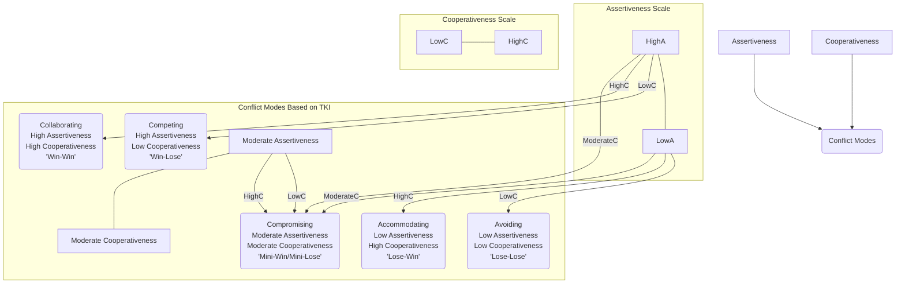

# Chapter 10: Conflict Resolution for Engineers

Conflict in a high-performing software engineering team isn't just likely; it's inevitable. When passionate, intelligent individuals collaborate on complex problems with high stakes, differing opinions, approaches, and priorities are bound to surface. As a Senior Software Engineer, your ability to navigate these conflicts constructively is paramount. Unmanaged or poorly handled conflict can cripple team morale, stall projects, erode trust, and lead to attrition. Conversely, well-managed conflict can be a catalyst for innovation, stronger solutions, and deeper team cohesion.

This chapter provides the frameworks, techniques, and mindset needed to transform potentially destructive disagreements into productive opportunities for growth and improvement. Moving beyond simply _avoiding_ conflict, you'll learn how to engage with it skillfully, fostering healthier team dynamics and driving better technical outcomes.

## 10.1 Understanding the Sources of Conflict in Tech Teams

Recognizing the root cause of a conflict is the first step toward resolving it effectively. Conflicts in engineering environments often stem from a few common areas:

- **Technical Disagreements:**

  - **Architecture & Design Choices:** Debates over frameworks, patterns, database models, API contracts, etc. (e.g., Microservices vs. Monolith, REST vs. GraphQL).
  - **Implementation Details:** Differing opinions on specific algorithms, library usage, coding style, or testing strategies.
  - **Tooling & Technology Selection:** Arguments over build tools, CI/CD pipelines, monitoring solutions, or programming languages.
  - **Technical Debt:** Disagreements on prioritizing refactoring vs. new features, or the acceptable level of compromise for short-term velocity.

- **Process & Workflow Issues:**

  - **Development Methodologies:** Friction between Agile purists and pragmatists, disagreements on sprint length, ceremony effectiveness (or lack thereof).
  - **Code Review Process:** Conflicts over review turnaround time, depth of review expected, style nitpicks vs. substantive feedback.
  - **Deployment & Release Cadence:** Disagreements on frequency, rollback procedures, or testing requirements before release.
  - **Task Allocation & Ownership:** Unclear responsibilities, perceived unfair distribution of desirable or undesirable tasks.

- **Interpersonal Clashes:**

  - **Communication Styles:** Misunderstandings arising from direct vs. indirect communication, varying levels of detail, or assumptions about shared context.
  - **Personality Differences:** Friction between introverts and extroverts, differing approaches to problem-solving (e.g., cautious vs. risk-taking).
  - **Working Styles:** Conflicts arising from differences in preferred collaboration methods (e.g., synchronous vs. asynchronous), focus time needs, or documentation habits.
  - **Lack of Trust or Psychological Safety:** Team members feeling unable to voice concerns or make mistakes without fear of blame or ridicule.
  - **Ego and Defensiveness:** Individuals becoming overly attached to their ideas or resistant to feedback.

- **Resource Constraints & Priorities:**

  - **Time Pressure:** Conflicts arising from tight deadlines, leading to shortcuts, stress, and blame.
  - **Budget Limitations:** Disagreements over resource allocation for tools, training, or infrastructure.
  - **Shifting Priorities:** Frustration and conflict when project goals or requirements change frequently without clear communication or rationale.
  - **Cross-Functional Dependencies:** Conflicts arising from misalignment or delays involving Product, Design, QA, Ops, or other teams.

- **Value Differences:**
  - **Quality vs. Speed:** Fundamental disagreements on the acceptable balance between delivering features quickly and ensuring high quality, robustness, and maintainability.
  - **Innovation vs. Stability:** Tension between adopting cutting-edge technologies and maintaining stable, predictable systems.
  - **Individual vs. Team Goals:** Conflict when individual incentives or recognition priorities clash with overall team objectives.

Being able to pinpoint the _type_ of conflict often suggests the most effective resolution path. A technical disagreement might require data and objective analysis, while an interpersonal clash needs empathy and improved communication strategies.

## 10.2 Healthy vs. Unhealthy Conflict

Not all conflict is detrimental. Recognizing the difference between productive (healthy) and destructive (unhealthy) conflict is crucial for fostering a positive environment.

**Healthy Conflict (Constructive Disagreement):**

- **Focus:** Ideas, processes, technical merits, objective data.
- **Nature:** Respectful debate, challenging assumptions, seeking the best solution for the team/product/company.
- **Communication:** Active listening, clear articulation of viewpoints, willingness to understand others' perspectives, focus on "what" is right, not "who" is right.
- **Emotions:** Passion and engagement are present, but controlled. Frustration is directed at the problem, not people.
- **Outcomes:** Stronger solutions, innovation, deeper understanding, clearer alignment, increased trust, team growth, better decision-making.
- **Example:** A vigorous debate about the pros and cons of two different database technologies for a new service, involving data, benchmarks, and consideration of long-term maintenance, ending with a reasoned decision the team can support.

**Unhealthy Conflict (Destructive Disagreement):**

- **Focus:** Personalities, blame, past grievances, winning the argument.
- **Nature:** Personal attacks, sarcasm, passive-aggression, stonewalling, gossip, undermining others.
- **Communication:** Interrupting, dismissiveness, making assumptions, closed body language, raising voices, focusing on blame.
- **Emotions:** Anger, resentment, fear, defensiveness, hostility directed at individuals.
- **Outcomes:** Damaged relationships, decreased morale, erosion of trust, reduced psychological safety, paralysis in decision-making, good people leaving the team, project failure.
- **Example:** During a code review, one engineer personally criticizes another's intelligence ("How could you possibly think this was a good idea?") instead of focusing on the code's specific issues and suggesting improvements.

As a senior engineer, your goal is to encourage healthy conflict while actively identifying and de-escalating or redirecting unhealthy conflict.

## 10.3 Frameworks for Approaching Conflict Constructively

Having structured approaches can depersonalize conflict and guide participants toward resolution.

### A. Nonviolent Communication (NVC)

Developed by Marshall Rosenberg, NVC is a powerful framework for expressing oneself and hearing others with empathy, even in difficult situations. It focuses on four components:

1.  **Observations:** State objective facts without evaluation or judgment. What did you actually see or hear?
    - _Instead of:_ "You completely ignored the coding standards in your PR."
    - _Try:_ "I noticed in PR #123 that the variable naming convention we discussed last week wasn't applied to the new service module."
2.  **Feelings:** Express the emotions triggered by the observation. Use "I feel..." statements, focusing on _your_ emotions, not blaming others for them.
    - _Instead of:_ "You made me angry by messing up the build."
    - _Try:_ "When the build failed after the merge, I felt frustrated and anxious about our release timeline."
3.  **Needs:** Articulate the underlying universal needs that aren't being met. These are core human requirements like respect, understanding, support, efficiency, clarity, contribution, safety, etc.
    - _Instead of:_ "Your sloppy code is unprofessional."
    - _Try:_ "I need reliability in our build process so we can confidently deploy features." (Need: Reliability, Confidence) or "I need clarity on the agreed-upon standards to ensure consistency in our codebase." (Need: Clarity, Consistency)
4.  **Requests:** Make clear, positive, and actionable requests for specific actions that could fulfill the identified need. Ask, don't demand. Be open to hearing "no" or negotiating.
    - _Instead of:_ "Fix your code now!"
    - _Try:_ "Would you be willing to pair with me for 30 minutes to refactor that module according to the standards and fix the build?" or "Could we schedule a brief chat to clarify the coding standards for this part of the system?"

**Using NVC in Reverse (Empathetic Listening):** When someone else is expressing frustration or criticism, try to guess their Observations, Feelings, Needs, and potential Requests, even if they aren't using NVC language. "So, it sounds like when you saw the documentation was missing [Observation], you felt annoyed [Feeling] because you need clarity to use the API effectively [Need]. Are you looking for me to update the docs [Request]?"

### B. Thomas-Kilmann Conflict Mode Instrument (TKI)

TKI identifies five common styles of responding to conflict based on two dimensions: **Assertiveness** (concern for your own goals) and **Cooperativeness** (concern for others' goals). Understanding these modes helps you recognize your own tendencies and choose the most appropriate approach for a given situation.



- **Competing:** Assertive and uncooperative. Pursuing your own concerns at the other person's expense. _Use Case:_ Emergencies requiring decisive action, enforcing critical safety rules. _Risk:_ Can damage relationships if overused.
- **Accommodating:** Unassertive and cooperative. Neglecting your own concerns to satisfy others. _Use Case:_ When the issue is much more important to the other person, preserving harmony is critical, or you realize you are wrong. _Risk:_ Can lead to being taken advantage of, unresolved issues festering.
- **Avoiding:** Unassertive and uncooperative. Sidestepping the conflict, postponing, or withdrawing. _Use Case:_ Trivial issues, cooling down period needed, no chance of satisfying your concerns. _Risk:_ Problems can worsen, decisions made by default.
- **Collaborating:** Assertive and cooperative. Working _with_ the other person to find a solution that fully satisfies both concerns. _Use Case:_ Complex issues needing diverse perspectives, integrating different viewpoints, gaining commitment. _Risk:_ Time-consuming, requires high trust.
- **Compromising:** Moderately assertive and cooperative. Finding an expedient, mutually acceptable solution that partially satisfies both parties. _Use Case:_ Goals are moderately important but not worth the effort of collaborating, temporary settlements needed, time pressure exists. _Risk:_ May lead to suboptimal solutions, nobody fully satisfied.

Senior engineers should strive for **Collaboration** whenever possible, especially for important technical or team issues. However, recognizing when other modes are strategically necessary (or being employed by others) is key. Over-reliance on Avoiding or Accommodating can hinder progress, while excessive Competing can create a toxic environment.

### C. Interest-Based Relational (IBR) Approach

This approach, often used in negotiation (see Chapter 11), emphasizes:

1.  **Separate the People from the Problem:** Focus on the issue, not personalities.
2.  **Focus on Interests, Not Positions:** Understand the underlying needs, desires, and concerns (the "why") behind stated positions (the "what").
3.  **Invent Options for Mutual Gain:** Brainstorm multiple solutions that could address the interests of all parties.
4.  **Insist on Using Objective Criteria:** Base decisions on data, principles, standards, or benchmarks rather than willpower or arbitrary choices.

## 10.4 Mediating Disputes Between Team Members

As a senior engineer, you may be called upon (or need to step in) to help junior colleagues or peers resolve a conflict they can't navigate on their own. Effective mediation requires neutrality, active listening, and guiding the parties towards their _own_ solution.

**Steps for Informal Mediation:**

1.  **Preparation:**
    - Understand the context: Briefly talk to each party separately (if appropriate) to grasp their perspective. Focus on listening, not judging or solving.
    - Ensure willingness: Confirm both parties are willing to attempt mediation.
    - Define your role: Clarify you are there to facilitate communication, not impose a solution. You are neutral.
2.  **Setting the Stage:**
    - Choose a neutral, private space and time.
    - Establish ground rules: e.g., speak one at a time, focus on the issue, use "I" statements, aim for understanding, confidentiality.
    - State the goal: To understand each other's perspectives and collaboratively find a way forward.
3.  **Hearing Perspectives:**
    - Allow each person uninterrupted time to explain their view of the situation, their feelings, and their needs (using NVC principles helps here).
    - Use active listening: Summarize, paraphrase, ask clarifying questions ("Can you tell me more about...", "So if I understand correctly, you felt... because you needed...?"). Ensure each party feels heard by the _other_ party, not just by you.
4.  **Identifying Issues and Underlying Interests/Needs:**
    - Help distill the core points of disagreement.
    - Shift the focus from positions ("We must use framework X!") to interests ("We need a framework that offers long-term support and has a large talent pool").
    - Summarize the shared and differing interests/needs.
5.  **Brainstorming Solutions:**
    - Encourage the parties to generate potential solutions together. "What are some ways we could address both the need for stability and the need for faster development?"
    - Defer judgment initially; get all ideas out first.
    - Explore options based on objective criteria where possible.
6.  **Reaching Agreement:**
    - Help the parties evaluate the options against their needs and objective criteria.
    - Guide them toward a mutually acceptable solution. It might be a compromise or a fully collaborative outcome.
    - Clearly articulate the agreed-upon actions, responsibilities, and timelines.
7.  **Follow-up:**
    - Check in later to see if the agreement is holding and if the relationship has improved.

**Key Mediator Skills:** Neutrality, patience, active listening, empathy, questioning, summarizing, reframing negative statements, managing emotions (yours and theirs).

## 10.5 Disagreeing Productively (Disagree and Commit)

One of the most critical conflict skills for senior engineers is the ability to disagree constructively and then fully support the final decision, even if it wasn't your preferred option. This is often encapsulated in the phrase "Disagree and Commit."

**Disagreeing Productively:**

- **State Intent:** Signal that you're offering a different perspective for the good of the project/team. "I have a different take on this I'd like to share," or "Let me play devil's advocate for a moment."
- **Use Data and Logic:** Base your arguments on evidence, technical principles, potential risks, and objective criteria, not just personal preference or opinion. "Based on the performance benchmarks from X, I'm concerned this approach might not scale."
- **Focus on the Problem, Not the Person:** Critique the idea, the proposal, or the code, not the individual who suggested it. Use NVC principles.
- **Listen Actively to Understand:** Genuinely try to grasp the other perspective before refuting it. Acknowledge valid points in their argument. "I understand your point about faster initial development..."
- **Propose Alternatives:** Don't just poke holes; suggest concrete alternative solutions or modifications.
- **Be Respectful:** Maintain a calm tone, avoid sarcasm or dismissive language, and acknowledge the value of the discussion.
- **Know When to Stop:** If consensus can't be reached after reasonable discussion, avoid repetitive arguments. It might be time to escalate (see 10.6) or move to the "Commit" phase.

**Committing:**

- **Explicit Agreement:** Once a decision is made (by the team, tech lead, manager, etc.), explicitly state your commitment to supporting it, even if you initially disagreed. "Okay, while I still have some reservations about X, the decision is Y. I'll fully support making Y successful."
- **Genuine Support:** This isn't passive-aggressive compliance. It means actively working towards the success of the chosen path. No "I told you so" if issues arise (instead, focus on solving the new problem). No undermining the decision in side conversations.
- **Why It Matters:** "Disagree and Commit" builds trust, enables faster decision-making, ensures team alignment, and prevents resentment from festering. It shows maturity and prioritizes collective success over individual rightness.

## 10.6 Escalating Effectively When Necessary

Sometimes, despite best efforts, conflicts cannot be resolved at the current level. Escalation isn't failure; it's a tool to be used judiciously when a resolution is needed that requires broader input, authority, or resources.

**When to Consider Escalation:**

- **Impasse:** The parties involved cannot reach an agreement after genuine attempts at resolution, and the issue is blocking progress.
- **Scope/Impact:** The conflict involves decisions or consequences that extend beyond the team's authority (e.g., cross-departmental impact, significant budget implications, architectural changes affecting multiple teams).
- **Pattern of Unhealthy Behavior:** Persistent interpersonal conflict, bullying, or violation of company policies or code of conduct that isn't being addressed.
- **Ethical Concerns:** Disagreements involving potential security vulnerabilities, data privacy issues, or other ethical breaches.
- **Resource Needs:** Resolving the conflict requires resources (time, money, people) that the current group cannot allocate.

**How to Escalate Effectively:**

1.  **Attempt Resolution First:** Ensure you've made reasonable attempts to resolve the conflict directly with the involved parties using the techniques discussed earlier. Escalation should generally not be the first resort.
2.  **Choose the Right Person/Forum:** Escalate to the appropriate individual or group – your direct manager, the tech lead, an architect, a project manager, or potentially HR, depending on the nature of the conflict. Avoid "going nuclear" by escalating too high too quickly.
3.  **Prepare Your Case:**
    - **Facts, Not Feelings:** Gather objective information, data, logs, design documents, or examples related to the conflict.
    - **Context:** Briefly explain the situation and the core points of disagreement.
    - **Attempts Made:** Describe the steps already taken to resolve the conflict.
    - **Impact:** Clearly articulate the consequences of _not_ resolving the conflict (e.g., project delays, technical risks, team health issues).
    - **Desired Outcome/Proposed Solution:** Suggest potential paths forward or clearly state what kind of decision or intervention you are seeking.
4.  **Communicate Calmly and Objectively:** Present the situation neutrally, focusing on the issue and its impact. Avoid blame, emotional language, or personal attacks. Frame it as seeking help to resolve a blocker or make a necessary decision.
5.  **Inform Involved Parties (Usually):** In many cases (especially technical or process disagreements), it's professional courtesy to inform the other party(ies) that you need to escalate to get a decision or additional input. This shouldn't feel like a threat but a necessary step for clarity. (Use judgment; this may not apply in cases of harassment or severe misconduct).
6.  **Respect the Decision:** Once the escalation point makes a decision, practice "Disagree and Commit."

## 10.7 Giving and Receiving Difficult Feedback Related to Conflict

Conflict situations often necessitate giving feedback about behaviors that contributed to the issue, or receiving feedback about your own role. This is distinct from general performance feedback and requires particular sensitivity.

**Giving Difficult Feedback Related to Conflict:**

- **Timeliness and Privacy:** Address the issue promptly but privately. Don't provide sensitive feedback in a public channel or meeting.
- **Use a Framework (e.g., SBI - Situation, Behavior, Impact):**
  - **Situation:** Describe the specific context. "During the design review meeting yesterday morning..."
  - **Behavior:** Describe the _observable_ behavior, without judgment or interpretation. "...when Mark presented his proposal, you interrupted him multiple times and rolled your eyes." (Avoid: "...you were really disrespectful.")
  - **Impact:** Explain the effect the behavior had on you, the team, or the situation. "The impact was that the meeting got derailed, Mark seemed hesitant to continue sharing his thoughts, and we didn't reach a decision on the design."
- **Focus on Behavior, Not Personality:** Target specific actions, not character traits.
- **Use "I" Statements and NVC:** Express how the behavior impacted _you_ or the situation from your perspective. "I felt frustrated because I needed us to reach a decision efficiently."
- **Be Solution-Oriented:** After describing the issue, open a dialogue about how to handle similar situations differently in the future. "How can we ensure everyone gets heard in future design discussions?" or "What could help make these debates feel more constructive?"
- **Check for Understanding:** Ensure the person understands your feedback.

**Receiving Difficult Feedback Related to Conflict:**

- **Listen Actively:** Focus on understanding the other person's perspective, even if you disagree or feel defensive. Avoid interrupting. Use paraphrasing: "So you're saying that when I raised my voice [Behavior] during the stand-up [Situation], it made you feel uncomfortable speaking up afterwards [Impact]?"
- **Manage Defensiveness:** Take a deep breath. Remind yourself that feedback is a chance to learn, even if delivered imperfectly. Ask clarifying questions to understand fully, not to argue. "Can you give me a specific example of when you observed that?"
- **Acknowledge Valid Points:** Even if you don't agree with everything, find something you _can_ acknowledge. "I understand that interrupting Mark was counter-productive." or "I can see how my frustration might have come across negatively."
- **Seek Specificity:** If the feedback is vague ("You were difficult"), ask for concrete examples of the behavior.
- **Thank the Giver:** Acknowledge the courage it takes to give difficult feedback. "Thank you for bringing this to my attention."
- **Take Time to Process:** You don't have to respond fully immediately. "Thanks, I need some time to think about this."
- **Decide on Action:** Reflect on the feedback. Is it valid? What can you learn? What concrete steps can you take to adjust your behavior if needed? Follow up with the giver if appropriate to share your reflections or commitments.

## 10.8 Role-Playing Common Conflict Scenarios

Theory is helpful, but practice builds skill and confidence. Role-playing allows you to try out these techniques in a safe environment. Grab a trusted peer, mentor, or manager and work through these common senior engineer conflict scenarios:

1.  **Scenario: Technical Disagreement on Approach**

    - **Setup:** Engineer A (you) strongly believes a new service should use asynchronous message queues for decoupling and resilience. Engineer B (your peer) argues for direct synchronous API calls for simplicity and immediate feedback. A technical lead needs a recommendation soon.
    - **Role-Play Focus:** Practice using NVC to express your needs (resilience, scalability). Practice disagreeing productively, using data/principles to support your view. Explore collaborative brainstorming (IBR) to see if a hybrid approach could meet both needs. Practice "Disagree and Commit" if the lead ultimately chooses the other path.

2.  **Scenario: Process Conflict - Code Review Standards**

    - **Setup:** Engineer A (you) feels Engineer B's code reviews are consistently superficial, missing obvious issues and focusing only on minor style nits. Engineer B feels Engineer A's reviews are overly pedantic, block PRs unnecessarily, and slow down delivery.
    - **Role-Play Focus:** Practice giving feedback using SBI. Practice active listening to understand the other's perspective (Engineer B might be under pressure, or have different assumptions about review goals). Use NVC to express feelings ("I feel concerned...") and needs ("I need confidence in our code quality..."). Aim to collaboratively redefine team code review norms (Chapter 6).

3.  **Scenario: Interpersonal Clash - Communication Styles**

    - **Setup:** Engineer A (you) prefers detailed, asynchronous communication via design docs and Slack threads. Engineer B prefers quick, synchronous discussions and hallway conversations, often starting implementation before full alignment. This leads to misunderstandings and rework.
    - **Role-Play Focus:** Practice expressing your needs for clarity and documentation using NVC. Practice active listening to understand Engineer B's need for speed or interactive problem-solving. Negotiate a communication protocol for different types of decisions or tasks.

4.  **Scenario: Resource Conflict - Prioritization**
    - **Setup:** Your team has bandwidth for one major initiative next sprint. Engineer A (you) wants to prioritize paying down significant technical debt in a critical service that's causing operational pain. Engineer B wants to build a highly requested new feature pushed by Product.
    - **Role-Play Focus:** Practice making the business case for your priority (Chapter 7). Use objective data (e.g., outage frequency, support tickets vs. feature request impact). Practice negotiating and potentially compromising (Chapter 11). Frame the discussion around team/product goals, not personal preference. Practice escalating effectively if alignment can't be reached and a higher-level decision is needed.

## Conclusion: Conflict as Catalyst

Conflict is an inherent part of collaborative, high-stakes work. As a Senior Software Engineer, your ability to navigate it constructively is not just a "nice-to-have" soft skill; it's fundamental to your effectiveness as a leader, mentor, and technical contributor. By understanding the sources of conflict, differentiating healthy from unhealthy forms, applying structured frameworks like NVC, mediating when necessary, mastering productive disagreement, escalating wisely, and handling feedback gracefully, you transform conflict from a potential team-killer into a powerful catalyst for better solutions, stronger relationships, and a more resilient, high-performing engineering culture. Embracing conflict competence is embracing senior leadership.

```

---

This detailed chapter draft provides theoretical grounding, practical frameworks (like NVC and TKI with a Mermaid diagram), step-by-step guides for mediation and escalation, specific advice on feedback related to conflict, and actionable role-playing scenarios tailored for senior engineers. It aims to be comprehensive and authoritative, fitting the "bible" concept you described. Remember to potentially add cross-references to other chapters (like Chapter 7 for Influence, Chapter 11 for Negotiation, Chapter 6 for Code Reviews) as you finalize the book.
```
