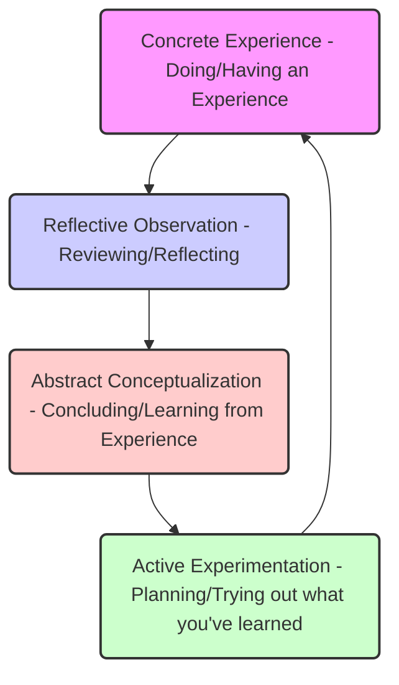
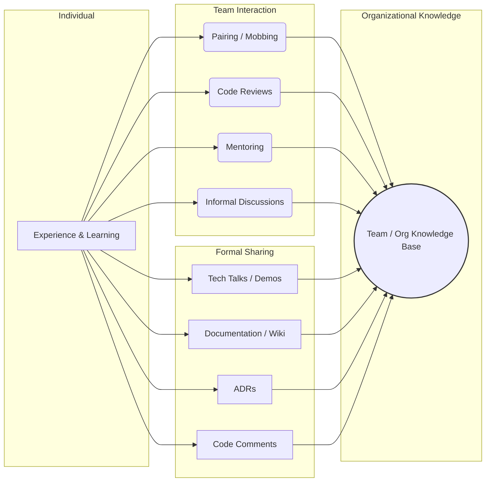

# Chapter 14: Continuous Learning and Adaptability

> "The only constant in the technology industry is change." - Marc Benioff (paraphrased)

## Introduction: The Unending Evolution

As a Senior Software Engineer, you've reached a point where your technical expertise is significant. You can design complex systems, debug gnarly issues, and lead feature development. However, the landscape of software engineering is perpetually shifting. New languages emerge, frameworks evolve, architectural patterns gain (and lose) favor, cloud platforms update constantly, and methodologies are refined. Stagnation is the silent career killer in this field.

More than just keeping up, true seniority involves _leading_ through change, anticipating shifts, and helping your team and organization navigate the evolving technical terrain. Continuous learning isn't just about acquiring new syntax; it's about developing a deeper understanding of principles, refining your problem-solving toolkit, and cultivating the **adaptability** to thrive no matter what comes next. This chapter explores the crucial skills and mindsets required to remain not just relevant, but influential, throughout your senior engineering career. It's about transforming learning from a chore into a core, strategic competency.

## Staying Technically Relevant: Strategies Beyond Reading Blogs

While blogs, newsletters, and social media provide valuable awareness of trends, relying solely on surface-level updates is insufficient for deep technical relevance. Senior engineers need strategies that build robust, transferable knowledge and skills.

### 1. Deep Dives into Fundamentals: The Bedrock of Adaptability

Technology trends change, but fundamental principles endure. A solid grasp of computer science fundamentals allows you to understand _why_ new technologies work the way they do and evaluate them critically.

- **Algorithms & Data Structures:** Revisit complexity analysis, common algorithms (sorting, searching, graph traversal), and data structures. Understand their trade-offs in different scenarios (e.g., when to use a hash map vs. a tree). This knowledge applies regardless of the specific language or framework.
- **System Design Principles:** Master concepts like scalability, reliability, availability, consistency (CAP theorem), latency, caching, load balancing, message queues, database design (SQL vs. NoSQL trade-offs), and distributed systems challenges.
- **Networking Concepts:** Understand the TCP/IP stack, HTTP/S, DNS, load balancing, firewalls, and CDNs. This is crucial for building and debugging modern web applications.
- **Operating Systems Concepts:** Refresh your understanding of processes, threads, memory management, concurrency, and I/O.

### 2. Hands-On Application: Learning by Doing (and Building)

Passive consumption of information leads to familiarity, not mastery.

- **Side Projects:** Build something non-trivial using a new technology you want to learn. This forces you to overcome real-world challenges and integrate different components.
- **Contribute to Open Source:** Find a project that interests you (perhaps one your company uses) and start contributing. This exposes you to different coding styles, review processes, large codebases, and collaborative development practices on a global scale. Start small (fixing bugs, improving documentation) and gradually take on more complex tasks.
- **Internal Tooling:** Identify pain points within your team or company and build tools to solve them. This provides direct value and allows you to experiment with approved or emerging technologies in a relevant context.
- **Implement Concepts from Scratch:** Try implementing a basic version of a known technology (e.g., a simple message queue, a key-value store, a web framework). This provides profound insights into how they work internally.

### 3. Deliberate Practice: Focused Skill Improvement

Adopted from expert performance research, deliberate practice involves focused effort on specific skills just beyond your current capabilities, coupled with immediate feedback.

- **Identify Specific Weaknesses:** Don't just "learn Go." Instead, focus on "mastering Go's concurrency model" or "optimizing Go performance for CPU-bound tasks."
- **Set Clear Goals:** Define what success looks like for your learning objective.
- **Focused Effort:** Allocate dedicated, distraction-free time (see Chapter 13 on Time Management).
- **Feedback Loop:** Seek feedback through code reviews, pairing, benchmarking, or comparing your solution to established patterns.
- **Iteration:** Refine your approach based on feedback and repeat.

### 4. Curated Information Streams and Deep Reading

Move beyond random blog posts to more structured and in-depth resources.

- **Key Conferences and Journals:** Follow major conferences (e.g., QCon, Strange Loop, KubeCon, re:Invent) not just for talks, but for trends and papers. Explore resources like the ACM Digital Library or Usenix proceedings for foundational research.
- **Seminal Books:** Read classic texts in software engineering (e.g., "Designing Data-Intensive Applications," "Clean Architecture," "Site Reliability Engineering") and newer influential books.
- **Technology-Specific Documentation:** Read the _official_ documentation thoroughly for technologies you use regularly. You'll often discover features and nuances missed in tutorials.
- **Source Code Exploration:** Read the source code of libraries and frameworks you depend on. This is one of the most effective ways to understand their inner workings, design patterns, and limitations.
- **Follow Thought Leaders Critically:** Follow influential engineers and researchers, but critically evaluate their ideas rather than accepting them unquestioningly. Understand their context and potential biases.

### 5. Engage with Communities

Learning is often a social activity.

- **Internal Tech Talks / Brown Bags:** Attend and, more importantly, _present_ at internal sessions. Teaching forces deeper understanding.
- **Meetups and User Groups:** Engage with local or virtual communities focused on specific technologies or domains.
- **Online Forums and Q&A Sites:** Participate thoughtfully in relevant Stack Overflow tags, subreddits, or Discords. Answering questions can solidify your own knowledge.

**The Senior Engineer's Edge:** Your goal isn't just to learn a new tool, but to understand its underlying principles, its trade-offs, where it fits in the broader ecosystem, and how it impacts maintainability, scalability, cost, and team velocity. You evaluate technology strategically, not just based on hype.

## Learning How to Learn Effectively: Mastering Metacognition

Senior engineers don't just learn; they understand _how_ they learn best and optimize that process. This is metacognition – thinking about your own thinking and learning.

### 1. Understand Your Learning Preferences (but Don't Be Limited By Them)

While concepts like VARK (Visual, Auditory, Read/Write, Kinesthetic) are popular, research suggests the most effective learning often involves multiple modalities. Be aware of what comes naturally to you, but actively engage different methods:

- **Visual:** Diagrams, flowcharts, videos, mind maps.
- **Auditory:** Lectures, podcasts, discussions, explaining concepts aloud.
- **Read/Write:** Reading documentation, books, articles; writing summaries, notes, code.
- **Kinesthetic:** Building things, hands-on tutorials, whiteboarding, manipulating models.

Experiment to find the combinations that work best for specific types of learning. For example, system design might benefit from visual (diagrams) and kinesthetic (whiteboarding), while mastering an API might involve read/write (docs) and kinesthetic (coding).

### 2. Employ Effective Learning Techniques

- **Active Recall:** Instead of passively re-reading notes, actively try to retrieve information from memory. Test yourself frequently. Ask: "What are the key components of Kafka?" before looking it up.
- **Spaced Repetition:** Review material at increasing intervals (e.g., using tools like Anki for facts, or revisiting concepts after 1 day, 3 days, 1 week, etc.). This combats the forgetting curve.
- **The Feynman Technique:**
  1.  Choose a concept you want to understand.
  2.  Explain it in simple terms, as if teaching it to someone else (e.g., a child or a rubber duck).
  3.  Identify gaps in your understanding or areas where your explanation is complex or fuzzy.
  4.  Go back to the source material to fill those gaps.
  5.  Simplify and refine your explanation. Repeat until clear and concise.
- **Chunking:** Break down complex topics into smaller, manageable chunks. Master one chunk before moving to the next.
- **Interleaving:** Mix practice of different (but related) skills or concepts in a single study session. This can feel harder initially but leads to more robust learning than blocking (practicing one skill repeatedly). For example, when learning a new language, mix exercises on syntax, concurrency, and error handling rather than doing each for hours exclusively.

### 3. Focus and Environment

- **Time Blocking:** Dedicate specific slots in your calendar _exclusively_ for learning (see Chapter 13). Protect this time fiercely.
- **Minimize Distractions:** Turn off notifications, find a quiet space, and use tools to block distracting websites if necessary. Deep learning requires focus.
- **Embrace Productive Struggle:** Learning happens when you're challenged. Don't give up immediately when something is difficult. Work through the problem, even if it's uncomfortable.

### 4. Kolb's Experiential Learning Cycle

This model provides a framework for structuring your learning experiences, particularly hands-on ones:



- **Concrete Experience:** Engage in an activity (e.g., try implementing a feature with a new library).
- **Reflective Observation:** Step back and observe what happened. What worked? What didn't? Why? (e.g., "The library handled concurrency well, but error handling was confusing.")
- **Abstract Conceptualization:** Formulate general principles or theories based on your observations. (e.g., "This library pattern requires careful state management.")
- **Active Experimentation:** Apply your new understanding to a different situation or refine your approach. (e.g., "Next time, I'll structure my error handling differently using this library.")

**The Senior Engineer's Edge:** You actively manage your learning portfolio, balancing foundational knowledge, domain expertise, and exploration of new technologies. You can articulate _how_ you learned something and identify the most efficient path to acquire a necessary skill under pressure.

## Adapting to New Technologies, Processes, and Team Structures

Change is inevitable. Senior engineers are expected not just to cope with change, but to navigate it effectively and often lead others through it.

### 1. Cultivate a Growth Mindset

As discussed in Chapter 1, embrace challenges, view effort as the path to mastery, learn from criticism, and find inspiration in the success of others. See change not as a threat, but as an opportunity to learn and grow. Contrast this with a fixed mindset, where change is perceived as risky and potentially exposing inadequacy.

### 2. Understand the "Why" Behind the Change

Don't just react to a change; seek to understand its drivers.

- **Technology:** Is a new framework being adopted to improve performance, developer experience, or security? What specific problems does it solve better than the old one?
- **Process:** Is a shift to Agile/Scrum/Kanban intended to increase visibility, speed up delivery, or improve predictability? What are the intended benefits and potential trade-offs?
- **Team Structure:** Is a reorg happening to align teams better with business domains, improve communication flow, or foster specialization? What are the strategic goals?

Understanding the rationale helps you engage constructively and adapt more effectively. Ask clarifying questions (Chapter 3) rather than simply resisting.

### 3. Proactive Exploration and Skill Building

Anticipate potential changes. If your company heavily uses AWS, proactively learn about new AWS services relevant to your domain. If a shift towards microservices is being discussed, deepen your understanding of distributed systems patterns and relevant tooling (e.g., Kubernetes, service mesh). Don't wait for the change to be mandated.

### 4. Embrace Incremental Adaptation

You don't need to become an expert overnight. Break down the adaptation process:

- **Initial Learning:** Understand the basics and core concepts.
- **Experimentation:** Try applying the new tech/process in a small, low-risk context.
- **Seek Feedback:** Get input from early adopters or experts.
- **Iterate:** Refine your understanding and approach.
- **Gradual Integration:** Start using the new way more broadly as your confidence grows.

### 5. Flexibility and Pragmatism

Recognize that there's rarely one "perfect" way. Be willing to adjust your preferred methods or tools. Understand the trade-offs involved in the new approach and focus on achieving the desired outcomes, even if the path differs from your previous experience. Avoid "not invented here" syndrome or clinging to legacy ways simply out of familiarity.

### 6. Communicate Effectively Through Change

- **Voice Concerns Constructively:** If you foresee genuine problems with a change, articulate them clearly, backed by data or reasoned arguments, and propose solutions or alternatives. Frame it as helping the change succeed, not blocking it.
- **Share Your Learnings:** As you adapt, share your experiences (both successes and challenges) with your team to help them navigate the transition.
- **Mentor Others:** Help junior team members understand and adapt to the changes.

### 7. A Model for Navigating Change:

```mermaid
graph LR
    A[Change Introduced] --> B{Initial Reaction / Resistance?};
    B -- Yes --> C[Acknowledge Feelings & Seek Understanding (Why?)];
    B -- No --> D[Seek Understanding (Why?)];
    C --> D;
    D --> E[Identify Required Skills/Knowledge Gaps];
    E --> F[Prioritize & Plan Learning];
    F --> G[Active Learning / Experimentation (Small Steps)];
    G --> H{Apply & Practice};
    H --> I[Seek Feedback & Reflect];
    I -- Adjustment Needed --> G;
    I -- Integration --> J[Integrate into Workflow];
    J --> K[Share Learnings / Mentor Others];

    style A fill:#eee,stroke:#333,stroke-width:1px
    style B fill:#ffddc1,stroke:#333,stroke-width:1px
    style G fill:#ccffcc,stroke:#333,stroke-width:1px
    style K fill:#c1ddff,stroke:#333,stroke-width:1px
```

**The Senior Engineer's Edge:** You act as a stabilizing force during change, helping the team understand the rationale, navigate uncertainty, and adopt new ways of working productively. You model adaptability and resilience.

## Embracing Failure as a Learning Opportunity

In innovation and complex system development, failures are inevitable. They range from small bugs to major outages or failed project approaches. A senior engineer's response to failure – both their own and the team's – is a critical differentiator.

### 1. Foster Psychological Safety

As discussed in Chapter 4, create an environment where team members feel safe to take risks, experiment, and admit mistakes without fear of blame or punishment. This is the foundation for learning from failure.

### 2. Implement Blameless Post-Mortems

When things go wrong, the focus should be on understanding the systemic causes, not assigning individual blame.

- **Goal:** Identify contributing factors (technical, process, communication) and define concrete actions to prevent recurrence.
- **Process:** Gather data, create a timeline, analyze events objectively, identify root causes (often multiple), and generate actionable recommendations.
- **Culture:** Emphasize learning and improvement. Separate the individual from the mistake.

### 3. Reframe Failure: Data, Not Defeat

Shift your perspective. Every "failure" is a data point about what _doesn't_ work.

- **Failed Experiments:** A technical spike that proves an approach unviable isn't a waste of time; it's valuable information that prevents larger investment in a dead end.
- **Bugs:** Each bug reveals a weakness in the code, tests, or development process. Fixing the bug _and_ addressing the underlying cause (e.g., improving test coverage, clarifying requirements) leads to systemic improvement.
- **Misestimations:** Consistently missing estimates isn't a personal failing; it's data suggesting the estimation process or understanding of complexity needs refinement.

### 4. Separate Self-Worth from Outcome

Don't tie your identity or value solely to the success of a specific project or feature. Your worth lies in your skills, your problem-solving ability, your collaborative spirit, and your capacity to learn and grow, _especially_ from setbacks.

### 5. Share "Failure Stories" and Learnings

Be open about your own mistakes and what you learned from them. This normalizes failure as part of the process and encourages others to do the same. Sharing lessons learned prevents others from repeating the same mistakes.

### 6. The Failure-Learning Feedback Loop:

```mermaid
graph TD
    A[Action / Experiment / Build] --> B{Outcome};
    B -- Success --> F[Reinforce & Scale];
    B -- Failure / Unexpected Result --> C[Detect & Acknowledge];
    C --> D[Blameless Analysis / Post-mortem];
    D --> E[Identify Root Causes & Learnings];
    E --> G[Define Improvement Actions (Code, Test, Process)];
    G --> H[Implement Actions];
    H --> A;  % Feedback loop to improve next action
    F --> A;  % Continue building on success
    style B fill:#eee,stroke:#333,stroke-width:1px
    style D fill:#ffcccc,stroke:#333,stroke-width:2px
    style E fill:#ffebcc,stroke:#333,stroke-width:1px
    style G fill:#ccffcc,stroke:#333,stroke-width:1px
```

**The Senior Engineer's Edge:** You champion a culture where failures are treated as learning opportunities. You guide constructive post-mortem discussions, extract valuable lessons, and ensure those lessons translate into tangible improvements in systems, processes, and team knowledge.

## Sharing Knowledge Effectively Within the Team and Organization

As a senior engineer, your impact is amplified when you effectively share your knowledge and expertise. This scales your influence, reduces knowledge silos, mitigates the "bus factor" (how many people need to be hit by a bus before the project stalls), and helps level up the entire team.

### 1. Understand Knowledge Types

- **Explicit Knowledge:** Easily documented and transferred (e.g., code comments, API documentation, design documents, diagrams).
- **Tacit Knowledge:** Difficult to articulate; learned through experience, intuition, and practice (e.g., debugging instincts, understanding complex system interactions, navigating organizational politics). Sharing tacit knowledge often requires direct interaction like pairing or mentoring.

### 2. Choose the Right Medium for the Message

- **Documentation (Wikis, Readmes, ADRs):** Best for durable, referenceable information – system architecture, setup guides, decisions, API usage. _Key_: Keep it up-to-date, discoverable, and written for the target audience. Architectural Decision Records (ADRs) are crucial for documenting _why_ decisions were made.
- **Code Comments & Reviews:** Explain the _why_ behind non-obvious code, not just the _what_. Use reviews to share patterns, context, and trade-offs (Chapter 6).
- **Tech Talks / Brown Bags / Demos:** Ideal for introducing new concepts, sharing learnings from a project, or demonstrating a new tool to a wider audience. Encourages Q&A and discussion.
- **Pair/Mob Programming:** Excellent for transferring tacit knowledge, collaborating on complex problems, and sharing context in real-time (Chapter 4).
- **Mentoring:** Focused, ongoing knowledge transfer tailored to an individual's needs (Chapter 8).
- **Slack/Chat:** Good for quick questions and transient information, but poor for durable knowledge capture (ensure important info gets documented elsewhere).

### 3. Make Knowledge Discoverable

It's not enough to write documentation; people need to be able to find it.

- **Centralized Knowledge Base:** Use a team wiki (e.g., Confluence, Notion) or a well-organized repository structure.
- **Clear Naming Conventions:** Use consistent and descriptive names for documents, pages, and code modules.
- **Cross-Linking:** Link related documents, code, and discussions.
- **Onboarding Material:** Ensure new team members know where to find key information.

### 4. Cultivate a Culture of Sharing

- **Lead by Example:** Regularly document your work, share interesting articles or findings, present tech talks, and offer to pair or mentor.
- **Encourage Questions:** Foster an environment where asking questions is encouraged and seen as a learning opportunity, not a sign of weakness.
- **Recognize and Reward Sharing:** Acknowledge team members who actively share knowledge through documentation, presentations, or mentorship.

### 5. Knowledge Sharing Mechanisms:



**The Senior Engineer's Edge:** You think strategically about knowledge management within your team and sphere of influence. You identify knowledge gaps and bottlenecks and proactively implement mechanisms to ensure critical information is captured, shared, and maintained. You see knowledge sharing as a core responsibility, not an optional extra.

## Building a Personal Knowledge Management (PKM) System

With the sheer volume of information engineers encounter daily, having a system to capture, organize, and retrieve knowledge is crucial for long-term effectiveness and continuous learning. A PKM system is your personal, external brain.

### 1. Why Bother? Benefits of a PKM

- **Combat Information Overload:** Tame the flood of articles, documentation, meeting notes, and ideas.
- **Improve Retention:** The act of processing and organizing information aids memory.
- **Generate Insights:** Connecting disparate pieces of information can lead to new ideas and deeper understanding.
- **Faster Problem Solving:** Quickly retrieve relevant notes, code snippets, or past solutions.
- **Support Content Creation:** Easily gather material for documentation, talks, or blog posts.

### 2. Core Principles of Effective PKM

- **Capture:** Get information into your system quickly and easily, wherever you encounter it (browser extensions, mobile apps, email forwarding). Don't filter too much at this stage.
- **Organize/Process:** Structure the captured information in a way that makes sense _to you_. This might involve tagging, linking, summarizing, or placing notes into specific folders or contexts. Add your own thoughts and connections.
- **Synthesize/Distill:** Regularly review and synthesize your notes. What are the key takeaways? How do different ideas connect? This is where deep learning happens. Create summaries or "evergreen notes" for core concepts.
- **Retrieve/Express:** Be able to find what you need when you need it. Use your PKM to inform your work, solve problems, or share knowledge with others (writing, speaking).

### 3. Popular Methods and Tools (Focus on Principles, Not Just Tools)

- **Zettelkasten ("Slip Box"):** A method focused on creating atomic, linked notes. Each note captures a single idea and links heavily to other related notes, fostering emergent connections. Tools like Obsidian, Roam Research, and Logseq are well-suited for this.
- **PARA (Projects, Areas, Resources, Archives):** A system by Tiago Forte for organizing digital information based on actionability.
  - **Projects:** Short-term efforts with a defined goal (e.g., "Implement new auth service").
  - **Areas:** Long-term responsibilities with a standard to maintain (e.g., "Team Leadership," "System Performance").
  - **Resources:** Topics of ongoing interest (e.g., "Kubernetes," "Python," "System Design Patterns").
  - **Archives:** Inactive items from the other categories.
- **Digital Garden:** A metaphor for a PKM that is constantly growing, evolving, and interconnected, more like a wiki or public notebook than a private archive.

**Tools:** Notion, Obsidian, Evernote, Roam Research, Logseq, DEVONthink, or even plain text files with good search tools. _The best tool is the one you consistently use._

### 4. A Simple PKM Workflow Example:

```mermaid
graph TD
    A[Information Encountered (Article, Meeting, Idea)] --> B(Capture Tool - e.g., Web Clipper, Quick Note);
    B --> C{Inbox / Fleeting Notes};
    C --> D[Process Regularly: Review Inbox];
    D --> E{Is it Actionable?};
    E -- Yes --> F[Add to Task Manager / Project Notes];
    E -- No --> G{Is it Useful Reference?};
    G -- Yes --> H[Create/Update Permanent Note];
    G -- No --> I[Archive or Delete];
    H --> J(Add Tags / Links to Related Notes);
    J --> K(Organize - e.g., PARA, Zettelkasten Links);
    K --> L[Synthesize / Review Periodically];
    L --> M((Searchable Knowledge Base));
    M --> N[Retrieve for Problem Solving / Content Creation];

    style M fill:#ccffcc,stroke:#333,stroke-width:2px
```

### 5. Tips for Senior Engineers

- **Capture Code Snippets and Patterns:** Store useful code examples, configuration snippets, and common patterns with context.
- **Document Decisions and Rationale:** Use your PKM to capture notes on _why_ certain technical decisions were made (even if they also go into official ADRs).
- **Track Learnings from Incidents:** Summarize key takeaways from post-mortems or tricky debugging sessions.
- **Link to People:** Note who is an expert on particular topics within your organization.
- **Regular Review:** Schedule time (e.g., weekly) to process your inbox and review/synthesize existing notes. A PKM is useless if it becomes a write-only graveyard.

**The Senior Engineer's Edge:** Your PKM becomes a strategic asset, helping you track complex technical details, connect ideas across projects and domains, recall past decisions, and accelerate future learning and problem-solving. It's an investment in your long-term effectiveness.

## Conclusion: Learning as a Foundational Skill

In the dynamic world of software engineering, technical skills have a half-life. Continuous learning and adaptability are not optional extras for senior engineers; they are foundational requirements. By cultivating effective learning strategies, embracing change, learning from failures, sharing knowledge generously, and managing your personal knowledge effectively, you ensure your continued growth, relevance, and impact. This commitment to lifelong learning is what distinguishes competent engineers from truly indispensable senior leaders who can navigate the complexities of modern technology and guide their teams towards future success.

**Exercises / Reflection:**

1.  **Self-Assessment:** Honestly assess your current learning habits. Where do you rely mostly on surface-level information? What fundamental areas could use a deeper dive?
2.  **Learning Strategy:** Pick one new technical skill or concept you want to learn deeply. Design a learning plan using techniques like Feynman, active recall, and hands-on projects. Block time in your calendar.
3.  **Adaptability Audit:** Reflect on a recent significant change (technology, process, team). How did you react initially? How could you have navigated it more effectively using the principles in this chapter?
4.  **Failure Reflection:** Think about a recent technical mistake or failure (yours or the team's). Was there a blameless analysis? What were the key learnings, and how were they actioned? How could the process be improved?
5.  **Knowledge Sharing Gap:** Identify one piece of valuable knowledge currently siloed with you or a small group. What's the best way to share it more broadly (documentation, tech talk, pairing)? Make a plan to do it.
6.  **PKM Start:** If you don't have a PKM system, choose a tool and method (start simple!) and commit to capturing information for one week. If you have one, schedule a review session to process, synthesize, and improve its organization.

---
