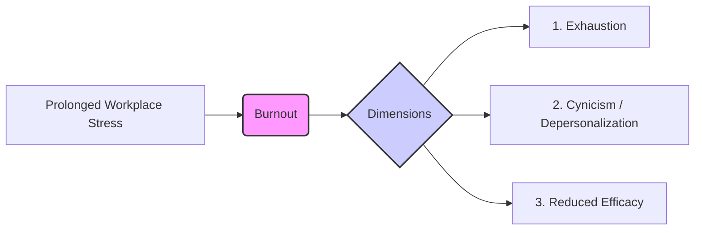
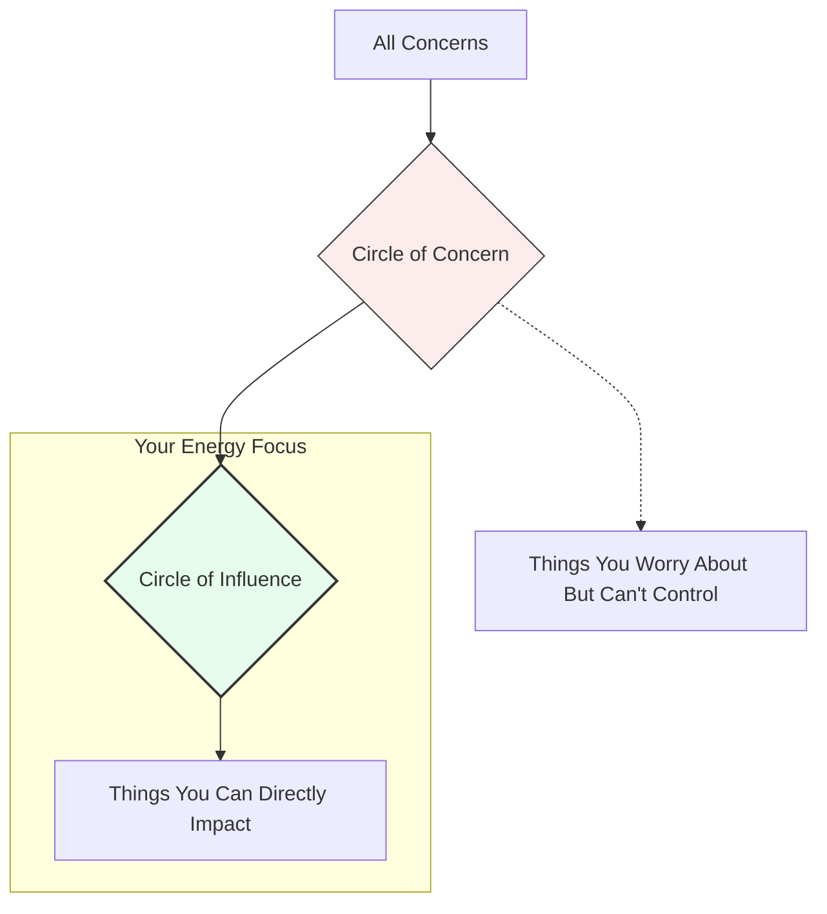
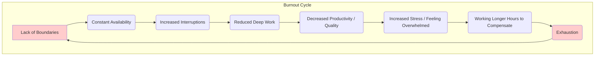

# Chapter 15: Building Resilience and Managing Stress

**(Part V: Personal Effectiveness and Career Growth)**

> _"The greatest weapon against stress is our ability to choose one thought over another."_ - William James

## Introduction: The High-Stakes Tightrope of Senior Engineering

As a Senior Software Engineer, you operate at the confluence of complex technical challenges, demanding project timelines, intricate team dynamics, and significant business impact. The intellectual stimulation and sense of accomplishment are profound, but so too are the pressures. Late-night debugging sessions, production outages, challenging architectural decisions, mentoring responsibilities, and the constant need to stay technically relevant can create a high-stress environment.

While technical proficiency got you here, sustained effectiveness and leadership hinge on your ability to navigate this pressure cooker without succumbing to burnout. This requires more than just coping mechanisms; it demands **resilience** – the capacity to withstand, adapt to, and recover from difficulties – and proactive **stress management**.

Ignoring these aspects isn't just detrimental to your personal well-being; it directly impacts your performance, decision-making, collaboration, and ultimately, your team's success and your career trajectory. This chapter provides practical strategies and frameworks specifically tailored for the demands of senior engineering roles, helping you build the mental fortitude needed to thrive long-term.

---

## 15.1 Recognizing the Signs of Burnout in Yourself and Others

Burnout isn't just having a bad day or feeling tired; it's a state of chronic physical and emotional exhaustion often stemming from prolonged workplace stress. The World Health Organization (WHO) recognizes it as an "occupational phenomenon." It's typically characterized by three key dimensions, as defined by the Maslach Burnout Inventory (MBI):

1.  **Exhaustion:** Feeling emotionally drained, depleted, and lacking energy to face the demands of work.
2.  **Cynicism/Depersonalization:** Developing a detached, negative, or indifferent attitude towards work, colleagues, or the value of one's contributions.
3.  **Reduced Professional Efficacy:** Experiencing a decline in feelings of competence, achievement, and productivity; doubting one's abilities and impact.

**Signs of Burnout in Yourself (as a Senior Engineer):**

- **Cognitive:**
  - Difficulty concentrating, brain fog, trouble solving complex problems you'd normally handle.
  - Increased forgetfulness regarding technical details or commitments.
  - Loss of creativity and innovation; defaulting to easiest solutions rather than best ones.
- **Emotional:**
  - Persistent irritability, impatience, or short temper (e.g., in code reviews, meetings).
  - Feeling overwhelmed, anxious, or constantly "on edge."
  - Loss of enthusiasm for previously engaging technical challenges.
  - Feeling detached from your work's purpose or impact.
  - Increased sensitivity to feedback or perceived criticism.
- **Behavioral:**
  - Withdrawal from team activities, social interactions, or mentoring opportunities.
  - Procrastination on complex or challenging tasks.
  - Working longer hours but achieving less (decreased productivity).
  - Noticeable decline in code quality, attention to detail, or test coverage.
  - Increased errors or bugs in your work.
  - Neglecting documentation or skipping established processes.
  - Changes in communication patterns (e.g., becoming less responsive, more terse).
- **Physical:**
  - Chronic fatigue, even after adequate sleep.
  - Frequent headaches, muscle tension, or stomach problems.
  - Changes in sleep patterns (insomnia or excessive sleeping).
  - Weakened immune system (getting sick more often).

**Recognizing Signs in Others (Your Responsibility as a Senior):**

As a senior member, you often have visibility into your colleagues' work patterns and attitudes. Recognizing potential burnout in others is crucial for team health and psychological safety. Look for sustained changes, not just isolated incidents:

- **Decreased Engagement:** Less participation in discussions, lack of initiative, missing stand-ups or team events.
- **Increased Negativity:** Frequent complaining, cynical remarks about projects or leadership, dismissive attitude towards new ideas.
- **Drop in Quality/Performance:** Uncharacteristic mistakes, missed deadlines, difficulty grasping new concepts.
- **Irritability/Withdrawal:** Snapping at colleagues, avoiding collaboration, seeming isolated.
- **Visible Exhaustion:** Appearing constantly tired, mentioning poor sleep or health issues.

If you notice these signs, approach the individual with empathy and concern (privately), perhaps asking open-ended questions like "How are things going?" or "You seem a bit overloaded lately, is there anything I can help with?". Avoid making diagnoses, but encourage them to seek support or talk to their manager.

---

## 15.2 Strategies for Managing Workload and Preventing Burnout

Burnout often stems from a perceived or real imbalance between demands and resources. Proactive workload management is essential prevention. As a Senior Engineer, you have more agency (and responsibility) to shape your workload than junior members.

- **Ruthless Prioritization (Revisit Chapter 13):**

  - Continuously evaluate tasks against project goals and business value. Use frameworks like Eisenhower Matrix (Urgent/Important) or MoSCoW.
  - Focus on high-impact activities. Not everything requires senior-level attention.
  - Communicate priorities clearly to stakeholders and your manager.

- **Realistic Estimation and Scope Management:**

  - Leverage your experience for better estimation, but always build in buffers for unknowns (research, unexpected complexity, interruptions).
  - Break down large tasks into smaller, manageable chunks.
  - Actively push back against scope creep. Articulate the impact of changes on timelines and resources (refer to Chapter 11 on Negotiation).
  - Communicate proactively and transparently when estimates change.

- **Effective Delegation (Revisit Chapter 9):**

  - Identify tasks suitable for delegation to junior or mid-level engineers. This provides growth opportunities for them and frees up your capacity for higher-leverage work.
  - Provide clear context, desired outcomes, and appropriate support, but trust them to execute. Avoid micromanaging.

- **Strategic "No" (Revisit Chapter 13):**

  - Recognize your capacity limits. Saying "yes" to everything leads to mediocrity and burnout.
  - Learn to decline requests respectfully, explaining your current commitments and constraints.
  - Offer alternatives, suggest delegation, or propose phasing if appropriate.

- **Time Blocking and Protecting Deep Work:**

  - Schedule dedicated blocks of uninterrupted time for complex problem-solving, coding, or design work.
  - Minimize context switching. Turn off notifications (Slack, email) during deep work sessions.
  - Communicate your focus time needs to your team.

- **Leverage Asynchronous Communication:**

  - Use tools like documentation (RFCs, design docs), well-written tickets, and thoughtful Slack messages to reduce the need for constant meetings (refer to Chapter 5).

- **Regular Breaks and Micro-Rest:**

  - Integrate short breaks throughout the day (e.g., Pomodoro technique). Step away from the screen, stretch, walk around.
  - Mental fatigue significantly impairs complex technical thinking. Breaks restore focus.

- **Automate Repetitive Tasks:**
  - Invest time in scripting, tooling, or improving CI/CD pipelines to automate toil and reduce manual effort.

---

## 15.3 Building Mental Resilience to Handle Setbacks and Pressure

Resilience is the psychological muscle that helps you bounce back from adversity – buggy releases, project failures, critical feedback, organizational changes. It's not about being unaffected; it's about how effectively you navigate and recover.

- **Cultivate a Growth Mindset (Revisit Chapter 1):**

  - View challenges, failures, and setbacks not as reflections of your inadequacy but as opportunities for learning and growth.
  - Reframe "I failed" to "This approach didn't work; what can I learn?"
  - Embrace feedback as data for improvement.

- **Cognitive Reframing:**

  - Challenge negative self-talk and cognitive distortions (e.g., catastrophizing, black-and-white thinking, imposter syndrome).
  - Ask yourself: "Is this thought objectively true? Is there another way to look at this situation? What evidence supports/contradicts this thought?"
  - Focus on facts and potential solutions rather than dwelling on worst-case scenarios.

- **Focus on Your Circle of Influence (Stephen Covey):**
  - Distinguish between things you can control or influence (your code, your communication, your effort, your team processes) and things you cannot (market conditions, upper management decisions, legacy system constraints).
  - Direct your energy primarily towards your Circle of Influence. Worrying excessively about things outside your control is a major source of stress and drains energy.

- **Practice Mindfulness and Stress Reduction Techniques:**

  - **Mindfulness:** Pay attention to the present moment without judgment. Even short mindfulness exercises (1-5 minutes) can reduce reactivity to stress. Apps like Headspace or Calm can help.
  - **Deep Breathing:** Simple diaphragmatic breathing can calm the nervous system during acute stress (e.g., before a difficult meeting or during an outage).
  - **Physical Activity:** Regular exercise is a powerful stress reliever and mood booster. Find something you enjoy.
  - **Adequate Sleep:** Prioritize 7-9 hours of quality sleep. Sleep deprivation severely impacts cognitive function, emotional regulation, and resilience.

- **Learn from Failure Constructively:**

  - Advocate for and participate in blameless post-mortems. Focus on system/process improvements, not individual blame.
  - Internalize lessons learned to prevent recurrence and build confidence for future challenges.

- **Build Strong Social Connections:**
  - Cultivate positive relationships with colleagues, mentors, and friends. Social support is a critical buffer against stress.

---

## 15.4 The Importance of Boundaries and Disconnecting

In a field known for passionate individuals and demanding timelines, blurring the lines between work and personal life is common, especially with remote work. However, establishing and maintaining clear boundaries is _crucial_ for long-term sustainability and preventing burnout.

- **Defining Boundaries:** These are the limits you set to protect your time, energy, and mental well-being. Examples include:

  - **Time Boundaries:** Defining clear work hours, sticking to them most of the time, avoiding checking emails/Slack late at night or on weekends unless truly urgent (and defining what "urgent" means).
  - **Task Boundaries:** Protecting your focused work time, saying "no" to non-essential requests, avoiding excessive scope creep.
  - **Emotional Boundaries:** Not taking work criticism personally, not absorbing the stress of others unnecessarily, maintaining perspective.

- **Why Boundaries Are Hard (and Essential) for Engineers:**

  - **Passion:** Genuine interest in technology can make it hard to switch off.
  - **Urgency Culture:** Constant pressure for speed and delivery.
  - **"Always-On" Expectations:** Pager duty, global teams, instant messaging tools create pressure to be constantly available.
  - **Hero Mentality:** The temptation to solve every problem, work excessive hours, and be the indispensable person (often leads to burnout and becomes a single point of failure).

- **Practical Strategies for Setting Boundaries:**
  - **Define Your Work Hours:** Communicate them clearly to your team (e.g., in your Slack status, calendar).
  - **Disable/Mute Notifications:** Turn off work-related notifications outside of working hours on your phone and computer. Configure PagerDuty/Opsgenie alerts carefully to only trigger for true emergencies during off-hours.
  - **Create Physical Separation (if possible):** If working remotely, have a dedicated workspace. If in the office, leave work materials at work.
  - **Schedule Downtime:** Intentionally block time for non-work activities, hobbies, family, and rest.
  - **Take Real Vacations:** Disconnect fully. Avoid checking email or Slack. Trust your team and ensure proper handoffs.
  - **Communicate Boundaries Respectfully:** Let colleagues know your availability and preferred communication methods/times.

Setting boundaries isn't selfish; it's essential self-preservation that enables you to perform at your best sustainably. It also sets a positive example for junior team members.

---

## 15.5 Seeking Support and Utilizing Available Resources

Trying to handle overwhelming stress or burnout alone is often ineffective and isolating. Leveraging support systems is a sign of strength and self-awareness.

- **Your Manager:** Your direct manager should be a primary point of contact. Use your 1:1s to discuss workload concerns, challenges, and stress levels. A good manager will help you prioritize, manage scope, and find solutions.
- **Mentors and Trusted Peers:** Talk to experienced colleagues or mentors (inside or outside your company) who may have faced similar challenges. They can offer perspective, advice, and validation. (Refer to Chapter 8).
- **Team Members:** Foster a culture where team members can openly discuss workload and stress without fear of judgment. Offer support to others, and be willing to ask for help when needed (e.g., "I'm swamped with X, could someone take a look at Y?").
- **Human Resources (HR) / People Operations:** HR can provide information on company policies related to workload, time off, and well-being programs.
- **Employee Assistance Programs (EAPs):** Many companies offer confidential EAPs that provide short-term counseling, referrals, and resources for various personal and work-related issues, including stress management and mental health support. Familiarize yourself with your company's EAP offerings.
- **Professional Help:** Therapists, counselors, or coaches specializing in workplace stress or tech industry challenges can provide tailored strategies and coping mechanisms. Seeking professional help is a proactive step towards well-being, not a sign of weakness.
- **Professional Networks and Communities:** Sometimes discussing challenges with peers outside your immediate organization (while respecting confidentiality) can provide valuable insights and a sense of shared experience.

**Overcoming the Stigma:** The tech industry sometimes fosters an environment where discussing stress or mental health challenges feels taboo. As a senior engineer, you can help break this stigma by:

- Being open (appropriately) about your own challenges and how you manage stress.
- Normalizing discussions about workload and well-being in team meetings or retrospectives.
- Actively encouraging team members to utilize available resources like EAPs or take necessary time off.
- Modeling help-seeking behavior yourself.

---

## 15.6 Cultivating a Sustainable Pace

The goal isn't just to survive stressful periods but to build a working rhythm that allows for high performance over the long haul – a marathon, not an endless series of sprints.

- **Marathon, Not Sprint Mentality:** Recognize that software development is a long-term endeavor. Constant high-intensity sprints are unsustainable and lead to burnout and technical debt. Advocate for realistic planning and pacing.
- **Build Slack into Schedules:** Avoid scheduling every minute. Allow buffer time for unexpected issues, learning, helping others, and context switching. Over-optimization leads to fragility.
- **Regular Reflection and Adjustment:** Periodically (e.g., weekly or bi-weekly) reflect on your workload, energy levels, and stress. Ask yourself:
  - Is my current pace sustainable?
  - What's draining my energy the most?
  - What changes can I make next week to improve my balance?
- **Celebrate Small Wins:** Acknowledge and appreciate progress, both for yourself and your team. This helps maintain motivation and perspective during long projects.
- **Prioritize High-Quality Work Over Rushed Output:** While deadlines matter, consistently sacrificing quality for speed leads to technical debt, rework, and increased future stress. Advocate for quality as a cornerstone of sustainability.
- **Invest in Continuous Improvement:** Regularly improving tools, processes, and skills can reduce friction and make work more efficient and less stressful over time (linking back to Chapter 14).
- **Advocate for Team Sustainability:** As a senior engineer, use your influence (Chapter 7) to advocate for realistic deadlines, manageable workloads, blameless culture, and team norms that support well-being (e.g., respecting focus time, encouraging vacations).

```mermaid
graph TD
    subgraph Sustainable Pace
        direction LR
        A[Realistic Planning] --> B(Manageable Workload);
        B --> C(Focus on Quality);
        C --> D(Regular Breaks & Downtime);
        D --> E(Continuous Improvement);
        E --> F(Reduced Friction / Stress);
        F --> G(Consistent High Performance);
        G --> H(Long-Term Well-being);
        H --> A;
    end

    subgraph Burnout Pace
        direction LR
        S1[Unrealistic Deadlines] --> S2(Overload / Constant Urgency);
        S2 --> S3(Cutting Corners / Low Quality);
        S3 --> S4(No Breaks / Always On);
        S4 --> S5(Increased Rework / Firefighting);
        S5 --> S6(High Stress / Errors);
        S6 --> S7(Short-Term Bursts, Long-Term Crash);
        S7 --> S8(Burnout / Attrition);
        S8 --> S1;
    end

    style Sustainable Pace fill:#e6fcec
    style Burnout Pace fill:#fcecec
```

---

## Chapter Summary and Reflection

Mastering resilience and stress management is not a "soft" addition to your technical skills; it is fundamental to your effectiveness, leadership, and longevity as a Senior Software Engineer. Burnout is a significant occupational hazard in technology, but it is often preventable.

**Key Takeaways:**

- **Recognize the Signs:** Be vigilant for signs of burnout in yourself and your colleagues (Exhaustion, Cynicism, Reduced Efficacy).
- **Manage Workload Proactively:** Prioritize ruthlessly, estimate realistically, delegate effectively, and learn to say "no" strategically.
- **Build Resilience:** Cultivate a growth mindset, practice cognitive reframing, focus on your circle of influence, and prioritize physical and mental well-being.
- **Set Boundaries:** Protect your time and energy by defining clear work-life boundaries and disconnecting regularly.
- **Seek Support:** Leverage your manager, mentors, peers, EAPs, and professional help when needed. Normalize help-seeking.
- **Cultivate Sustainability:** Aim for a marathon pace, build slack, reflect regularly, and advocate for team well-being.

**Reflection Questions:**

1.  Reflecting on the signs of burnout, where do you currently see yourself or your team on that spectrum?
2.  What is one concrete strategy for managing your workload you can implement or improve this week?
3.  When was the last time you felt truly resilient in the face of a significant setback? What helped you bounce back?
4.  Are your current work-life boundaries clearly defined and consistently maintained? Where could they be stronger?
5.  What support resources (personal or professional) could you leverage more effectively when feeling stressed or overwhelmed?
6.  Is your current work pace sustainable for the next year? If not, what needs to change?

Building resilience is an ongoing practice, not a one-time fix. By consciously integrating these strategies into your work habits, you invest not only in your personal well-being but also in your capacity to lead, innovate, and thrive in the demanding yet rewarding role of a Senior Software Engineer.
