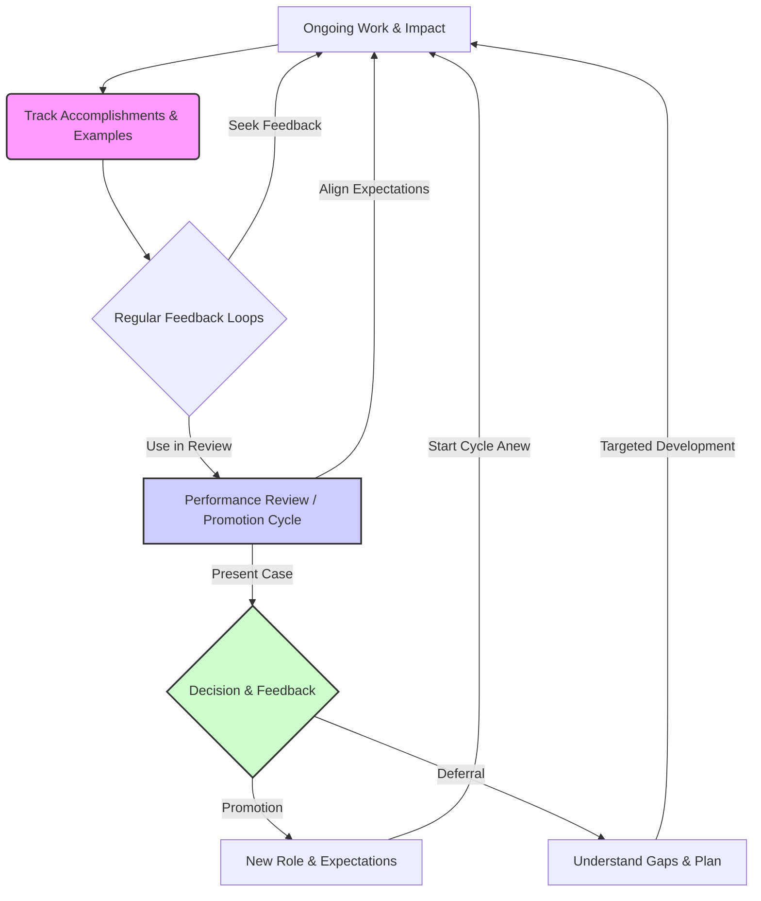
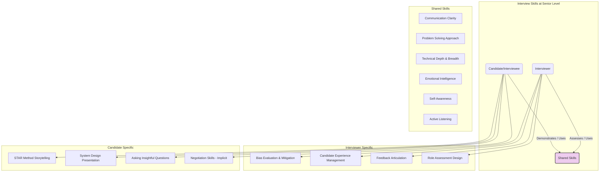

# Chapter 16: Career Development and Strategic Networking: Charting Your Course

> "The only way to do great work is to love what you do. If you haven't found it yet, keep looking. Don't settle. As with all matters of the heart, you'll know when you find it." - Steve Jobs

Welcome to a pivotal chapter in your journey as a Senior Software Engineer. Thus far, we've explored the crucial soft skills that enable technical excellence, effective collaboration, and impactful leadership. Now, we turn our focus inward and outward simultaneously: How do you intentionally shape your career path, leverage your accumulated skills for growth, and build the relationships necessary to achieve your professional aspirations?

At the senior level, career progression is rarely linear or accidental. It requires conscious effort, strategic thinking, and the adept application of the very soft skills we've been discussing. Waiting for recognition or hoping the "right" opportunity falls into your lap is a passive stance. Proactive career development involves understanding your options, articulating your value, building supportive relationships, and positioning yourself for the future you desire.

This chapter will equip you with the mindset and tools to:

- Define and pursue a career trajectory that aligns with your strengths and interests.
- Master the art of navigating performance reviews and promotion cycles using your soft skills.
- Build and maintain a robust professional network based on authenticity and mutual value.
- Leverage that network effectively for knowledge, support, and opportunities.
- Craft a compelling personal brand that reflects your expertise and aspirations.
- Excel in senior-level interviews, both as a candidate seeking new challenges and as an interviewer identifying top talent.

Let's move beyond simply _being_ a Senior Engineer and focus on _strategically growing_ as one.

## 16.1 Defining Your Career Trajectory: IC Leadership, Management, or Architecture?

As a Senior Software Engineer, you've likely reached a point where your technical skills are well-established. Your impact extends beyond individual tasks to influencing team direction and project outcomes. Now, you face choices about _how_ you want to scale that impact further. While paths can be fluid and company structures vary, three common archetypes emerge:

1.  **The Individual Contributor (IC) Leader (Staff/Principal/Distinguished Engineer):**

    - **Focus:** Deep technical expertise, solving the most complex technical challenges, setting technical direction, influencing across multiple teams or the entire organization, mentoring senior engineers, driving technical strategy and innovation _without_ direct people management responsibilities.
    - **Key Soft Skills:** Advanced communication (articulating complex technical strategy), influence (Chapter 7), mentorship (Chapter 8), technical leadership (Chapter 9), navigating ambiguity (Chapter 12), negotiation (Chapter 11).
    - **Appeal:** For those passionate about staying deeply hands-on with technology, designing systems, and scaling their technical impact broadly.

2.  **The Engineering Manager:**

    - **Focus:** People leadership, building and developing high-performing teams, managing team processes and execution, performance management, career development for direct reports, strategic alignment with product and business goals, removing roadblocks, fostering team health and psychological safety.
    - **Key Soft Skills:** Emotional intelligence (Chapter 2), communication (especially active listening and feedback), conflict resolution (Chapter 10), delegation (Chapter 9), mentorship (Chapter 8), influencing stakeholders, strategic thinking.
    - **Appeal:** For those energized by empowering others, building teams, improving processes, and focusing on the human dynamics of software development. This path involves significantly less direct coding over time.

3.  **The Specialist/Architect:**
    - **Focus:** Deep domain expertise in a specific area (e.g., security, infrastructure, performance, data science, a specific business domain). Designing and overseeing the implementation of critical systems within that domain, setting standards, consulting across teams, often acting as the ultimate technical authority in their niche.
    - **Key Soft Skills:** Deep technical communication, influence within their domain, clarity in complexity (Chapter 3), negotiation (defending architectural choices), risk assessment (Chapter 9), continuous learning (Chapter 14).
    - **Appeal:** For those driven by mastery in a particular field and shaping the technical landscape within that specialty. Often overlaps with the IC Leader path but may have a narrower, deeper focus.

**Choosing Your Path: Questions for Self-Reflection**

There's no single "right" path. The best fit depends on your skills, interests, values, and the opportunities available within your context. Ask yourself:

- **What energizes me most?** Solving deep technical puzzles? Enabling and coaching others? Designing elegant, large-scale systems? Defining standards in a specific domain?
- **Where do my strengths lie?** Am I strongest in technical depth, influencing strategy, building consensus, or developing people? (Refer back to Chapter 1: Self-Awareness).
- **What kind of impact do I want to have?** Directly on the codebase and architecture? On the team's effectiveness and growth? On the organization's specialized technical capabilities?
- **What frustrates me?** Bureaucracy? Interpersonal conflicts? Technical limitations? Lack of strategic direction? Your frustrations can hint at where you'd prefer _not_ to focus.
- **What are the needs of my organization?** Where are the gaps in leadership or expertise? Aligning your growth with organizational needs can create powerful opportunities.
- **What am I willing to learn or let go of?** Are you willing to code less to manage people? Are you prepared to dive deeper into a specific niche? Are you ready to influence without authority at a larger scale?

**Exploring Options:**

- **Talk to people:** Have informational interviews with individuals on each path within your company or network. Ask about their day-to-day, challenges, and rewards.
- **Seek "stretch" assignments:** Volunteer to tech lead a project, mentor junior engineers formally, take ownership of a cross-team technical initiative, or participate in architectural review committees. These experiences provide valuable data points.
- **Get feedback:** Ask your manager, mentors, and trusted peers where they see your strengths and potential growth areas aligning with these different paths.

Remember, career paths aren't always rigid. Hybrid roles exist, and transitions between paths are possible, though they often require deliberate effort and skill development. The key is intentionality – choosing a direction rather than drifting.

## 16.2 Using Soft Skills to Navigate Promotions and Performance Reviews

Promotions and positive performance reviews at the senior level are rarely just about technical output. They hinge on your ability to demonstrate **impact**, **influence**, and **leadership potential** – all underpinned by strong soft skills. Simply doing good work isn't enough; you need to make that work _visible_ and articulate its _value_ effectively.

**Performance Reviews: A Continuous Dialogue**

Don't treat performance reviews as an annual surprise. Engage in a continuous feedback loop with your manager:

- **Align Expectations:** Regularly discuss your role's expectations, especially focusing on behaviors and impact expected at the _next_ level.
- **Track Your Impact (The "Brag Document"):** Maintain a running log of your accomplishments, linking them to team/company goals. Quantify results whenever possible (e.g., "Reduced API latency by 15%," "Mentored two junior engineers who are now independently leading features," "Led the design and implementation of X system, now serving Y traffic"). Include specific examples of collaboration, influence, and problem-solving.
- **Proactively Seek Feedback:** Don't wait for the formal cycle. Ask for feedback after projects, presentations, or significant collaborations (Ref: Chapter 1).
- **Use Reviews for Planning:** Treat the review conversation as a strategic planning session for your growth, identifying areas for development and potential opportunities.

**Navigating Promotions: Building Your Case**

Promotion to levels beyond Senior (e.g., Staff, Principal, Manager) typically requires demonstrating sustained impact _already operating at that next level_. Your soft skills are crucial for building and presenting this case:

- **Articulating Impact (Chapter 3: Communication):** Clearly explain _what_ you did, _why_ it mattered (business/technical impact), and _how_ you achieved it (demonstrating skills like collaboration, technical leadership, problem-solving). Tailor the narrative to your audience (manager, promotion committee).
- **Demonstrating Influence (Chapter 7: Leading Without Authority):** Provide concrete examples of how you influenced technical direction, improved processes, mentored others effectively, or drove alignment across teams. Highlight instances where you persuaded stakeholders or navigated disagreements productively.
- **Showcasing Leadership (Chapter 9: Technical Leadership):** Detail initiatives you've led, complex technical decisions you've made (and their rationale/outcomes), risks you've identified and mitigated, and how you've delegated or empowered others.
- **Negotiating Scope and Priorities (Chapter 11: Negotiation):** Your ability to negotiate for impactful projects or argue effectively for technical investments contributes to your visibility and impact. Document these instances.
- **Receiving Feedback Gracefully (Chapter 1 & 6):** If promotion is deferred, use your feedback skills to understand the gaps clearly and create an action plan. Demonstrating resilience and a growth mindset (Chapter 1) is critical.
- **Mentorship and Sponsorship (Chapter 8):** Highlighting your contributions to growing others is often a key component of senior-level promotion cases. Having sponsors who can advocate for you is also invaluable.

**The Promotion Cycle Visualization:**

_Diagram Explanation:_ This cycle shows that career progression isn't linear but iterative. Your daily work feeds into documented impact, which informs regular feedback discussions. These feed the formal review/promotion process, leading to either advancement or specific feedback for targeted development, restarting the cycle with clearer goals. Soft skills are the lubricant making this cycle work smoothly.

## 16.3 Building and Maintaining a Professional Network Authentically

Networking often gets a bad reputation, conjuring images of awkward cocktail parties and forced small talk. For Senior Engineers, however, strategic networking is less about collecting contacts and more about building **genuine, mutually beneficial relationships** based on shared interests, respect, and a willingness to help.

**Why Network?**

A strong professional network provides:

- **Knowledge Sharing:** Access to diverse perspectives, solutions to tough problems, insights into new technologies and practices.
- **Opportunities:** Awareness of internal projects, potential job openings, speaking engagements, collaborations.
- **Support System:** Advice, mentorship, sponsorship, and encouragement during challenging times.
- **Influence Amplification:** Allies who can support your ideas and initiatives.
- **Industry Perspective:** Understanding trends and challenges beyond your immediate team or company.

**The Pillars of Authentic Networking:**

1.  **Be Genuine and Curious:** Approach interactions with a sincere interest in others and their work. Ask thoughtful questions (Chapter 3) and listen actively. Share your own experiences and challenges openly.
2.  **Focus on Giving:** Offer help, share relevant information, make introductions, or provide feedback _before_ you expect anything in return. Build a reputation as someone helpful and knowledgeable.
3.  **Seek Common Ground:** Connect over shared technical interests, past projects, conference experiences, or even non-work hobbies. These create stronger, more natural bonds.
4.  **Quality over Quantity:** Deep, trusting relationships with a smaller number of people are often more valuable than superficial connections with hundreds.
5.  **Consistency over Intensity:** Maintain connections through occasional check-ins, sharing relevant articles, or offering congratulations on achievements. Small, consistent efforts build lasting relationships.

**Where and How to Network:**

- **Internally:**
  - **Cross-Team Collaboration:** Build rapport with engineers, product managers, designers, etc., on projects (Chapter 4).
  - **Company Events & Socials:** Engage in informal conversations.
  - **Employee Resource Groups (ERGs):** Connect with colleagues who share common interests or backgrounds.
  - **Internal Tech Talks & Guilds:** Share your knowledge and learn from others. Offer constructive feedback (Chapter 6).
  - **Mentorship Programs:** Act as a mentor or seek one out (Chapter 8).
- **Externally:**
  - **Conferences and Meetups:** Attend talks, ask questions, participate in "hallway track" discussions. Prepare a few conversation starters based on the event's theme.
  - **Online Communities:** Participate thoughtfully in relevant Slacks, Discords, forums, or mailing lists. Answer questions and share insights.
  - **LinkedIn:** Connect with people you meet or respect. Personalize connection requests. Share updates or interesting articles. Engage with others' posts meaningfully.
  - **Open Source Projects:** Contribute code, documentation, or help triage issues. Engage with the project community.
  - **Professional Organizations:** Join groups related to your field (e.g., ACM, IEEE).

**Tips for Introverts:**

Networking doesn't have to mean large crowds. Focus on:

- **One-on-One Conversations:** Seek deeper discussions with individuals.
- **Smaller Groups:** Meetups or internal guilds can be less overwhelming.
- **Online Engagement:** Contributing to forums or open source allows thoughtful participation on your own terms.
- **Prepared Questions:** Having a few relevant questions ready can ease conversation entry.
- **Listening:** Leverage strong listening skills as your primary networking tool.

Authentic networking is a long game. Invest in relationships, be helpful, and stay curious.

## 16.4 Leveraging Your Network for Opportunities and Knowledge

Once you've cultivated a network, it becomes a powerful resource – but tapping into it requires tact and respect. It's not just about _what_ you know or _who_ you know, but _how you interact_ with who you know.

**Accessing Knowledge and Perspectives:**

- **Seeking Advice:** When facing a tough technical or career challenge, reach out to relevant contacts.
  - **Be Specific:** Clearly articulate the problem and what kind of input you're looking for.
  - **Respect Their Time:** Keep your request concise. Offer to schedule a brief call if needed.
  - **Share Context:** Briefly explain why you thought _they_ specifically would have valuable insight.
  - **Follow Up:** Thank them for their time and, if appropriate, let them know how their advice helped.
- **Learning About Trends:** Ask your network about new tools, techniques, or challenges they're encountering. This keeps you informed beyond your immediate bubble.
- **Getting Diverse Viewpoints:** Before making a significant technical decision, solicit opinions from trusted peers with different backgrounds or expertise.

**Exploring Opportunities:**

- **Internal Mobility:** Your internal network can provide insights into upcoming projects, team reorganizations, or new roles before they are formally announced. Expressing interest early can position you favorably.
- **External Job Market:**
  - **Informational Interviews:** Reach out to contacts at companies you admire to learn about their culture, challenges, and engineering practices, _not_ explicitly asking for a job initially.
  - **Referrals:** If actively job searching, politely ask relevant contacts if they'd be comfortable referring you for specific, suitable roles. Make it easy for them by providing your resume and highlighting your fit. Understand they may decline, and respect their decision.
  - **Market Intelligence:** Your network can offer insights into salary expectations, interview processes, and company reputations.
- **Speaking/Writing Opportunities:** Let your network know if you're interested in giving talks or writing articles; opportunities often arise through personal connections.

**The Art of the "Ask":**

- **Warm Introductions:** If you want to connect with someone you don't know, ask a mutual contact for an introduction. Provide the context and why you want to connect, making it easy for the introducer to forward or adapt your message.
- **Reciprocity is Key:** Networking is a two-way street. Be equally willing to share your knowledge, offer help, provide introductions, and act as a referral for others in your network when appropriate. If someone helps you, look for opportunities to return the favor later.
- **Don't Be Purely Transactional:** Avoid only reaching out when you need something. Maintain relationships through regular, low-effort touchpoints (sharing an article, congratulating on a promotion, etc.).

Leveraging your network effectively combines the communication skills from Chapter 3 (clarity, tailoring your message) with the empathy and rapport-building from Chapter 2 (understanding others' perspectives and time constraints).

## 16.5 Crafting Your Personal Brand as a Senior Engineer

Your personal brand isn't about flashy self-promotion; it's about your **reputation** – what you're known _for_ professionally. As a Senior Engineer, consciously cultivating your brand helps shape how others perceive your expertise, reliability, and leadership potential. It influences the opportunities that come your way and the weight your opinions carry.

**Why Your Brand Matters:**

- **Credibility & Trust:** A strong brand built on expertise and reliability makes others more likely to trust your technical judgment and leadership.
- **Influence:** It enhances your ability to influence decisions and rally support for initiatives (Chapter 7).
- **Opportunity Flow:** A well-defined brand attracts relevant projects, collaborations, and career opportunities.
- **Differentiation:** It helps you stand out in a crowded field, highlighting your unique strengths and contributions.

**Defining Your Brand:**

Ask yourself:

- **What are my core technical strengths?** (e.g., distributed systems, front-end performance, specific language mastery)
- **What are my key soft skill strengths?** (e.g., mentorship, clear communication, conflict resolution, strategic thinking)
- **What values drive my work?** (e.g., quality, pragmatism, innovation, collaboration, user focus)
- **What do I want to be the go-to person for?**
- **How does this align with my career trajectory goals (Section 16.1)?**

Your brand should be an authentic reflection of who you are and what you consistently deliver.

**Building and Communicating Your Brand:**

Your brand is built through your actions and communicated through various channels:

- **Consistent High-Quality Work:** This is the foundation. Deliver reliable, well-crafted solutions. Own your work (Chapter 9).
- **Clear Communication (Chapter 3):** Articulate your ideas clearly in design docs, code reviews (Chapter 6), presentations, and discussions. Be known for clarity.
- **Mentorship and Support (Chapter 8):** Being a helpful and effective mentor builds a reputation for leadership and generosity.
- **Thought Leadership:**
  - **Internal:** Write internal blog posts, give tech talks, share learnings in team meetings or Slack channels. Lead discussions on best practices.
  - **External:** Contribute to blogs, speak at conferences/meetups, participate actively in open source, maintain a professional online presence (e.g., updated LinkedIn profile reflecting your expertise).
- **Reliability and Ownership:** Be dependable. Follow through on commitments. Take accountability for outcomes, both good and bad.
- **Specialization:** Develop deep expertise in a valuable area (aligns with Architect/Specialist path).
- **Constructive Feedback:** Be known for giving and receiving feedback thoughtfully (Chapter 1 & 6).

**Managing Your Brand:**

- **Be Consistent:** Ensure your actions, communication, and online presence align with the brand you want to project.
- **Seek Feedback:** Ask trusted colleagues or mentors how they perceive your strengths and contributions. Does it match your intended brand?
- **Curate Your Online Presence:** Ensure your LinkedIn profile, personal website (if any), and public contributions (GitHub, etc.) reflect your professional identity accurately.
- **Authenticity:** Don't try to project a persona that isn't genuine. Authenticity builds trust.

Crafting your personal brand is an ongoing process, deeply intertwined with self-awareness (Chapter 1) and continuous learning (Chapter 14). It’s about intentionally shaping your reputation through consistent excellence and effective communication.

## 16.6 Interviewing Skills (Both as Interviewer and Interviewee at the Senior Level)

Interviews at the senior level are significantly different from junior or mid-level ones. Whether you're the candidate or the interviewer, the focus shifts towards assessing (or demonstrating) strategic thinking, leadership, complex problem-solving, communication, and broad impact. Soft skills are not just a tie-breaker; they are core evaluation criteria.

**As the Interviewee:**

Getting hired for a senior role requires proving you can operate at that level from day one.

- **Beyond Algorithms:** While coding proficiency is assumed, expect less emphasis on pure algorithmic puzzles and more on:
  - **System Design:** Designing scalable, resilient, and maintainable systems. Articulating trade-offs clearly is crucial.
  - **Behavioral Questions:** Deep dives into past experiences focusing on leadership, conflict resolution (Chapter 10), navigating ambiguity (Chapter 12), mentorship (Chapter 8), influence (Chapter 7), and handling failure. Use the **STAR method (Situation, Task, Action, Result)** with specific, impactful examples.
  - **Technical Deep Dives:** Discussing past complex projects, architectural decisions, and debugging scenarios.
  - **Problem-Solving Approach:** Demonstrating how you break down complex, ill-defined problems, ask clarifying questions, and collaborate towards a solution.
- **Preparation is Key:**
  - **Research:** Understand the company's business, culture, technical challenges, and the specific role deeply.
  - **Prepare Examples:** Have multiple STAR stories ready for common behavioral themes (leadership, conflict, ambiguity, success, failure, mentorship). Quantify impact.
  - **Practice System Design:** Work through common archetypes (e.g., social feeds, e-commerce sites, URL shorteners). Focus on the _discussion_ and trade-offs, not just the final diagram.
  - **Prepare Questions:** Ask insightful questions about the team, challenges, culture, technical strategy, and expectations for the role. This shows engagement and critical thinking.
- **Showcase Soft Skills During the Interview:**
  - **Communication (Chapter 3):** Explain your thought process clearly, articulate trade-offs, listen actively to the interviewer, structure your answers logically.
  - **Collaboration:** Treat coding or design exercises as collaborative sessions. Talk through your approach.
  - **Handling Ambiguity (Chapter 12):** Ask clarifying questions when requirements are unclear. State your assumptions.
  - **Emotional Intelligence (Chapter 2):** Manage stress, remain composed, build rapport with the interviewer.
  - **Self-Awareness (Chapter 1):** Be able to discuss your strengths and weaknesses honestly, reflecting on past experiences.

**As the Interviewer:**

Senior engineers are frequently called upon to interview candidates. Your role is critical in identifying strong technical _and_ behavioral fits while ensuring a fair and positive candidate experience.

- **Your Responsibilities:**
  - **Assess Relevant Skills:** Evaluate candidates against the specific requirements of the senior role (technical depth, system design, leadership, communication, collaboration).
  - **Reduce Bias:** Use structured interviews, focus on observable behaviors, be aware of common biases (halo effect, confirmation bias), and use rubrics for consistent evaluation.
  - **Provide a Positive Candidate Experience:** Be punctual, respectful, clear about the process, and represent the company culture well. Remember, the candidate is also evaluating you and the company.
  - **Be an Ambassador:** Sell the role and company appropriately, answering candidate questions honestly.
- **Designing Effective Senior Interviews:**
  - **Go Beyond Coding:** Include system design, behavioral interviews, and potentially discussions about past projects or technical leadership scenarios.
  - **Focus on "How":** Pay attention not just to _what_ the candidate knows, but _how_ they solve problems, communicate, and collaborate.
  - **Use Behavioral Questions:** Probe for specific examples using STAR. Ask follow-up questions to understand the candidate's specific role and impact.
  - **Structure and Rubrics:** Use consistent questions and pre-defined criteria (rubrics) to evaluate candidates objectively across different interviewers.
- **Conducting the Interview:**
  - **Set the Stage:** Introduce yourself, explain the interview format and goal, build initial rapport.
  - **Active Listening (Chapter 3):** Pay close attention to the candidate's answers, both verbal and non-verbal cues.
  - **Probe Effectively:** Ask clarifying questions ("Can you tell me more about...", "What was your specific contribution?", "What were the trade-offs?").
  - **Manage Time:** Keep the interview on track while allowing sufficient time for each section and candidate questions.
  - **Assess Soft Skills:** Observe communication clarity, problem-solving approach, collaboration signals (if pair programming), how they handle ambiguity or corrections, self-awareness, and enthusiasm.
- **Providing Feedback:**
  - **Be Specific and Evidence-Based:** Base your feedback on concrete observations and examples from the interview, tied to the rubric criteria. Avoid vague statements.
  - **Focus on Skills and Behaviors:** Evaluate job-related competencies, not personality traits.
  - **Be Timely:** Submit your feedback promptly while the details are fresh.

**Senior Interview Skills Overlap:**

_Diagram Explanation:_ This diagram shows that both interviewers and candidates at the senior level rely on a core set of shared skills (Communication, Problem Solving, Technical Depth, EQ, Self-Awareness, Active Listening). However, each role also has specific skills: the interviewer focuses on evaluation and experience management, while the candidate focuses on effectively showcasing their experience and fit. Mastering both sides makes you a more effective senior engineer.

## Chapter Summary

Strategic career development and networking are not optional extras for ambitious Senior Software Engineers; they are essential practices powered by sophisticated soft skills. This chapter provided a framework for:

- **Defining Your Trajectory:** Intentionally choosing between IC Leadership, Management, or Specialist paths based on self-awareness and goals.
- **Navigating Growth:** Using communication, influence, and impact tracking to excel in performance reviews and secure promotions.
- **Authentic Networking:** Building genuine relationships based on mutual value, both internally and externally.
- **Leveraging Connections:** Tapping into your network ethically and effectively for knowledge, support, and opportunities.
- **Crafting Your Brand:** Consciously shaping your professional reputation through consistent excellence and communication.
- **Mastering Interviews:** Excelling in senior-level interviews from both sides of the table, recognizing the critical role of soft skills in assessment and demonstration.

Your technical skills opened the door to seniority. Your ability to strategically manage your career, build relationships, and communicate your value will determine how far you progress beyond it.

## Reflection Questions & Action Items

1.  **Trajectory Check-In:** Revisit Section 16.1. Which career path currently resonates most with you? What's one small step you can take this quarter to explore it further (e.g., an informational interview, volunteering for a relevant task)?
2.  **Impact Log:** Start (or update) your "brag document" today. Add at least three specific accomplishments from the past month, focusing on the _impact_ and the _skills_ you used.
3.  **Network Audit:** Identify 3-5 people in your network (internal or external) you haven't connected with recently but value. Schedule a brief virtual coffee or send a personalized check-in message this week. Focus on giving/sharing first.
4.  **Brand Statement:** Draft a one-sentence statement defining the personal brand you _want_ to have as a Senior Engineer. Does it align with your recent actions and contributions?
5.  **Interview Practice:** Identify one behavioral question area (e.g., handling conflict, leading an initiative) and practice formulating a STAR response based on a real experience. If you interview candidates, review your company's rubric – how explicitly are soft skills assessed?
