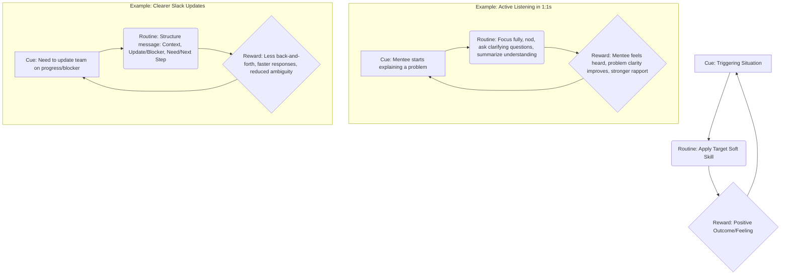
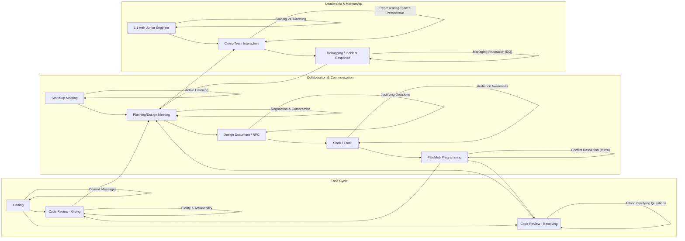
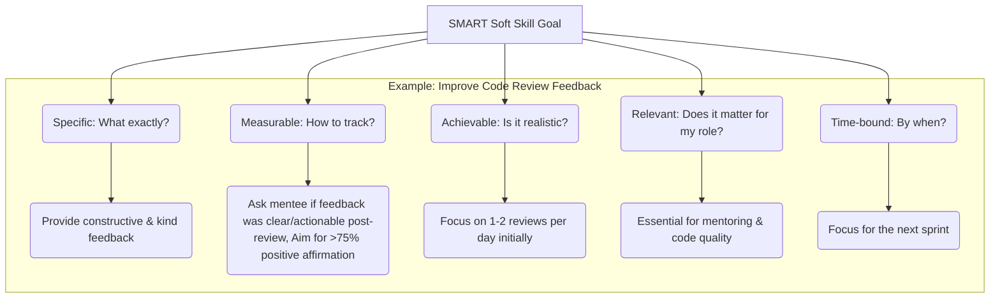

# Chapter 17: Integrating Soft Skills into Your Daily Engineering Workflow

> _"We are what we repeatedly do. Excellence, then, is not an act, but a habit."_ - Will Durant (often attributed to Aristotle)

You've journeyed through the foundational pillars, explored collaboration dynamics, delved into influence and leadership, navigated complexity, and considered personal effectiveness. You now possess a comprehensive understanding of the _what_ and _why_ of soft skills critical for senior engineering roles. Knowledge, however, is only potential power. True power, true effectiveness, comes from _application_. This chapter is the linchpin, the bridge between understanding these concepts and weaving them seamlessly into the fabric of your daily engineering life. It's about transforming conscious effort into subconscious competence, making these vital skills not just something you _know_, but something you _do_, naturally and effectively, every single day.

The goal isn't to add _more_ tasks to your already demanding schedule. It's about fundamentally changing _how_ you approach the tasks you already perform – coding, reviewing, meeting, designing, discussing, mentoring. It's about recognizing that every interaction, every line of code commented, every design document written, is an opportunity to practice and refine your soft skills, ultimately amplifying your technical impact and leadership potential.

## Making Soft Skills a Habit, Not an Afterthought

Habits are the bedrock of consistent performance. Just as you wouldn't consciously decide _whether_ to write unit tests (it's often an ingrained part of your workflow) or format your code according to team standards, the most effective senior engineers apply soft skills with similar automaticity. Reaching this state requires deliberate practice until it becomes second nature.

**Why Integration is Crucial:**

1.  **Consistency:** Sporadic application yields sporadic results. Habitual practice ensures consistent positive interactions and outcomes.
2.  **Authenticity:** When soft skills become habits, they feel less like a performance and more like a genuine aspect of your professional persona, building deeper trust.
3.  **Efficiency:** Consciously deciding how to communicate or manage conflict in every instance is mentally taxing. Habits free up cognitive load for complex technical problem-solving.
4.  **Compounding Returns:** Small, consistent improvements in communication, collaboration, and influence compound over time, leading to significant career growth and impact.

**Overcoming the Inertia:**

- **Link to Technical Outcomes:** Explicitly connect soft skill practice to tangible engineering benefits. Better communication leads to clearer requirements and fewer bugs. Effective conflict resolution unblocks projects faster. Stronger influence gets critical technical initiatives prioritized.
- **Start Small:** Don't try to overhaul everything at once. Pick one or two specific skills or behaviors to focus on each week or sprint.
- **Leverage Existing Routines:** Piggyback soft skill practice onto existing engineering rituals (stand-ups, code reviews, planning sessions).
- **Mindset Shift:** View soft skill development not as a "nice-to-have" distraction from "real work," but as an essential multiplier for your technical contributions and leadership effectiveness. It's an investment, not a cost.

**The Soft Skill Habit Loop:**

Understanding the habit loop (Cue -> Routine -> Reward) can help embed these skills:



Consciously identify cues in your daily work, define the desired soft skill routine, and acknowledge the reward (even if it's just internal satisfaction initially) to reinforce the loop.

## Identifying Daily Opportunities for Skill Practice

Your typical engineering day is brimming with opportunities to hone soft skills. The key is to develop the awareness to recognize them and the intention to leverage them.

**Mapping Opportunities to Daily Tasks:**



**Actionable Prompts for Daily Reflection:**

- **Before a meeting:** "What is my goal for this meeting? How can I best contribute/facilitate? Who is the audience, and how should I tailor my communication?"
- **Before writing a design doc:** "Who needs to understand this? What level of detail is appropriate? How can I make the trade-offs crystal clear?"
- **Before starting a code review:** "What is the primary goal here (mentorship, correctness, maintainability)? How can I phrase my feedback constructively and kindly?"
- **After a technical disagreement:** "Did I listen fully to the other perspective? Did I articulate my points clearly and respectfully? Could I have approached the conflict more effectively?"
- **During a 1:1 with a mentee:** "Am I truly listening, or just waiting to talk? Am I asking questions that encourage their thinking?"
- **When feeling blocked or frustrated:** "What emotion am I feeling? How can I regulate it constructively? How can I communicate this blocker clearly and without blame?"

Intentionally pausing before and reflecting after these common activities transforms them from routine tasks into deliberate practice sessions.

## Setting Personal Goals for Soft Skill Development

Vague intentions like "get better at communication" are rarely effective. Just as you set technical goals, establishing specific, measurable goals for soft skill improvement provides focus, direction, and a way to track progress.

**Using the SMART Framework for Soft Skills:**

- **Specific:** Target a precise skill or behavior. Instead of "improve communication," aim for "provide more actionable feedback in code reviews" or "ask more open-ended questions during planning meetings."
- **Measurable:** Define how you'll track progress. This is often qualitative but can be quantified. Examples: "Reduce the need for follow-up clarification questions on my design docs by 50%," "Successfully summarize the other person's key points in 3 out of 5 technical discussions this week," "Receive positive feedback on meeting facilitation from at least one peer this month."
- **Achievable:** Set realistic goals based on your current skill level and opportunities for practice. Don't try to become a master presenter overnight if you rarely present.
- **Relevant:** Ensure the goal directly contributes to your effectiveness as a senior engineer and aligns with your career aspirations. Improving presentation skills is relevant if you aim to influence technical direction more broadly.
- **Time-bound:** Set a timeframe for achieving the goal (e.g., "within the next quarter," "by the end of the next sprint," "over the next month"). This creates urgency and points for evaluation.

**Example SMART Soft Skill Goals:**

1.  **Skill:** Active Listening
    - **Goal:** "Over the next month, during my weekly 1:1s with junior engineers, I will actively practice summarizing their main points before offering my own suggestions, aiming to do this successfully at least twice per session."
2.  **Skill:** Clarity in Written Communication
    - **Goal:** "For the next major feature design document I write (due in 3 weeks), I will explicitly include a 'Trade-offs Considered' section and solicit feedback specifically on its clarity from at least two peers before finalizing."
3.  **Skill:** Meeting Facilitation
    - **Goal:** "When I lead the next team technical design meeting (scheduled next sprint), I will prepare and share a clear agenda with goals beforehand, actively ensure all attendees have a chance to speak, and document clear action items at the end. I will ask for feedback on my facilitation afterwards."
4.  **Skill:** Receiving Feedback
    - **Goal:** "During the next code review cycle for my feature branch (expected this week), when I receive feedback I initially disagree with, I will pause, count to five, and respond first by asking a clarifying question (e.g., 'Can you help me understand the specific concern about X?') before explaining my rationale, aiming to do this for at least 80% of such comments."



Choose 1-3 goals at a time to maintain focus. Revisit and adjust them regularly, perhaps quarterly or aligned with performance review cycles.

## Creating a Personal Development Plan (PDP)

A Personal Development Plan translates your goals into a structured roadmap for action. It's your personal blueprint for soft skill growth, integrating learning, practice, and reflection.

**Components of a Soft Skills PDP:**

1.  **Identified Skill Areas:** Based on self-assessment (Chapter 1, Appendix A), feedback, and career goals. (e.g., Technical Influence, Conflict Resolution, Mentoring Effectiveness).
2.  **Specific SMART Goals:** As defined above.
3.  **Learning Activities:** How will you deepen your understanding?
    - Re-reading specific chapters of this book.
    - Attending workshops or training (internal or external).
    - Reading relevant articles or books (Appendix E).
    - Observing skilled practitioners (mentors, senior leaders).
4.  **Practice Activities:** How will you apply the skill?
    - Volunteering to lead a meeting or facilitate a discussion.
    - Intentionally practicing active listening in specific interactions.
    - Seeking opportunities to present technical ideas.
    - Drafting RFCs or design docs with a focus on clarity and justification.
    - Offering to mentor a junior engineer.
5.  **Resources & Support:** What or who can help you?
    - Mentors or trusted peers for feedback and guidance.
    - Your manager (discussing goals in 1:1s).
    - Company-provided learning resources.
    - Online communities or forums.
6.  **Measurement & Reflection:** How will you track progress and learn from experience?
    - Scheduled reflection time (e.g., weekly journaling, end-of-sprint review).
    - Soliciting specific feedback related to your goals.
    - Tracking progress against your measurable goal metrics.
7.  **Timeline:** Target dates for achieving milestones or revisiting the plan.

**Simple PDP Template Structure:**

| Skill Area              | SMART Goal                                                                                                                                 | Learning Activities                                 | Practice Activities                                                                               | Resources/Support  | Measurement / Reflection Method                                     | Timeline    |
| :---------------------- | :----------------------------------------------------------------------------------------------------------------------------------------- | :-------------------------------------------------- | :------------------------------------------------------------------------------------------------ | :----------------- | :------------------------------------------------------------------ | :---------- |
| **Technical Influence** | Present technical trade-offs clearly enough that non-technical stakeholders understand the core issues in the next project planning cycle. | Re-read Ch 3 & 7. Observe Tech Lead's presentation. | Prepare concise summaries for 1:1s with PM. Volunteer to present 1 section in planning.           | Manager, Tech Lead | Ask PM/Manager for feedback on clarity. Self-reflect.               | Next Qtr    |
| **Conflict Resolution** | Apply the NVC framework (Observe, Feel, Need, Request) in at least one technical disagreement per sprint without resorting to blame.       | Re-read Ch 10. Practice phrasing with a peer.       | Identify potential conflict points proactively. Intentionally use NVC phrasing during discussion. | Peer, Ch 10        | Journal after disagreements. Track successful application attempts. | Ongoing     |
| **Mentoring**           | Improve feedback delivery to mentee: Ensure feedback is specific, actionable, and kind (ASK framework) in every 1:1.                       | Re-read Ch 8 & Ch 6. Ask for feedback from mentor.  | Prepare feedback points before 1:1s using ASK. Ask mentee for feedback on the feedback.           | Mentee, Ch 8       | Mentee feedback. Self-rating of adherence to ASK.                   | Next 2 mos. |

Keep your PDP concise and actionable. It should be a living document you refer to and update regularly.

## Measuring Your Growth and Impact

Measuring soft skill improvement can feel less tangible than tracking bug counts or feature velocity, but it's crucial for motivation, course correction, and demonstrating value.

**Methods for Measuring Soft Skill Growth:**

1.  **Self-Reflection & Journaling:**

    - Regularly (daily or weekly) jot down instances where you consciously applied a target soft skill.
    - Note what went well, what was challenging, and what you learned.
    - Use checklists (like Appendix A) periodically for a structured self-assessment.
    - Consider: "How did my communication impact this situation?" "Did my approach to this conflict lead to a better outcome?"

2.  **Soliciting Specific Feedback:**

    - Don't just ask "How am I doing?". Ask targeted questions:
      - "In that design meeting, how clear was my explanation of the caching strategy?"
      - "When I gave feedback on your code review earlier, was it actionable and easy to understand?"
      - "Did you feel I adequately addressed your concerns during our discussion about X?"
      - "How could I have facilitated that retro more effectively?"
    - Leverage 360-degree feedback cycles if available, but supplement with informal, timely requests.

3.  **Observing Outcomes (Proxy Metrics):**

    - _Communication Clarity:_ Are you seeing fewer clarification questions on your design docs or tickets? Are meetings you lead more focused and result in clearer actions?
    - _Collaboration Effectiveness:_ Is there less friction in your team interactions? Are code reviews completed more smoothly and quickly (while maintaining quality)? Are cross-functional dependencies managed with less hassle?
    - _Influence:_ Are your technical suggestions being adopted more often? Are you successfully making the case for important technical work?
    - _Mentorship:_ Is your mentee showing demonstrable growth and confidence? Do they seek you out for guidance?
    - _Conflict Resolution:_ Are disagreements resolved more quickly and constructively? Is there a reduction in escalated conflicts involving you or your immediate team?

4.  **Tracking Goal Achievement:**
    - Refer back to the 'M' (Measurable) aspect of your SMART goals. Did you meet the specific metrics you set?

**The Feedback Loop for Continuous Improvement:**

```mermaid
graph TD
    A[1. Practice Skill (Routine)] --> B(2. Observe Outcome/Impact);
    B --> C{3. Gather Feedback (Self/Others)};
    C --> D[4. Reflect & Analyze];
    D -- Adjust Approach --> A;
    D -- Reinforce Success --> A;

    subgraph Legend
        direction LR
        Practice --> Action;
        Observe --> Result;
        Feedback --> Data;
        Reflect --> Learning;
    end
```

Embrace feedback as data, not judgment. Use it to refine your approach, celebrate successes (reinforcing the habit loop!), and identify new areas for growth. Measuring impact isn't just about proving value to others; it's about fueling your own continuous learning journey.

---

By consciously weaving these practices – habit formation, opportunity identification, goal setting, planning, and measurement – into your daily engineering rhythm, you transform soft skills from abstract concepts into powerful, practical tools. This integration is the hallmark of a truly effective senior engineer, enabling you to not only solve complex technical problems but also to lead, influence, collaborate, and mentor at the highest level, ultimately becoming an indispensable asset to your team and organization.
