# Chapter 18: The Future of Senior Engineering: Trends and Evolving Skill Needs

## Introduction: The Shifting Sands of Software Engineering

The relentless pace of technological advancement is a defining characteristic of software engineering. What distinguished a Senior Software Engineer five years ago is different from today, and the role will undoubtedly continue to evolve. While core technical competencies remain essential, the _nature_ of the challenges, the _tools_ at our disposal, and the _collaborative landscape_ are shifting dramatically. This chapter explores the key trends shaping the future of software engineering and, crucially, dissects the corresponding evolution of soft skills required for Senior Engineers not just to survive, but to thrive and lead in this dynamic environment. Staying ahead requires more than just learning the next framework; it demands a conscious cultivation of the soft skills that enable adaptability, influence, and strategic impact in an increasingly complex world.

---

## 1. The Impact of AI and Automation on Engineering Roles

Artificial intelligence (AI), particularly machine learning (ML) and large language models (LLMs), is arguably the most disruptive force currently reshaping software development. It's moving beyond specialized domains and permeating the entire software lifecycle.

**What's Changing:**

- **AI-Assisted Development:** Tools like GitHub Copilot, Tabnine, and others are becoming sophisticated partners, suggesting code, writing tests, generating documentation, and even debugging.
- **Automation of Toil:** Routine tasks in testing, deployment (advanced CI/CD), monitoring, and infrastructure management are becoming increasingly automated, often incorporating ML for predictive scaling or anomaly detection.
- **Rise of AI-Native Systems:** More products and features are being built _with_ AI/ML at their core, requiring engineers to understand, integrate, and manage these complex, often non-deterministic systems.
- **Natural Language Interfaces:** Interacting with development tools, querying data, and even generating boilerplate code might increasingly happen through natural language prompts.

**Impact on Senior SWE Role:**

The focus shifts from solely _writing_ code to _leveraging, orchestrating, validating, and strategically applying_ technology, including AI. Senior engineers will be responsible for:

- **Evaluating and Integrating AI Tools:** Determining where AI assistance adds genuine value versus introducing risk or complexity.
- **Designing for AI:** Architecting systems that effectively incorporate AI components, considering data pipelines, model lifecycle management, and observability for AI.
- **Debugging and Validating AI Outputs:** Understanding the limitations, potential biases, and non-deterministic nature of AI tools and systems. Ensuring the generated code/suggestions meet quality, security, and performance standards.
- **Higher-Level Problem Solving:** With AI handling more routine coding, senior engineers can focus on more complex architectural decisions, system design, and strategic technical direction.

**Evolving Soft Skill Needs:**

- **Critical Thinking & Judgment:** Evaluating AI-generated outputs requires _more_, not less, critical thinking. Is the suggested code secure? Performant? Maintainable? Does it _actually_ solve the right problem? Blindly accepting AI suggestions is a path to technical debt or failure.
- **Advanced Communication & Explainability:** Communicating the capabilities, limitations, and risks of AI tools/systems to both technical and non-technical stakeholders is crucial. Explaining _why_ an AI-driven system behaves a certain way (explainability) becomes a key skill.
- **Adaptability & Continuous Learning:** The AI landscape changes rapidly. Senior engineers must constantly learn about new tools, techniques, ethical considerations, and best practices for leveraging AI responsibly.
- **Collaboration (Human-AI & Human-Human):** Learning to work _effectively_ with AI tools as collaborators. Furthermore, collaborating closely with data scientists, ML engineers, and domain experts becomes even more critical when building AI-native systems.
- **Ethical Reasoning:** Deeply understanding and mitigating potential biases in AI models and data, ensuring fairness, and considering the societal impact of AI-powered features.

**Diagram: Shifting Focus of Senior Engineering Tasks with AI**

```mermaid
graph LR
    A[Traditional SWE Tasks] --> B(Code Implementation);
    A --> C(Manual Testing);
    A --> D(Basic Automation);
    A --> E(System Design);

    F[Future SWE Tasks (AI-Integrated)] --> G(Strategic AI Tool Leverage);
    F --> H(AI Output Validation & Debugging);
    F --> I(Orchestrating Complex Systems);
    F --> J(Advanced System Architecture);
    F --> K(Ethical AI Implementation);

    subgraph Requires Enhanced Soft Skills
        G --> S1(Critical Thinking);
        H --> S1;
        I --> S2(Systems Thinking);
        J --> S2;
        K --> S3(Ethical Reasoning);
        G --> S4(Adaptability);
        I --> S5(Collaboration);
        H --> S6(Communication);
        K --> S6;
    end

    style F fill:#f9f,stroke:#333,stroke-width:2px
```

_Diagram Caption: AI shifts the Senior Engineer's focus from heavy implementation towards strategic leverage, validation, orchestration, and ethical considerations, amplifying the need for critical thinking, adaptability, and communication._

---

## 2. Increasing Importance of Cross-Disciplinary Collaboration

Software is rarely built in a vacuum. The trend towards deeply integrated, user-centric products necessitates even tighter collaboration between engineering and other disciplines like Product Management, Design (UX/UI), Data Science, Marketing, Sales, Operations, and Legal/Compliance.

**What's Changing:**

- **Product-Led Growth:** Engineering decisions are increasingly driven by user data, A/B testing results, and direct feedback loops, requiring close alignment with Product and Data Science.
- **Design Systems & Component Libraries:** Closer collaboration between Design and Engineering is needed to build and maintain robust, reusable UI components.
- **DevSecOps Culture:** Security and operations are not afterthoughts but integral parts of the development lifecycle, demanding constant communication and shared responsibility.
- **Data-Driven Decisions:** Engineers need to understand and engage with data analysis to inform technical choices, performance optimizations, and feature development.
- **Complex Compliance & Privacy:** Regulations like GDPR, CCPA, etc., require engineers to work closely with legal and compliance teams to ensure software meets requirements.

**Impact on Senior SWE Role:**

Senior engineers act as crucial bridges between technical implementation and the needs/constraints of other disciplines. They must:

- **Understand the "Why":** Deeply grasp the business context, user needs, and market drivers behind the software they build.
- **Translate Effectively:** Convert business requirements into technical specifications and explain technical complexities and trade-offs in terms understandable by non-engineers.
- **Negotiate and Align:** Find solutions that balance technical excellence with product goals, design constraints, operational realities, and time-to-market pressures.
- **Build Shared Understanding:** Foster empathy and respect across different functional teams, promoting a cohesive "one team" approach.

**Evolving Soft Skill Needs:**

- **Empathy & Perspective-Taking:** The ability to genuinely understand the goals, pressures, and vocabulary of colleagues in Product, Design, Data Science, etc., is paramount.
- **Communication Versatility:** Mastering the art of tailoring communication (written and verbal) to vastly different audiences (as detailed in Chapter 3) becomes even more critical. Active listening is non-negotiable.
- **Negotiation & Influence (Cross-Functional):** Persuading stakeholders from other disciplines, advocating for technical priorities, and reaching mutually agreeable compromises requires sophisticated negotiation and influence skills (Chapters 7 & 11).
- **Systems Thinking:** Understanding not just the technical system, but the entire value stream and how different functions contribute to and depend on each other.
- **Facilitation:** Leading discussions that involve multiple disciplines, ensuring all voices are heard, and driving towards clear decisions and actions (Chapter 5).

**Diagram: The Interconnected Senior Engineer**

```mermaid
graph TD
    SE(Senior Software Engineer)

    subgraph Core Engineering Team
        direction LR
        JrEng(Junior/Mid Eng)
        OtherSr(Other Senior Eng)
        Arch(Architect)
        EM(Eng Manager)
    end

    subgraph Cross-Functional Partners
        direction RL
        PM(Product Management)
        Design(UX/UI Design)
        Data(Data Science/Analytics)
        Ops(DevOps/SRE/Platform)
        Sec(Security)
        QA(Quality Assurance)
        Support(Customer Support)
        SalesMktg(Sales/Marketing)
        Legal(Legal/Compliance)
    end

    SE -- Mentors/Leads --> JrEng
    SE -- Collaborates/Aligns --> OtherSr
    SE -- Influences/Consults --> Arch
    SE -- Reports/Partners --> EM

    SE -- Translates Needs/Negotiates --> PM
    SE -- Implements Vision/Provides Feedback --> Design
    SE -- Consumes/Provides Data --> Data
    SE -- Builds On/Collaborates --> Ops
    SE -- Implements Controls/Consults --> Sec
    SE -- Supports/Provides Insights --> QA
    SE -- Receives Feedback/Escalates --> Support
    SE -- Understands Market/Impacts --> SalesMktg
    SE -- Ensures Compliance --> Legal

    style SE fill:#ccf,stroke:#333,stroke-width:4px
```



_Diagram Caption: The future Senior Engineer sits at a nexus, requiring strong soft skills to effectively interact and align with a wide array of internal technical colleagues and external cross-functional partners._

---

## 3. Ethical Considerations and Responsible Technology Development

The societal impact of technology is under intense scrutiny. Issues like data privacy, algorithmic bias, accessibility, sustainability, security vulnerabilities, and the spread of misinformation are no longer niche concerns but central challenges.

**What's Changing:**

- **Increased Public Awareness & User Expectations:** Users and the public demand more transparency, fairness, security, and ethical behavior from tech companies and products.
- **Regulatory Landscape:** Governments worldwide are enacting stricter regulations concerning data handling, AI bias, and cybersecurity.
- **Focus on Digital Trust:** Building and maintaining user trust is becoming a competitive differentiator.
- **Accessibility as Standard:** Designing inclusive products accessible to people with disabilities is increasingly becoming a baseline expectation and legal requirement.
- **Sustainability in Tech:** Growing concern about the environmental footprint of data centers, hardware, and inefficient software.

**Impact on Senior SWE Role:**

Senior engineers are on the front lines of building technology and must increasingly incorporate ethical considerations into their daily work. This means:

- **Proactive Identification:** Recognizing potential ethical pitfalls, biases, privacy concerns, security risks, and accessibility gaps early in the design and development process.
- **Advocacy for Responsible Practices:** Championing secure coding standards, privacy-preserving techniques, inclusive design, and ethical data handling within their teams and projects.
- **Considering Unintended Consequences:** Thinking critically about how technology might be misused or have negative downstream effects.
- **Building Trustworthy Systems:** Prioritizing reliability, security, transparency, and fairness in the systems they build.

**Evolving Soft Skill Needs:**

- **Ethical Reasoning & Moral Courage:** Developing a framework for analyzing ethical dilemmas, weighing conflicting values, and having the courage to speak up about concerns, even when uncomfortable (related to Chapter 10 on conflict).
- **Communication & Advocacy:** Clearly articulating ethical risks and responsible design principles to stakeholders who may prioritize speed or features over these concerns. Persuading teams and leadership to invest in ethical practices (Chapter 7).
- **Inclusivity & Empathy:** Designing with diverse users and accessibility in mind requires deep empathy and understanding of different user needs and experiences (related to Chapter 2).
- **Critical Thinking:** Analyzing the broader societal context and potential long-term impacts of technical decisions.
- **Diligence & Attention to Detail:** Ensuring security vulnerabilities, privacy leaks, or accessibility issues aren't introduced through carelessness.

---

## 4. The Evolving Definition of Technical Leadership

As engineers progress to senior levels, leadership expectations shift. While deep technical expertise remains foundational, leadership increasingly involves enabling others, setting direction, and driving impact beyond individual contributions.

**What's Changing:**

- **Emphasis on Enablement:** True leadership is measured less by individual code output and more by the ability to multiply the team's effectiveness, mentor junior engineers, and foster a healthy, productive environment.
- **Strategic Technical Vision:** Senior engineers are expected to contribute to and articulate a longer-term technical vision, aligning project-level decisions with broader architectural and business goals.
- **Influence over Authority:** Much of senior-level leadership happens without direct managerial authority, relying on influence, persuasion, and building consensus (Chapter 7).
- **Distributed Systems & Complexity:** Managing the inherent complexity of modern software systems requires leaders who can guide teams through ambiguity, make sound architectural trade-offs, and ensure operational excellence.
- **Focus on Process Improvement:** Identifying bottlenecks, improving development workflows, and championing better engineering practices are key leadership functions.

**Impact on Senior SWE Role:**

Senior engineers are expected to transition from being primarily individual contributors to technical leaders who:

- **Shape Technical Direction:** Define and advocate for sound architectural choices, technical strategies, and quality standards.
- **Mentor and Develop Talent:** Actively invest in the growth of more junior engineers (Chapter 8).
- **Drive Cross-Team Alignment:** Ensure technical consistency and collaboration across related projects or teams.
- **Own Outcomes:** Take responsibility not just for their code, but for the overall success and health of the systems and features their team delivers (Chapter 9).
- **Facilitate Decision Making:** Guide teams through complex technical discussions to reach well-reasoned decisions (Chapter 5).

**Evolving Soft Skill Needs:**

- **Mentorship & Coaching:** Effectively guiding, teaching, and providing constructive feedback to develop other engineers.
- **Strategic Thinking:** Seeing the bigger picture, understanding long-term consequences, and aligning technical work with business objectives.
- **Advanced Influence & Persuasion:** Building credibility and effectively advocating for technical initiatives, architectural decisions, and best practices across the organization.
- **Facilitation & Consensus Building:** Leading technical meetings and discussions productively, navigating disagreements, and driving towards group decisions (Chapter 4 & 5).
- **Delegation & Empowerment:** Trusting others with significant tasks and empowering them to succeed, rather than trying to do everything themselves.
- **Accountability & Ownership:** Demonstrating responsibility for team and system outcomes, including failures.

**Diagram: Evolution of Engineering Focus**

```mermaid
graph TD
    subgraph Junior/Mid-Level Engineer Focus
        direction LR
        J1(Feature Implementation);
        J2(Bug Fixing);
        J3(Learning Core Technologies);
        J4(Following Established Processes);
    end

    subgraph Senior Engineer / Tech Lead Focus
        direction LR
        S1(System Design & Architecture);
        S2(Technical Strategy & Vision);
        S3(Mentoring & Team Enablement);
        S4(Cross-Functional Collaboration & Influence);
        S5(Process Improvement & Best Practices);
        S6(Risk Identification & Mitigation);
        S7(Owning Outcomes);
    end

    J1 --> S1;
    J2 --> S6;
    J3 --> S2;
    J4 --> S5;
    Junior/Mid-Level Engineer Focus -->|Growth & Experience| Senior Engineer / Tech Lead Focus;

    style S1 fill:#dff, stroke:#333, stroke-width:2px;
    style S2 fill:#dff, stroke:#333, stroke-width:2px;
    style S3 fill:#dff, stroke:#333, stroke-width:2px;
    style S4 fill:#dff, stroke:#333, stroke-width:2px;
    style S5 fill:#dff, stroke:#333, stroke-width:2px;
    style S6 fill:#dff, stroke:#333, stroke-width:2px;
    style S7 fill:#dff, stroke:#333, stroke-width:2px;
```

_Diagram Caption: Seniority involves a shift from task-focused execution to broader responsibilities encompassing system-level thinking, strategic direction, team enablement, and cross-functional influence, all heavily reliant on advanced soft skills._

---

## 5. Lifelong Learning as a Core Competency

The idea that one can "master" software engineering and then rest on their laurels is more dangerous than ever. The pace of change in languages, frameworks, platforms, architectural patterns, and development methodologies is accelerating.

**What's Changing:**

- **Rapid Technology Churn:** New tools and paradigms emerge constantly (e.g., cloud-native architectures, serverless, WebAssembly, new AI frameworks). Existing technologies evolve quickly.
- **Increasing System Complexity:** Modern applications involve intricate interactions between microservices, cloud infrastructure, third-party APIs, data pipelines, and front-end frameworks.
- **Democratization of Information:** While resources are abundant (blogs, docs, courses, conferences), filtering signal from noise and learning efficiently is a skill in itself.
- **Need for T-Shaped Skills:** Deep expertise in one area combined with broader knowledge across related domains is increasingly valuable.

**Impact on Senior SWE Role:**

Continuous, self-directed learning is not optional; it's a fundamental requirement for maintaining effectiveness and relevance. Senior engineers must:

- **Stay Current:** Proactively identify and learn relevant new technologies and approaches.
- **Learn Efficiently:** Develop strategies for quickly grasping new concepts and applying them effectively (Chapter 14).
- **Synthesize and Share:** Not just learn, but understand concepts deeply enough to evaluate them critically, apply them appropriately, and teach them to others.
- **Embrace Adaptability:** Be willing to unlearn old habits and adapt to new ways of working when necessary.

**Evolving Soft Skill Needs:**

- **Growth Mindset:** Viewing challenges and unfamiliar territory as opportunities to learn, rather than threats to competence (Chapter 1).
- **Curiosity:** Possessing an innate drive to understand how things work, explore new possibilities, and ask "why?".
- **Self-Discipline & Time Management:** Carving out time for learning amidst project deadlines and other responsibilities (Chapter 13). Prioritizing _what_ to learn.
- **Information Literacy & Filtering:** Effectively navigating the vast sea of technical information, identifying credible sources, and discerning hype from substance.
- **Knowledge Sharing & Communication:** Articulating learned concepts clearly to others, contributing to team knowledge bases, and mentoring effectively reinforces personal understanding and lifts the team (Chapter 8 & 14).

---

## Synthesis: The Interwoven Future

These trends are not isolated; they interconnect and amplify each other. AI requires ethical consideration and cross-disciplinary collaboration to implement responsibly. Evolving technical leadership demands strong communication and influence skills to navigate cross-functional dependencies. Lifelong learning is the bedrock upon which adaptation to all other trends is built.

The Senior Software Engineer of the future is not just a master coder but a **strategic thinker, an effective communicator, an empathetic collaborator, an ethical practitioner, a dedicated mentor, and an adaptable lifelong learner.** The soft skills detailed throughout this book are not merely "nice-to-haves"; they are the essential toolkit for navigating the complexities and seizing the opportunities of the evolving technological landscape. They are what will continue to define true seniority and enduring impact.
