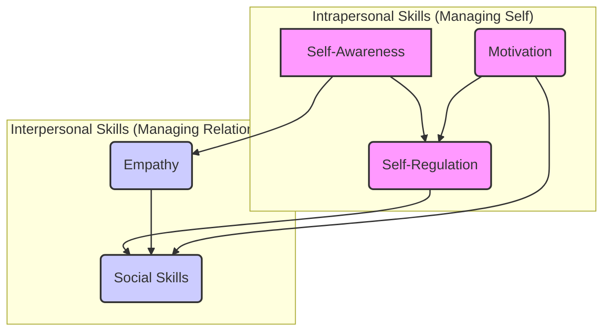
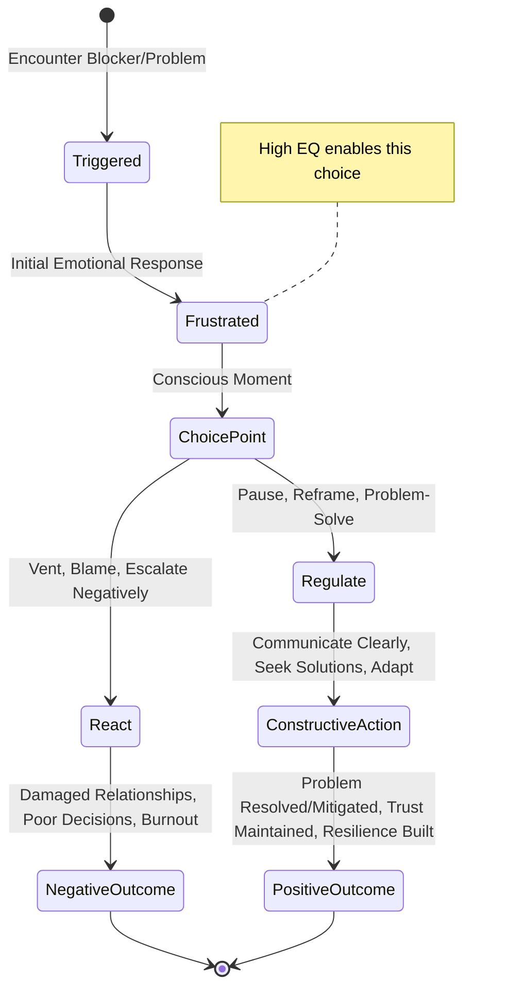
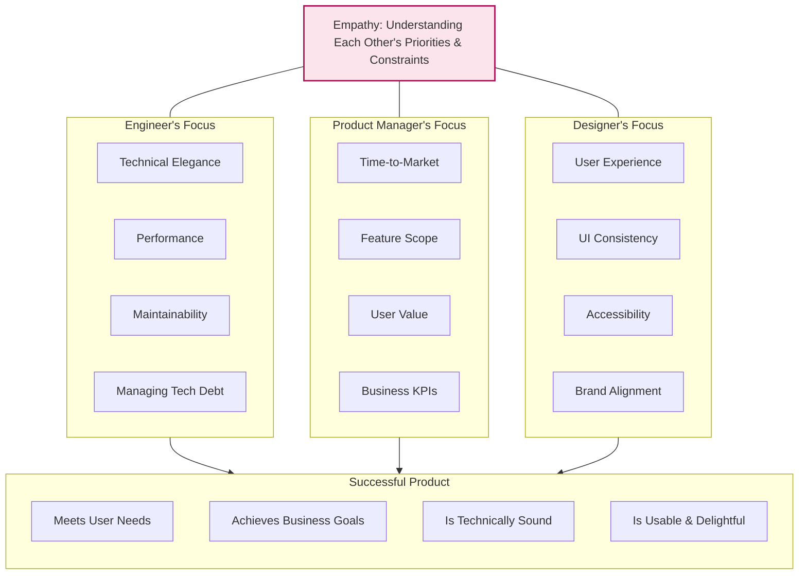

# Chapter 2: Emotional Intelligence (EQ) in the Tech Trenches

## Introduction: Beyond Algorithms – The Human Operating System

Welcome to the "Tech Trenches." It's a landscape often defined by logic, precision, and complex systems. As engineers, we excel at dissecting problems, crafting elegant solutions, and optimizing performance. Yet, the most intricate and often unpredictable system we navigate daily isn't written in Python, Java, or Go – it's the human system. The interactions, collaborations, frustrations, and triumphs within our teams and across the organization are governed by an equally complex 'operating system': **Emotional Intelligence (EQ)**.

For a Mid-Level engineer, technical skill combined with basic teamwork might suffice. But for a Senior Software Engineer, the expectations transcend individual contribution. You are expected to lead, influence, mentor, navigate ambiguity, and resolve conflict – tasks deeply rooted in understanding and managing emotions, both your own and others'. High EQ isn't a 'nice-to-have'; it's a force multiplier for your technical expertise. It transforms technical proficiency into tangible impact, effective leadership, and sustainable career growth. It's the critical differentiator that allows you to not just survive, but _thrive_ in the demanding environment of senior engineering.

This chapter delves into the core components of EQ and provides practical strategies for applying them amidst the daily challenges of software development – the code reviews, the production incidents, the design debates, the stakeholder negotiations. Consider this your foundational guide to mastering the human element of engineering leadership.

## The Components of EQ: Deconstructing the Engineer's Inner Toolkit

Emotional Intelligence is often discussed as a single concept, but it's more accurately understood as a collection of interrelated skills. Building on the influential work of Daniel Goleman and others, we can break EQ down into five core components, each vital for senior engineering effectiveness:



- **Diagram Explanation:** This diagram illustrates the five core components of EQ, grouped into Intrapersonal (self-management) and Interpersonal (relationship management) skills. Arrows suggest foundational relationships; for instance, Self-Awareness is crucial for both Self-Regulation and Empathy. Motivation fuels Self-Regulation and effective Social Skills.

Let's explore each component in the context of senior engineering:

### 1. Self-Awareness: Knowing Your Internal State

- **Definition:** The ability to recognize and understand your own emotions, moods, drives, strengths, weaknesses, values, and goals, as well as their impact on others.
- **In the Trenches:**
  - **Recognizing Bias:** Identifying your preference for a specific technology or architectural pattern and understanding how that bias might affect your evaluation of alternatives proposed by others.
  - **Understanding Triggers:** Knowing that tight deadlines or vague requirements cause you stress, allowing you to proactively manage your response.
  - **Accurate Self-Assessment:** Honestly evaluating your proficiency in a new framework or your effectiveness in a recent technical debate.
  - **Impact Awareness:** Realizing that your critical tone in a code review, even if technically accurate, might discourage a junior engineer.
- **Why It's Crucial for Seniors:** It's the foundation. Without knowing _yourself_, you cannot effectively manage yourself or understand/influence others. It prevents blind spots from derailing your judgment and interactions.

### 2. Self-Regulation: Managing Your Internal State

- **Definition:** The ability to control or redirect disruptive impulses and moods, suspend judgment, think before acting, and manage your own emotional state effectively.
- **In the Trenches:**
  - **Handling Pressure:** Staying calm and methodical during a production outage instead of panicking or blaming.
  - **Managing Disagreement:** Responding thoughtfully to technical criticism rather than becoming defensive.
  - **Controlling Impulses:** Resisting the urge to immediately dismiss an idea that challenges your own, instead taking time to consider its merits.
  - **Adaptability:** Adjusting your approach when requirements change unexpectedly, rather than stubbornly sticking to the original plan.
- **Why It's Crucial for Seniors:** You set the emotional tone. Your ability to remain composed under pressure influences the entire team. It enables rational decision-making when stakes are high and prevents emotional reactions from damaging relationships or derailing projects.

### 3. Motivation: Driving Towards Goals with Resilience

- **Definition:** A passion for work that goes beyond money or status; a propensity to pursue goals with energy, persistence, and optimism, even in the face of setbacks. This is primarily _intrinsic_ motivation.
- **In the Trenches:**
  - **Perseverance:** Pushing through complex debugging sessions or long refactoring efforts without giving up.
  - **Initiative:** Proactively identifying areas for improvement (technical debt, process inefficiencies) and driving initiatives to address them.
  - **Optimism:** Maintaining a positive outlook when facing technical hurdles or project delays, inspiring confidence in the team.
  - **Commitment:** Seeing complex projects through to completion, taking ownership of the outcome.
- **Why It's Crucial for Seniors:** Senior roles often involve long-term, ambiguous, or challenging projects requiring sustained effort. Your intrinsic drive inspires and energizes the team, fostering a culture of commitment and resilience.

### 4. Empathy: Understanding Others' Perspectives

- **Definition:** The ability to understand the emotional makeup of other people; skill in treating people according to their emotional reactions. It involves understanding others' perspectives, needs, and concerns.
- **In the Trenches:**
  - **User-Centricity:** Truly understanding the user's pain points and designing solutions that meet their needs, not just fulfilling technical requirements.
  - **Mentoring:** Recognizing a junior engineer's struggles and providing support and guidance tailored to their specific challenges and learning style.
  - **Cross-Functional Collaboration:** Appreciating the priorities and constraints of Product Managers, Designers, or QA (e.g., understanding why a seemingly "minor" UI tweak is critical for Design).
  - **Reading Between the Lines:** Sensing hesitation or unspoken concerns from team members during discussions.
- **Why It's Crucial for Seniors:** Empathy builds trust, facilitates collaboration, enables effective mentorship, and leads to better product outcomes. It allows you to connect with and influence diverse groups of people.

### 5. Social Skills: Managing Relationships Effectively

- **Definition:** Proficiency in managing relationships and building networks; an ability to find common ground, build rapport, influence, persuade, lead change, and resolve conflicts. This component leverages the previous four.
- **In the Trenches:**
  - **Influence:** Persuading the team or management to adopt a new technology or architectural approach based on its merits and alignment with business goals.
  - **Collaboration:** Facilitating productive technical discussions, ensuring all voices are heard, and driving towards consensus.
  - **Conflict Resolution:** Mediating disagreements between team members constructively.
  - **Communication:** Clearly articulating complex technical ideas to different audiences (technical and non-technical).
  - **Mentorship & Leadership:** Inspiring and guiding team members, building strong team cohesion.
- **Why It's Crucial for Seniors:** This is where EQ translates into visible leadership and impact. Strong social skills allow you to leverage your technical expertise and the collective intelligence of the team to achieve significant outcomes.

---

## Reading the Room: Understanding Team Dynamics and Unspoken Cues

Being technically brilliant in isolation is insufficient. Senior engineers operate within a complex web of human interactions. "Reading the room" refers to the ability to perceive and interpret the emotional atmosphere, underlying dynamics, and non-verbal cues within a group setting – whether it's a physical meeting room, a video conference, or even a Slack channel.

**Why It Matters:**

- **Avoid Misunderstandings:** Catching subtle cues can prevent misinterpretations of tone or intent.
- **Tailor Communication:** Adjusting your message delivery based on the audience's apparent reception (e.g., noticing confusion and simplifying an explanation).
- **Gauge Consensus/Dissent:** Identifying whether silence means agreement, confusion, or unspoken disagreement.
- **Identify Hidden Concerns:** Noticing hesitation or tension that might indicate underlying technical risks or process issues.
- **Build Trust:** Showing you're attentive to others' reactions makes them feel heard and understood.

**Techniques for Reading the Room (Physical and Virtual):**

1.  **Observe Non-Verbal Cues:**
    - **In-Person:** Body language (posture, arms crossed, leaning in/out), facial expressions (furrowed brows, smiles, eye rolls), eye contact (engagement, avoidance).
    - **Virtual:** Facial expressions (magnified on screen), tone of voice (hesitation, excitement, flatness), participation patterns (who speaks, who's silent, interruptions), background activity (distraction). Even chat messages or emoji reactions provide data.
2.  **Listen Actively (Beyond Words):**
    - **Tone and Pace:** Is someone speaking quickly and excitedly, slowly and deliberately, or with a frustrated edge?
    - **Word Choice:** Are people using collaborative language ("we," "us") or divisive language ("they," "you")? Are technical terms being used precisely or vaguely?
    - **What _Isn't_ Said:** Notice topics being avoided, questions left unanswered, or sudden silences after a particular point is made. Who _isn't_ speaking up that you'd expect to?
3.  **Understand Baseline Behavior:** Know your team members' typical communication styles. A normally quiet person speaking up carries more weight than a normally talkative person doing so. A deviation from the baseline is often significant.
4.  **Track Participation Patterns:** Who initiates topics? Who responds? Who builds on others' ideas? Who consistently disagrees? Are there dominant voices? Are quieter members being overshadowed?
5.  **Consider the Context:** What's the history of this topic? Are there known tensions between certain individuals or teams? What are the external pressures (deadlines, business goals)?
6.  **Test Your Hypotheses (Carefully):** If you sense confusion or disagreement, gently probe: "It seems like there might be different perspectives on the performance implications. Could someone elaborate on the potential concerns?" or "I noticed a few people went quiet after the deployment strategy was mentioned – any thoughts or questions there?"

```mermaid
graph LR
    A[Observe Cues (Verbal/Non-Verbal)] --> B{Interpret Meaning};
    B --> C{Form Hypothesis};
    C --> D[Verify/Probe (Ask Questions)];
    D --> E{Adjust Approach};
    E --> A;  // Continuous Loop

    style A fill:#e6f0ff,stroke:#333,stroke-width:1px
    style B fill:#fff0e6,stroke:#333,stroke-width:1px
    style C fill:#fff0e6,stroke:#333,stroke-width:1px
    style D fill:#e6ffe6,stroke:#333,stroke-width:1px
    style E fill:#e6ffe6,stroke:#333,stroke-width:1px
```

- **Diagram Explanation:** This depicts the iterative process of reading the room: Observing cues, interpreting their potential meaning, forming a hypothesis about the group's state, gently verifying that hypothesis, and adjusting your communication or facilitation strategy accordingly. It's a continuous feedback loop.

Mastering this skill allows you to navigate meetings and discussions more effectively, ensuring alignment, surfacing risks, and fostering a more inclusive and productive environment.

---

## Managing Frustration: Dealing with Roadblocks, Delays, and Difficult Problems

Software engineering is inherently challenging. You _will_ encounter frustrating situations:

- intractable bugs
- unexpected production failures
- unforeseen technical debt discovered mid-project
- blockers from other teams or dependencies
- shifting requirements
- ambiguous specifications
- seemingly irrational technical choices made years ago

Frustration is a natural emotional response. However, _how_ a senior engineer manages and expresses that frustration significantly impacts team morale, problem-solving effectiveness, and personal reputation. Unchecked frustration can lead to blaming, negativity, rash decisions, and burnout.

**Strategies for Managing Frustration:**

1.  **Recognize Your Triggers (Self-Awareness):** Know what situations reliably cause you frustration. Is it vague requirements? Last-minute changes? Dealing with flaky tests? Awareness is the first step to management.
2.  **Pause and Regulate (Self-Regulation):** When you feel frustration rising:
    - **Take a Breath:** Simple, yet effective in creating a momentary pause.
    - **Step Away:** If possible, take a short break – walk away from the keyboard, get some water. This interrupts the emotional spiral.
    - **Label the Emotion:** Acknowledge internally, "I'm feeling frustrated right now because..." This helps regain cognitive control.
3.  **Reframe the Situation:** Shift your perspective from threat/annoyance to challenge/problem-to-be-solved.
    - Instead of: "This legacy code is impossible!"
    - Try: "Okay, this is complex. What's the smallest next step I can take to understand it or mitigate the risk?"
    - Instead of: "Why didn't QA catch this?!"
    - Try: "A bug slipped through. Let's focus on fixing it, then analyze how to improve our process."
4.  **Focus on Control:** Identify what aspects of the situation you _can_ influence versus those you can't. Expend energy on the former. You can't change the past decision, but you _can_ devise a migration plan. You can't force another team to speed up, but you _can_ clearly communicate the impact of the delay and explore workarounds.
5.  **Break Down the Problem:** Frustration often stems from feeling overwhelmed. Decompose large, frustrating problems into smaller, manageable steps. Celebrate small wins along the way.
6.  **Seek Perspective:**
    - **Talk it Out:** Discuss the problem with a trusted peer. Explaining the issue can clarify your thinking, and they might offer a fresh perspective or solution. (Rubber duck debugging for emotional states!)
    - **Consider the Bigger Picture:** How critical is this issue in the grand scheme of the project or business goals? Is your level of frustration proportionate?
7.  **Communicate Constructively:** When discussing blockers or problems:
    - **Focus on Facts and Impact:** "The deployment is blocked because service X isn't responding. This impacts our ability to release the feature by Friday."
    - **Avoid Blame:** Frame issues around the problem, not the people.
    - **Propose Solutions/Next Steps:** "Could we explore using a mock of service X temporarily?" or "What information do you need from us to help resolve this?"



- **Diagram Explanation:** This state diagram illustrates the critical choice point when frustration arises. A low-EQ reaction leads down a negative path. A high-EQ response involves self-regulation, leading to constructive actions and better outcomes. Senior engineers strive to consciously choose the regulation path.

Managing frustration is not about suppressing emotions, but about channeling them productively. It preserves your energy, maintains positive team dynamics, and ultimately leads to better technical solutions.

---

## Building Rapport and Trust: The Currency of Influence

In senior engineering roles, your ability to influence decisions, lead initiatives, and mentor effectively hinges on the **rapport and trust** you build with others. Technical credibility is necessary, but insufficient. People are more likely to listen to, collaborate with, and follow those they trust and feel connected to.

**Why Rapport and Trust are Vital:**

- **Influence:** People are more receptive to ideas from those they trust.
- **Collaboration:** Trust lubricates teamwork, making discussions more open and honest.
- **Mentorship:** Mentees are more receptive to feedback and guidance from trusted mentors.
- **Psychological Safety:** Trust is foundational for creating an environment where team members feel safe to take risks, ask questions, and admit mistakes.
- **Information Flow:** People share information more freely (including crucial warnings or 'bad news') when trust exists.

**Building Rapport and Trust Across Different Groups:**

- **With Peers:**
  - **Reliability:** Do what you say you will do. Be dependable.
  - **Competence & Humility:** Demonstrate your expertise, but also readily admit when you don't know something or made a mistake.
  - **Share Knowledge:** Be generous with your insights and help others solve problems. Avoid hoarding information.
  - **Give Credit:** Acknowledge and appreciate the contributions of others.
  - **Constructive Disagreement:** Challenge ideas respectfully, focusing on the technical merits, not the person.
- **With Junior Engineers:**
  - **Approachability:** Make them feel comfortable asking questions, even "dumb" ones.
  - **Patience:** Understand they are still learning and provide guidance without condescension.
  - **Invest Time:** Show genuine interest in their growth and development (code reviews, pairing, informal chats).
  - **Empowerment:** Delegate tasks appropriately and trust them to execute, providing support as needed.
  - **Advocacy:** Stand up for them and highlight their successes.
- **With Leadership (Managers, Directors, Skip-Levels):**
  - **Transparency:** Provide clear, concise updates on progress, risks, and challenges. Avoid surprises.
  - **Solution-Oriented:** When raising problems, also propose potential solutions or mitigation strategies.
  - **Understand Business Context:** Show you grasp how your technical work connects to broader business goals.
  - **Professionalism:** Be prepared for meetings, communicate clearly, and respect their time.
  - **Deliver Results:** Consistently delivering high-quality work builds fundamental trust in your capabilities.

**Universal Actions for Building Rapport and Trust:**

- **Active Listening:** Pay full attention when others speak. Show you've heard and understood before responding.
- **Consistency:** Behave predictably and ethically over time.
- **Authenticity:** Be genuine. People can often sense insincerity.
- **Show Respect:** Treat everyone, regardless of role or title, with courtesy.
- **Find Common Ground:** Connect on shared interests (technical or non-technical) where appropriate. Small talk can build bridges.
- **Offer Help:** Proactively assist others when you see an opportunity.

```mermaid
graph LR
    A[Consistent Reliable Actions (Competence, Honesty, Helpfulness)] --> B(Trust Builds);
    B --> C{Effective Collaboration & Influence};
    C --> D(Positive Outcomes (Project Success, Team Health));
    D --> E[Reinforced Reputation & Opportunities];
    E --> A; // Loop reinforces itself

    style A fill:#d5f5e3,stroke:#1e8449,stroke-width:1.5px
    style B fill:#aed6f1,stroke:#2471a3,stroke-width:1.5px
    style C fill:#aed6f1,stroke:#2471a3,stroke-width:1.5px
    style D fill:#f9e79f,stroke:#b7950b,stroke-width:1.5px
    style E fill:#f9e79f,stroke:#b7950b,stroke-width:1.5px
```

- **Diagram Explanation:** This illustrates the positive feedback loop of trust. Consistent positive actions build trust, enabling better collaboration and influence, leading to positive results, which further enhance reputation and opportunities, reinforcing the motivation for trustworthy actions.

Trust is built incrementally through consistent actions and behaviors. It's fragile and can be broken quickly. As a senior engineer, consciously cultivating trust is an ongoing investment that pays significant dividends.

---

## Empathy in Action: Understanding Diverse Perspectives

Empathy, in a professional context, is primarily about **cognitive empathy**: the ability to understand someone else's perspective, thought process, and feelings without necessarily sharing those feelings (affective empathy). For senior engineers, this means stepping outside your own technical mindset to grasp the viewpoints of others – users, product managers, designers, junior developers, operations, management, etc.

**Why Empathy is a Senior Engineering Superpower:**

- **Better Products:** Understanding user needs and pain points leads to more effective and user-friendly solutions.
- **Smoother Collaboration:** Reduces friction with non-technical roles by appreciating their goals and constraints (e.g., why Product needs a feature by a certain date, even if it means accruing some tech debt).
- **Effective Mentorship:** Tailoring guidance by understanding a mentee's specific struggles and perspective.
- **Conflict Resolution:** Finding common ground by seeing the validity in differing viewpoints.
- **Clearer Communication:** Explaining technical concepts in a way that resonates with the audience's background and concerns.

**Practicing Empathy in Daily Engineering Work:**

1.  **User Perspective:**
    - **Ask "Why?":** Why does the user need this feature? What problem does it solve for _them_?
    - **Engage with User Feedback:** Read support tickets, participate in user interviews (if possible), or talk to support teams.
    - **Use the Product:** Experience the software as a user would.
2.  **Cross-Functional Perspective (Product, Design, QA, Ops, etc.):**
    - **Understand Their Goals:** What are Product's KPIs? What are Design's principles? What are QA's biggest concerns? What keeps Ops up at night?
    - **Learn Their Language:** Understand key terms and concepts from their domain (e.g., market fit, usability heuristics, SLOs/SLIs).
    - **Ask Clarifying Questions:** "Help me understand the business impact of this deadline." or "What's the main usability concern with the current approach?"
    - **Acknowledge Their Constraints:** "I understand you're under pressure to launch quickly. Let's figure out how we can deliver core value safely."
3.  **Junior Developer Perspective:**
    - **Remember Your Own Journey:** Recall what it was like to be less experienced.
    - **Review Code with Patience:** Frame feedback constructively, explaining the 'why' behind suggestions.
    - **Check for Understanding:** Ensure they grasp complex concepts; don't assume knowledge.
4.  **Leadership/Management Perspective:**
    - **Understand Business Priorities:** Why are certain initiatives funded or prioritized over others?
    - **Communicate Risk and Trade-offs Clearly:** Explain the _business implications_ of technical decisions.
    - **Think Strategically:** Consider the long-term vision, not just the immediate technical task.



- **Diagram Explanation:** This diagram highlights how different roles (Engineer, Product Manager, Designer) have distinct primary focuses and priorities. Empathy acts as the bridge, enabling them to understand each other's perspectives and constraints, ultimately leading to collaboration towards the shared goal of a successful product that balances technical soundness, business needs, and user experience.

Empathy isn't about always agreeing, but about genuinely understanding. A senior engineer who actively practices empathy can navigate complex organizational dynamics, build stronger relationships, and contribute to building better technology.

---

## Scenario Analysis: Applying EQ in Common Engineering Situations

Theory is useful, but EQ skills are honed through practice and reflection. Let's analyze common scenarios senior engineers face, contrasting low-EQ and high-EQ responses.

**Scenario 1: Heated Technical Debate**

- **Situation:** During a design review for a critical new service, a disagreement erupts between two senior engineers about the choice of database technology. Voices are raised, points become personal ("That's obviously the wrong choice," "You clearly don't understand the scaling issues").
- **Low-EQ Response:** Joining the fray, doubling down on your own preferred solution, interrupting, making dismissive remarks, focusing on "winning" the argument. The meeting ends with no clear decision and strained relationships.
- **High-EQ Response (Applying Self-Regulation, Empathy, Social Skills):**
  1.  **Regulate:** Notice the rising tension (in self and others). Avoid getting drawn into the emotional aspect.
  2.  **Facilitate:** Step in calmly. "Okay, it sounds like we have strong opinions on both sides, which is good – it means we care about getting this right. Let's take a step back."
  3.  **Empathize & Clarify:** "Alice, can you summarize the core advantages you see with NoSQL here, specifically regarding the expected access patterns? Bob, can you do the same for the relational approach, focusing on data integrity concerns?" (Actively listen to both).
  4.  **Re-center on Goals:** "Let's remember the primary goals for this service are X, Y, and Z. How does each approach map to those goals and associated risks?"
  5.  **Seek Objective Data:** "Are there benchmarks or prototypes we could use to test the assumptions about scaling/integrity?"
  6.  **Guide Towards Decision/Next Steps:** "Perhaps we need more data before deciding. Can we agree on an action item to investigate X and reconvene tomorrow?" or "Given the trade-offs discussed, and prioritizing goal X, it seems approach A might be slightly better aligned, acknowledging the mitigation needed for risk B. Can we provisionally agree and document the reasoning?"
- **Outcome:** Tension is defused, both perspectives are heard and validated, the discussion is refocused on objective criteria and goals, and a path towards a reasoned decision (or necessary investigation) is established. Trust might even increase due to constructive handling.

**Scenario 2: Receiving Critical Code Review Feedback**

- **Situation:** You receive feedback on a significant piece of code you authored. A respected peer points out several potential architectural flaws and suggests a substantially different approach, implying significant rework.
- **Low-EQ Response:** Feeling defensive and attacked. Immediately replying to justify your choices, nitpicking the reviewer's comments, dismissing the feedback ("They just don't get it," "It works fine"), or letting it silently damage your confidence and relationship with the reviewer.
- **High-EQ Response (Applying Self-Awareness, Self-Regulation, Empathy):**
  1.  **Awareness & Regulation:** Recognize the initial sting or defensive reaction. Pause before responding. Acknowledge the feeling ("Okay, this feedback is tough to hear"). Separate the feedback from your self-worth.
  2.  **Assume Positive Intent:** Assume the reviewer aims to improve the code/system, not to criticize you personally.
  3.  **Seek Understanding (Empathy):** Read the feedback carefully. Try to understand the _reviewer's_ perspective and concerns. What risks are they seeing? What principles are they upholding?
  4.  **Ask Clarifying Questions:** "Thanks for the detailed feedback. Could you elaborate on your concern about [specific point]? I want to make sure I fully understand the potential issue you're highlighting."
  5.  **Evaluate Objectively:** Re-evaluate your approach in light of the feedback. Are the concerns valid? What are the trade-offs of changing vs. not changing?
  6.  **Respond Constructively:** Acknowledge the feedback ("Thanks, I appreciate you taking the time for a thorough review"). Address the points thoughtfully, either agreeing ("Good point, I'll refactor this section"), proposing alternatives ("What if we address the scaling concern by adding caching here instead of changing the core structure?"), or explaining your reasoning if you still disagree respectfully ("My thinking on using this pattern was based on X, considering constraint Y. Perhaps I didn't document that well enough?").
- **Outcome:** Feedback is used constructively, the code potentially improves, the relationship with the reviewer is maintained or strengthened, and you demonstrate maturity and a growth mindset.

**Scenario 3: Communicating a Delay to Non-Technical Stakeholders**

- **Situation:** Your team realizes a critical feature promised to Product Management will be delayed by two weeks due to unforeseen technical complexities.
- **Low-EQ Response:** Sending a brief, technical email mentioning the delay without context ("Feature X delayed 2 weeks due to issues with API integration"). Blaming other teams or technical debt. Appearing indifferent to the impact.
- **High-EQ Response (Applying Empathy, Social Skills, Self-Regulation):**
  1.  **Regulate:** Manage any personal frustration about the delay before communicating.
  2.  **Empathize:** Understand the _impact_ of the delay on Product, Marketing, Sales, etc. What plans depend on this feature? What pressure are _they_ under?
  3.  **Communicate Proactively & Clearly:** Don't wait until the deadline. Request a brief meeting or send a well-structured message.
  4.  **Structure the Communication:**
      - **State the Issue Clearly:** "I'm writing to update you on the status of Feature X. We've encountered some unexpected complexities related to [brief, non-jargony explanation, e.g., integrating with the legacy payment system], and our revised estimate shows delivery will likely be delayed by approximately two weeks, targeting [new date]."
      - **Acknowledge Impact (Empathy):** "I understand this delay impacts the planned marketing launch, and I sincerely apologize for the disruption."
      - **Explain Briefly (Transparency, No Blame):** "The challenge involves [simple explanation]. We've explored [options tried], and the team is focused on resolving this." (Avoid excessive technical detail or blaming).
      - **Outline Next Steps/Mitigation:** "We are prioritizing this work. We've [action taken, e.g., pulled in an expert, simplified a sub-component]. We will provide another update by [date]."
      - **Offer Discussion:** "I'm happy to discuss this further and answer any questions."
- **Outcome:** Stakeholders are informed promptly and transparently. While the news is bad, the delivery builds trust. Understanding the situation and seeing a clear plan reduces anxiety and allows them to adjust their own plans accordingly.

---

## Conclusion: EQ as the Senior Engineer's Operating System Upgrade

Mastering Emotional Intelligence is akin to upgrading your personal operating system. It enhances how you process information (emotional data), manage resources (your emotional energy), interact with other systems (people), and ultimately, how effectively you execute complex tasks (lead projects, influence decisions, mentor others).

The skills discussed in this chapter – Self-Awareness, Self-Regulation, Motivation, Empathy, and Social Skills – are not static traits but dynamic capabilities that can be cultivated through conscious effort, practice, and reflection. By honing your ability to read the room, manage frustration, build trust, practice empathy, and apply these skills in real-world scenarios, you move beyond being just a skilled coder to becoming a truly effective and influential Senior Software Engineer. EQ is the invisible architecture supporting the most impactful and resilient technical leaders. It's the key to navigating the complexities of the 'Tech Trenches' with grace, effectiveness, and lasting impact.
