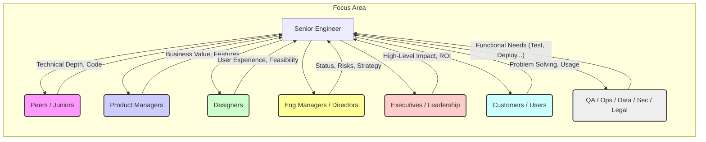
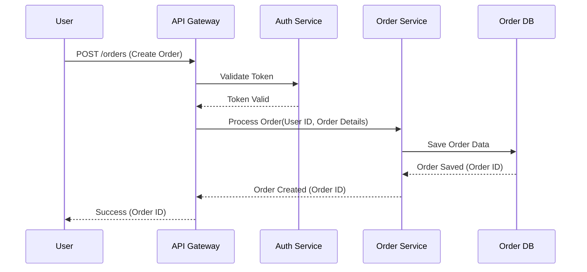

Okay, here is a very detailed and comprehensive draft for Chapter 3, designed to fit into your "bible" for Senior Software Engineers. It incorporates the requested elements, including MermaidJS diagrams where applicable.

# Chapter 3: The Articulate Engineer: Advanced Communication Strategies

> "The single biggest problem in communication is the illusion that it has taken place." - George Bernard Shaw

As engineers progress to senior levels, the nature of their work fundamentally shifts. While coding remains a core skill, the ability to _communicate_ effectively about technology, strategy, trade-offs, and impact becomes paramount. Senior engineers are no longer just implementing features; they are shaping technical direction, influencing stakeholders, mentoring others, and ensuring alignment across complex systems and teams. Miscommunication at this level doesn't just lead to minor bugs; it can derail projects, erode trust, waste significant resources, and hinder innovation.

This chapter moves beyond basic communication principles. We delve into the _advanced_ strategies senior engineers must master to navigate the complexities of their roles. Being "articulate" isn't just about using big words; it's about achieving _clarity_, fostering _understanding_, driving _action_, and building _strong relationships_ through deliberate, tailored communication in various contexts. It's the bridge between brilliant technical insight and tangible, valuable outcomes.

## Tailoring Your Message: Communicating Effectively with Diverse Audiences

A senior engineer acts as a communication hub, translating information between vastly different groups. A one-size-fits-all approach is doomed to fail. The key lies in understanding your audience's perspective, goals, and knowledge level, then adapting your message accordingly.

**Core Principle: Audience Empathy**

Before communicating, ask yourself:

- **Who** am I talking to? (Role, background, technical expertise)
- **What** do they need to know? (Level of detail, key takeaways)
- **Why** do they care? (Their goals, concerns, what's in it for them)
- **What** is the desired outcome? (Inform, persuade, decide, align, gather feedback)
- **What** is the best medium/channel? (Meeting, email, Slack, doc, presentation)

**Common Audiences and Tailoring Strategies:**

1.  **Fellow Engineers (Peers, Juniors):**

    - **Focus:** Technical depth, implementation details, code specifics, algorithms, patterns, potential edge cases, maintainability.
    - **Language:** Precise technical jargon is acceptable and often necessary. Assume a shared foundational knowledge but be prepared to explain specific context.
    - **Goal:** Collaboration, problem-solving, knowledge sharing, code quality, mentorship.
    - **Pitfall:** Assuming too much shared context; not explaining the "why" behind a decision.

2.  **Product Managers / Owners:**

    - **Focus:** User impact, business value, feature capabilities, feasibility, timelines, effort estimates, technical constraints, risks affecting scope or delivery.
    - **Language:** Translate technical complexity into user/business outcomes. Avoid deep implementation jargon unless necessary to explain a trade-off. Use terms like "user experience," "performance impact," "scalability limits."
    - **Goal:** Alignment on requirements, prioritization, understanding technical possibilities and limitations.
    - **Pitfall:** Getting bogged down in technical minutiae; not clearly linking technical choices to product goals.

3.  **Designers (UX/UI):**

    - **Focus:** User interaction, visual consistency, feasibility of design elements, technical limitations impacting UI/UX, performance implications of design choices, accessibility.
    - **Language:** Bridge the gap between visual/interaction concepts and technical implementation. Use terms related to components, states, responsiveness, and data flow where relevant.
    - **Goal:** Collaboration on user-facing aspects, ensuring technical feasibility, finding optimal solutions balancing design and engineering.
    - **Pitfall:** Saying "no" without explaining the technical reasons or offering alternatives; not understanding the user-centric perspective.

4.  **Engineering Managers / Directors:**

    - **Focus:** Project status, risks, blockers, team velocity, technical debt impact, strategic technical decisions, resource needs, alignment with broader technical strategy.
    - **Language:** Balance technical detail with strategic impact. Be concise and outcome-oriented. Highlight progress, challenges, and proposed solutions.
    - **Goal:** Visibility, resource allocation, risk management, strategic alignment, performance assessment.
    - **Pitfall:** Reporting raw data without context or analysis; failing to escalate critical issues appropriately.

5.  **Executives / Senior Leadership (CTO, VP Eng, CEO):**

    - **Focus:** High-level business impact, strategic alignment, major risks, competitive advantage, ROI of technical initiatives, innovation, overall system health/scalability.
    - **Language:** Minimal technical jargon. Focus entirely on business implications, strategy, and high-level outcomes. Use analogies and clear, concise summaries. Be prepared for "Why does this matter to the business?"
    - **Goal:** Secure buy-in, demonstrate value, inform strategic decision-making, build confidence.
    - **Pitfall:** Too much technical detail; failing to connect the dots to the company's bottom line or strategic objectives.

6.  **Customers / End-Users (e.g., Support Escalations, Demos):**

    - **Focus:** How the system solves their problem, user-facing functionality, impact of issues, workarounds, resolution timelines (if applicable).
    - **Language:** Simple, non-technical language. Focus on their experience and needs. Show empathy.
    - **Goal:** Build trust, resolve issues, gather feedback, demonstrate product value.
    - **Pitfall:** Using internal jargon; over-promising on fixes; being defensive.

7.  **Other Stakeholders (QA, Ops, Data Science, Security, Legal):**
    - **Focus:** Specific needs relevant to their function (testability, deployability, monitoring, data requirements, security implications, compliance).
    - **Language:** Tailor to their specific domain expertise, but always clarify assumptions.
    - **Goal:** Collaboration, ensure system robustness, meet cross-functional requirements.
    - **Pitfall:** Ignoring their requirements until late in the process; not understanding their constraints.

**Mermaid Diagram: Audience Communication Radar**



_This diagram illustrates the senior engineer as a central node, adapting communication focus based on the distinct needs and perspectives of different stakeholder groups._

## Clarity in Complexity: Explaining Intricate Technical Concepts Simply

Senior engineers often work on the most complex parts of a system. A critical skill is the ability to distill this complexity into understandable explanations for others, regardless of their technical background. This isn't about "dumbing down"; it's about precision and finding the right level of abstraction.

**Techniques for Achieving Clarity:**

1.  **Know Your Core Message:** What is the single most important thing the audience needs to understand? Start there.
2.  **Use Abstraction Layers:** Hide unnecessary details. Focus on the inputs, outputs, and purpose of a component or system, rather than its internal workings, unless specifically asked. Think in terms of APIs and contracts.
3.  **Leverage Analogies and Metaphors:** Relate complex technical concepts to familiar, real-world examples.
    - _Example:_ Explaining a cache: "It's like keeping frequently used tools on your workbench instead of walking back to the main toolbox every time. It's faster, but the workbench has limited space and might occasionally hold an older version of a tool."
    - _Caution:_ Ensure the analogy is accurate enough and doesn't introduce misconceptions. Tailor it to the audience's likely understanding.
4.  **Employ Visual Aids:** Diagrams, whiteboards (physical or virtual), and simple flowcharts can drastically improve understanding. "Show, don't just tell." (See Mermaid examples below).
5.  **Structure Your Explanation:**
    - **Top-Down:** Start with the high-level goal or concept, then progressively drill down into details as needed.
    - **Problem/Solution:** Clearly state the problem being solved before explaining the technical solution.
    - **Chronological/Sequential:** Explain processes or data flows step-by-step.
6.  **Define Jargon (or Avoid It):** If technical terms are necessary, define them clearly upon first use. If communicating with a non-technical audience, actively substitute jargon with simpler language.
7.  **Focus on the "Why":** Explain the _purpose_ and _benefit_ of a technical approach, not just the _how_. Why was this design chosen? What problem does it solve better than alternatives?
8.  **Tell a Story:** Frame the technical concept within a narrative. How does data flow? What journey does a user request take?
9.  **Check for Understanding:** Pause periodically. Ask clarifying questions like, "Does that make sense?" or "What questions do you have so far?" Observe body language (or virtual cues) for signs of confusion. Be prepared to re-explain using a different approach.

**Mermaid Diagram: Explaining a Microservice Interaction**



_This sequence diagram simplifies a potentially complex interaction, showing the flow of requests between different services without needing to detail the internal logic of each service. It's effective for explaining system architecture._

## Mastering Written Communication

In distributed teams and asynchronous workflows, written communication becomes a primary vehicle for collaboration, documentation, and decision-making. Poorly written documents, emails, or messages waste time, create confusion, and project unprofessionalism.

**Key Principles:**

- **Clarity & Conciseness:** Get to the point. Use simple language. Avoid ambiguity. Shorter is often better, provided clarity isn't sacrificed.
- **Structure:** Use headings, bullet points, numbered lists, and bold text to organize information and make it scannable.
- **Audience Awareness:** Tailor the tone, level of detail, and context to the intended readers (as discussed earlier).
- **Purposefulness:** Ensure every piece of writing has a clear objective (e.g., inform, request action, propose solution, document decision).
- **Proofreading:** Typos and grammatical errors undermine credibility. Reread before sending/publishing, or use spell/grammar check tools. For critical documents, ask a peer to review.

**Specific Formats:**

1.  **Effective Design Documents and RFCs (Requests for Comments):**

    - **Purpose:** To propose a technical solution, solicit feedback, achieve alignment, and serve as a record of the decision and rationale.
    - **Key Sections:**
      - **Problem/Motivation:** Clearly define the problem being solved and _why_ it needs solving now. Include context and background.
      - **Goals:** What specific, measurable outcomes will this design achieve?
      - **Non-Goals:** What is explicitly _out of scope_ for this proposal? (Helps manage expectations).
      - **Proposed Solution:** Describe the technical approach in sufficient detail. Use diagrams. Explain _how_ it meets the goals.
      - **Alternatives Considered:** Briefly describe other approaches explored and _why_ they were rejected. (Shows due diligence).
      - **Open Questions / Unresolved Issues:** Areas needing further discussion or investigation.
      - **Impacts:** Consider impacts on other systems, teams, performance, security, operations, cost, etc.
      - **Rollout Plan / Migration Strategy:** How will this be implemented and deployed safely?
    - **Process:** Share early, actively solicit feedback, respond thoughtfully to comments, update the document based on discussion, clearly state the final decision.

2.  **Clear Code Reviews and Comments:** (See also Chapter 6)

    - **Focus on Communication:** Code reviews are a dialogue. Comments should be constructive, specific, and kind.
    - **Explain the "Why":** Don't just say "Change this." Explain _why_ the change is needed (e.g., "This approach might lead to N+1 queries. Consider fetching data in bulk here...").
    - **Be Actionable:** Suggestions should be clear and achievable.
    - **Use Standardized Language (Optional):** Prefixes like `[Nit]` (nitpick), `[Question]`, `[Suggestion]` can help clarify intent.
    - **Code Comments (Inline):** Explain the _why_, not the _what_. Comment complex logic, business rules, or workarounds. Keep comments up-to-date.

3.  **Impactful Emails, Slack Messages, and Reports:**

    - **Subject Lines/Channel Topics:** Make them informative and searchable. (e.g., "RFC Feedback Request: New Authentication Flow" not "Doc").
    - **Conciseness:** Respect others' time. Put the key message or request upfront. Use lists for clarity.
    - **Context:** Provide enough background, especially in asynchronous communication (Slack, Email). Link to relevant documents or previous discussions.
    - **Clear Call to Action:** If action is needed, state clearly _who_ needs to do _what_ by _when_.
    - **Tone:** Be professional and respectful. Be mindful that written tone can be easily misinterpreted (especially in Slack). Use emojis judiciously to convey tone if appropriate for your team culture.
    - **Channel Choice:** Use the right tool. Urgent? Maybe Slack/call. Formal proposal? Email/Doc. Team-wide announcement? Appropriate Slack channel/Email list.

4.  **Concise Status Updates:**
    - **Focus:** Progress against goals, key accomplishments, current/upcoming blockers, next steps.
    - **Audience:** Tailor detail level to the audience (e.g., daily stand-up vs. weekly stakeholder report).
    - **Format:** Often bullet points. Be specific but brief. Quantify progress where possible.
    - **Example (Stand-up):** "Yesterday: Completed backend API for feature X, addressed PR feedback. Today: Starting integration tests, need input from Jane on analytics schema. Blockers: None."

## Verbal Communication Mastery

While written communication provides a record, verbal communication (meetings, presentations, one-on-ones) is crucial for dynamic discussion, immediate feedback, building rapport, and influencing in real-time.

**Key Skills:**

1.  **Active Listening: The Most Underrated Skill**

    - **Definition:** Fully concentrating on what is being said rather than just passively 'hearing' the message. It involves understanding the content, intent, and emotion behind the words.
    - **Techniques:**
      - **Pay Attention:** Minimize distractions (close irrelevant tabs, put phone away). Maintain eye contact (in person or towards the camera).
      - **Show You're Listening:** Use verbal and non-verbal cues (nodding, "uh-huh," leaning slightly forward).
      - **Provide Feedback (Paraphrase/Summarize):** "So, if I understand correctly, you're saying that..." or "Let me make sure I've got this: the main concern is..." This confirms understanding and validates the speaker.
      - **Ask Clarifying Questions:** "Could you elaborate on that point?" or "What did you mean when you said...?"
      - **Defer Judgment:** Avoid interrupting with counterarguments before the speaker has finished. Hear them out fully.
      - **Respond Appropriately:** Be thoughtful in your responses, acknowledging what was said.
    - **Benefits:** Builds trust, reduces misunderstandings, gathers better information, encourages collaboration, de-escalates conflict.

    **Mermaid Diagram: Active Listening Loop**

    ```mermaid
    graph LR
        A[Speaker Shares] --> B(Listen Attentively);
        B --> C{Understand Content & Intent};
        C --> D[Paraphrase / Summarize];
        D --> E{Confirm Understanding?};
        E -- Yes --> F[Ask Clarifying Questions];
        E -- No --> D;
        F --> G[Respond Thoughtfully];
        G --> A;
        C --> F;
    ```

2.  **Asking Powerful Questions:**

    - **Purpose:** To uncover information, stimulate thinking, challenge assumptions, clarify ambiguity, and guide discussions productively.
    - **Types of Powerful Questions:**
      - **Open-ended:** Cannot be answered with "yes" or "no." (e.g., "What are the potential risks of this approach?", "How might we simplify this design?")
      - **Probing:** Dig deeper into a topic. (e.g., "Why do you think that happened?", "What evidence supports that assumption?", "What if we considered...?")
      - **Clarifying:** Ensure shared understanding. (e.g., "When you say 'performance,' what specific metrics are you concerned about?", "Can you give me an example?")
      - **Hypothetical:** Explore possibilities. (e.g., "What would need to be true for option B to be viable?", "Imagine this fails; what would be the fallback?")
      - **Reflective:** Encourage deeper thought. (e.g., "What was the most challenging aspect of that?", "What did we learn from this?")
    - **Technique:** Frame questions neutrally. Listen actively to the answers. Use questions to guide, not interrogate.

3.  **Articulating Trade-offs and Risks Clearly:**

    - **Senior Responsibility:** A core senior task is identifying, evaluating, and communicating technical trade-offs (e.g., speed vs. reliability, cost vs. features, short-term fix vs. long-term solution) and associated risks.
    - **Strategy:**
      - **Be Objective:** Present options factually. Use data where possible.
      - **Clearly State Options:** Describe each choice and its consequences (pros and cons).
      - **Quantify Where Possible:** Instead of "slower," say "adds ~200ms latency." Instead of "riskier," say "higher chance of data inconsistency during deployment."
      - **Link to Business/Product Impact:** Explain _how_ the trade-off affects users, timelines, budget, or strategic goals.
      - **State Your Recommendation (If Applicable):** Based on the analysis, which option do you recommend and why?
      - **Acknowledge Uncertainty:** Be honest about unknown factors or risks that are hard to quantify.

4.  **Presenting Technical Ideas Persuasively:**
    - **Goal:** To gain buy-in, inform decisions, or educate others.
    - **Preparation:**
      - **Know Your Audience:** Tailor content and depth (see first section).
      - **Define Your Objective:** What do you want the audience to think, feel, or do after your presentation?
      - **Structure Logically:** Introduction (hook, agenda), Problem/Context, Proposed Solution/Idea, Benefits/Evidence, Trade-offs/Risks, Call to Action/Next Steps, Q&A.
      - **Create Clear Visuals:** Use diagrams, charts, concise text. Avoid walls of text. One key idea per slide.
      - **Practice:** Rehearse timing, flow, and key messages. Anticipate questions.
    - **Delivery:**
      - **Speak Clearly and Confidently:** Vary your tone. Avoid fillers ("um," "uh").
      - **Engage Your Audience:** Make eye contact. Use storytelling. Ask rhetorical questions.
      - **Handle Questions Gracefully:** Listen fully, clarify if needed, answer concisely. It's okay to say "I don't know, but I'll find out." Follow up afterwards.
      - **Manage Time Effectively:** Stick to the allotted time.

## Non-Verbal Communication: Presence and Impact (In-Person and Remote)

How you present yourself physically (or virtually) significantly impacts how your message is received. Non-verbal cues convey confidence, engagement, credibility, and emotion.

**In-Person Communication:**

- **Posture:** Stand or sit upright to convey confidence and alertness.
- **Eye Contact:** Make regular eye contact with individuals in the group to build connection and gauge reactions.
- **Gestures:** Use natural hand gestures to emphasize points, but avoid distracting fidgeting.
- **Facial Expressions:** Ensure your expression aligns with your message. Smile appropriately to build rapport. Show engagement.
- **Proximity:** Be aware of personal space norms.
- **Tone of Voice:** Vary pitch, pace, and volume to maintain interest and convey emotion appropriately.

**Remote Communication (Video Calls):**

- **Camera On (Generally Recommended):** Encourages engagement and allows for reading non-verbal cues (though imperfectly). Follow team norms.
- **Positioning:** Frame yourself appropriately (head and shoulders visible). Look at the camera when speaking (simulates eye contact), not just at others' faces on screen.
- **Background:** Ensure your background is professional and free from distractions. Use virtual backgrounds if needed.
- **Lighting:** Ensure your face is well-lit. Avoid backlighting (sitting with a bright window behind you).
- **Audio Quality:** Use a decent microphone/headset. Mute yourself when not speaking in larger meetings to minimize background noise.
- **Engagement Cues:** Use virtual reactions (thumbs up, raise hand), nod visibly, lean towards the camera slightly to show engagement. Be mindful of "resting face" - try to look attentive.
- **Minimize Distractions:** Close unnecessary tabs/apps. Avoid multitasking visibly.

## Templates and Checklists for Effective Communication

While genuine communication can't be fully scripted, templates and checklists provide valuable scaffolding, ensuring key elements aren't missed, especially for recurring tasks. (Refer to Appendix B for full examples).

- **Design Doc/RFC Checklist:**
  - [ ] Problem Statement Clear?
  - [ ] Goals Defined (SMART)?
  - [ ] Non-Goals Listed?
  - [ ] Proposed Solution Detailed? Diagrams included?
  - [ ] Alternatives Discussed? Rationale for rejection?
  - [ ] Impacts Assessed (Tech, Product, Ops, Sec)?
  - [ ] Open Questions Captured?
  - [ ] Rollout Plan Considered?
  - [ ] Audience Appropriate Language?
- **Meeting Agenda Template:**
  - Meeting Goal(s):
  - Attendees (Required/Optional):
  - Pre-Reading/Preparation:
  - Agenda Items (with time estimates & owner):
    - Topic 1 (Owner, XX mins)
    - Topic 2 (Owner, YY mins)
  - Desired Outcomes/Decisions Needed:
- **Code Review Feedback Checklist (Self-Check):**
  - [ ] Is the feedback constructive and kind?
  - [ ] Is it specific and actionable?
  - [ ] Does it explain the "why"?
  - [ ] Does it focus on significant issues (not just minor nits, unless specified)?
  - [ ] Does it align with team norms/style guides?
- **Presentation Prep Checklist:**
  - [ ] Objective Clear?
  - [ ] Audience Understood? Content Tailored?
  - [ ] Logical Structure? Clear Narrative?
  - [ ] Visuals Clear & Concise? (No Text Walls)
  - [ ] Key Message(s) Identifiable?
  - [ ] Practiced Timing?
  - [ ] Anticipated Questions?
  - [ ] Tech Check (Slides, Mic, Connection - for remote)?

---

Mastering articulate communication is an ongoing journey. It requires conscious effort, practice, seeking feedback, and adapting your approach based on context and audience. For a senior engineer, it's not a 'soft' skill; it's a fundamental enabler of technical leadership, influence, and impact. By honing these advanced strategies, you transition from being just a coder to being a true engineering leader who can translate technical vision into reality.
