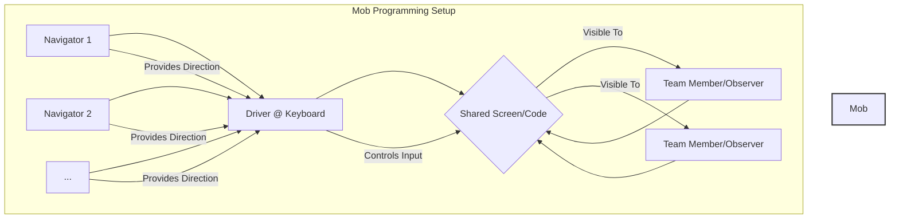
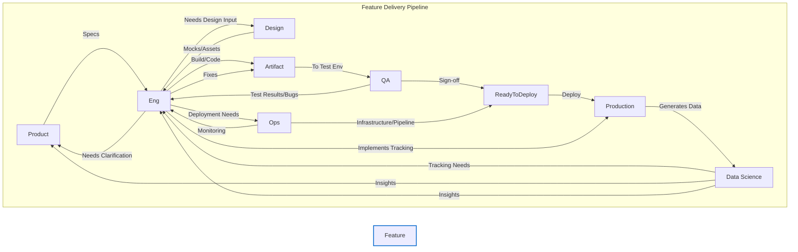

# Chapter 4: High-Impact Collaboration: Beyond Pair Programming

## Introduction: The Multiplier Effect of Senior Collaboration

As engineers progress in their careers, the nature of their contribution shifts. While individual technical prowess remains important, a Senior Software Engineer's true impact is often measured by their ability to _multiply_ the effectiveness of those around them. This chapter moves beyond the foundational collaborative practice of pair programming (though still valuable) to explore the more complex, nuanced, and scalable forms of collaboration essential at the senior level. High-impact collaboration isn't just about working _with_ others; it's about architecting _how_ work gets done together, fostering an environment where the collective intelligence of the team surpasses the sum of its individual parts, and navigating the intricate web of dependencies inherent in modern software development. Mastering these advanced collaborative techniques is fundamental to driving large initiatives, mentoring effectively, and ultimately, delivering significant business value.

---

## 4.1 Understanding Different Collaboration Models: Choosing the Right Tool for the Job

Senior engineers rarely operate within a single, fixed collaboration model. They must understand the strengths, weaknesses, and appropriate contexts for various approaches, dynamically selecting and adapting them based on the task, team composition, and project goals. Think of these models as tools in your collaboration toolbox – using the right one significantly improves efficiency and outcomes.

### 4.1.1 Pair Programming Revisited

While often introduced earlier in careers, pair programming (two engineers, one computer, one problem) remains a potent tool.

- **Strengths:** High code quality, real-time knowledge transfer, focused problem-solving, immediate feedback.
- **Best For:** Complex algorithmic problems, onboarding new members, critical bug fixes, exploring unfamiliar codebases.
- **Senior Considerations:** Focus shifts from just writing code to strategic pairing – mentoring juniors, tackling high-risk components, knowledge silo breaking. Ensure pairs have clear goals and know when to _stop_ pairing (diminishing returns).

### 4.1.2 Mob Programming (or Ensemble Programming)

This model involves the entire team (or a significant sub-group) working together on the same thing, at the same time, in the same space, and at the same computer. Roles (like Driver, Navigator) often rotate.

- **Concept:** A shared, collaborative coding and problem-solving environment.
- **Strengths:** Extreme knowledge sharing, rapid collective understanding, reduced Work-In-Progress (WIP), high psychological safety (when facilitated well), immediate feedback from multiple perspectives, reduced handoffs.
- **Best For:** Complex feature development requiring diverse input, critical architectural decisions, team onboarding to a new domain, resolving tricky bugs needing multiple viewpoints.
- **Challenges:** Scheduling logistics, requires strong facilitation, potential for bystander effect if not managed, can feel slow initially, requires dedicated space (physical or virtual).
- **Senior Role:** Often involves facilitation, ensuring balanced participation, guiding the "mob" towards strategic goals, and advocating for its use where appropriate.

_Diagram 4.1: Conceptual layout of Mob Programming, emphasizing shared context and directed input._

### 4.1.3 Asynchronous Collaboration (Async)

This model relies on communication and collaboration that doesn't require participants to be engaged at the same exact time. It heavily utilizes written communication and documentation.

- **Tools:** Design documents (RFCs, ADRs), detailed code reviews, issue trackers (Jira, GitHub Issues), chat platforms (Slack, Teams - used asynchronously), wikis (Confluence).
- **Strengths:** Bridges time zones and flexible schedules, allows for deep thinking and considered responses, creates a persistent record (audit trail), scales well, respects focus time.
- **Best For:** Non-urgent decisions, detailed technical design, code reviews, broad feedback gathering, documentation, status updates.
- **Challenges:** Slower feedback loop, potential for misinterpretation of written text (lack of tone/nuance), requires strong writing skills, necessitates proactive communication and clear documentation standards.
- **Senior Role:** Championing clear written communication standards, creating high-quality design docs, ensuring asynchronous discussions remain focused and converge, knowing when to switch _from_ async to a synchronous model to resolve ambiguity or conflict.

### 4.1.4 Cross-Functional Collaboration

This involves working closely with individuals from different disciplines (Product Management, Design, QA, Operations, Data Science, Marketing, etc.).

- **Concept:** Breaking down silos between functional teams to deliver a holistic product or feature.
- **Strengths:** Better product outcomes (diverse perspectives), faster feedback loops between disciplines, increased empathy and understanding across roles, alignment with business goals.
- **Best For:** Feature development (end-to-end), product strategy, process improvement initiatives, incident response.
- **Challenges:** Different jargons and communication styles, potentially conflicting priorities, requires effort to build shared understanding and trust.
- **Senior Role:** Acting as a technical liaison, translating technical concepts for non-technical audiences (and vice-versa), understanding and articulating trade-offs involving different disciplines, proactively identifying and managing dependencies (See Section 4.5).

### 4.1.5 Choosing the Right Model

There's no single "best" model. The optimal choice depends on:

- **Task Complexity & Urgency:** High urgency/complexity might favor synchronous models (Pair/Mob). Lower urgency/need for deep thought favors Async.
- **Team Distribution:** Geographically dispersed teams rely heavily on Async, with planned synchronous touchpoints.
- **Project Phase:** Design phases might lean on Async (RFCs) and Cross-Functional; implementation might use Pair/Mob; code review is primarily Async.
- **Goal:** Knowledge sharing (Mob/Pair), focused problem solving (Pair), broad feedback (Async), holistic product development (Cross-Functional).

**Senior engineers consciously evaluate these factors and guide the team towards the most effective collaboration pattern for the situation.**

---

## 4.2 Facilitating Effective Technical Discussions and Decision-Making

Senior engineers don't just participate in technical discussions; they often shape and guide them towards productive outcomes. Effective facilitation ensures discussions are focused, inclusive, and result in clear decisions and actions.

### 4.2.1 The Senior Engineer as Facilitator

Even without a formal facilitator title, seniors naturally step into this role by:

- **Setting the Stage:** Ensuring the _purpose_ of the discussion is clear (e.g., "Decide on caching strategy," "Brainstorm solutions for X," "Review RFC for Y").
- **Preparing the Ground:** Sharing pre-reading materials (RFCs, data, context) well in advance. Defining a clear agenda and desired outcome.
- **Guiding the Conversation:** Keeping the discussion on track, managing time effectively, preventing tangents.
- **Ensuring Inclusivity:** Actively soliciting opinions from quieter participants, balancing dominant voices.
- **Synthesizing and Clarifying:** Periodically summarizing points of agreement and disagreement, ensuring shared understanding.
- **Driving to Closure:** Identifying when enough information has been shared to make a decision, pushing for that decision, and clearly articulating it.
- **Documenting Outcomes:** Ensuring decisions and action items are captured and shared.

### 4.2.2 Techniques for Better Discussions

- **Timeboxing:** Allocate specific time slots for agenda items to maintain focus.
- **Structured Rounds:** Go around the "room" (physical or virtual) to ensure everyone gets a chance to speak initially without interruption.
- **Brainstorming vs. Critiquing:** Clearly separate idea generation phases (where all ideas are welcome) from evaluation phases (where ideas are critically assessed).
- **Visual Aids:** Use whiteboards (physical or virtual) or shared documents to visualize architectures, list pros/cons, or track ideas.
- **Active Listening:** Model attentive listening (nodding, summarizing, asking clarifying questions) and encourage it in others.
- **"Disagree and Commit" (See Section 4.3):** Use this principle when consensus is elusive but a decision is needed.

### 4.2.3 Decision-Making Frameworks (Light Touch)

While deep dives into frameworks like RAPID or DACI are beyond this scope, understanding basic concepts helps:

- **Consent vs. Consensus:**
  - **Consensus:** Everyone actively agrees. Ideal but often slow or impossible.
  - **Consent:** No one has a reasoned, paramount objection. Faster, focuses on "safe to try." Often more practical. Aim for consent in many technical decisions unless true consensus emerges naturally.
- **Single Decider:** For some decisions, especially those owned by a specific role (e.g., Tech Lead on architecture within their scope), a single person makes the final call after hearing input. Clarify who this is.

**The key is not the specific framework, but the _clarity_ around _how_ a decision will be made and _who_ is ultimately accountable.**

---

## 4.3 Building Consensus Without Compromising Technical Integrity

Collaboration often involves differing opinions, especially on technical approaches. Senior engineers must navigate these disagreements skillfully, aiming for alignment while upholding sound engineering principles. This is _not_ about finding the lowest common denominator; it's about finding the _best viable path forward_ collectively.

### 4.3.1 The Tension: Collaboration vs. Technical "Rightness"

There's often a perceived conflict between getting everyone to agree and choosing the technically superior solution. Senior engineers bridge this by:

- **Focusing on Principles and Goals:** Anchor discussions in agreed-upon architectural principles (e.g., scalability, maintainability, security), non-functional requirements, or overall project goals. Frame arguments around _how well_ a proposed solution meets these shared objectives.
- **Data and Evidence over Opinion:** Encourage debates based on data, prototypes, benchmarks, or documented experiences, rather than just personal preference ("I like X") or conjecture. Ask: "What evidence supports this approach?"
- **Articulating Trade-offs Explicitly:** Every technical decision involves trade-offs (e.g., performance vs. complexity, speed of delivery vs. tech debt). Clearly articulate these trade-offs for each option, using neutral language. Help the team weigh them objectively against the project goals.
- **Separating the Problem from the Solution:** Ensure everyone agrees on the _problem_ being solved before jumping to solutions. Often, disagreements stem from different understandings of the core issue.
- **Seeking Understanding, Not Victory:** Frame discussions as a collective search for the best solution, not a battle between competing ideas. Use phrases like, "Help me understand why you prefer X," or "What risks do you see with approach Y?"

### 4.3.2 Maintaining Technical Integrity

Sometimes, proposed solutions might genuinely compromise core principles (e.g., introduce significant security risks, create unmanageable tech debt, violate architectural standards). In these cases:

- **Clearly State the Objection:** Articulate _why_ the proposal is problematic, linking it back to agreed-upon principles or objective risks. Avoid personal attacks. Focus on the _impact_ of the decision.
- **Propose Alternatives:** Don't just veto; suggest alternative solutions that address the concerns while still meeting the project needs.
- **Escalate Appropriately (Rarely):** If a decision poses a significant, objective risk that cannot be resolved within the team, understand the appropriate escalation path (e.g., to an architect, principal engineer, or manager). This should be a last resort, used judiciously.

### 4.3.3 The Power of "Disagree and Commit"

When consensus or consent is challenging, but a decision is needed to move forward, this principle is vital:

1.  **Voice Your Disagreement:** Ensure your concerns and rationale are heard and understood during the discussion.
2.  **Acknowledge the Decision:** Once a decision is made (by the team, a lead, or via consent), even if it wasn't your preferred option, acknowledge it clearly.
3.  **Commit Fully:** Support the chosen path actively and professionally. Do not undermine it. Help make the chosen solution succeed.

**This allows teams to maintain velocity while ensuring diverse perspectives are considered. Senior engineers model this behavior effectively.**

---

## 4.4 Working Effectively Across Time Zones and Cultures (Remote Collaboration)

Distributed teams are the norm, bringing immense benefits but also unique collaboration challenges. Senior engineers play a key role in making remote, cross-cultural collaboration seamless and productive.

### 4.4.1 Key Challenges

- **Time Zone Differences:** Limited overlap for synchronous communication, potential delays in feedback loops.
- **Communication Latency:** Reliance on async communication can slow down clarification and decision-making if not managed well.
- **Cultural Nuances:** Differences in communication styles (direct vs. indirect), attitudes towards hierarchy, decision-making processes, feedback giving/receiving, and holidays/working hours.
- **Building Rapport:** Harder to establish informal connections and trust without face-to-face interaction.
- **Reduced Context:** Lack of non-verbal cues (body language, tone) in written communication can lead to misunderstandings.

### 4.4.2 Strategies for Success

- **Maximize Asynchronous Communication:**
  - **Invest in Writing:** Clear, concise, and context-rich documentation, RFCs, pull request descriptions, and status updates are paramount. Assume the reader lacks context.
  - **Default to Public Channels:** Use public Slack/Teams channels over DMs for project discussions to ensure visibility and allow others to chime in or catch up.
  - **Structure Information:** Use headings, bullet points, and summaries in written communication.
  - **Establish a Single Source of Truth (SSoT):** Use wikis or central repositories for key information, decisions, and documentation.
- **Optimize Synchronous Time:**
  - **Be Intentional:** Use precious overlapping hours for high-bandwidth discussions: complex problem-solving, sensitive feedback, final decision-making, team building.
  - **Prepare Agendas:** Make synchronous meetings hyper-efficient by sharing agendas and pre-reading materials beforehand.
  - **Record Meetings:** For those who cannot attend due to time zones (ensure consent). Share summaries and action items promptly.
- **Bridge Cultural Gaps:**
  - **Assume Positive Intent:** Interpret communication generously, especially across cultures. What seems abrupt might just be directness.
  - **Be Explicit:** Avoid jargon, idioms, and cultural references that might not translate. Over-communicate context.
  - **Learn About Communication Styles:** Be aware of potential differences (e.g., high-context vs. low-context communication). Ask clarifying questions if unsure.
  - **Respect Local Norms:** Be mindful of holidays, working hours, and response time expectations in different regions.
- **Foster Connection:**
  - **Virtual Social Events:** Optional virtual coffees, team lunches, or games can help build rapport.
  - **Use Video:** Encourage video calls (where appropriate and comfortable) to bring back non-verbal cues.
  - **Personal Check-ins:** Start meetings with brief, non-work-related check-ins.

**Senior engineers actively champion these practices, setting the standard for effective remote and cross-cultural collaboration.**

---

## 4.5 Navigating Cross-Functional Dependencies

Modern software isn't built in an engineering vacuum. Senior engineers frequently operate at the seams between engineering and other disciplines, requiring skillful navigation of dependencies.

### 4.5.1 Identifying the Web of Dependencies

Success often hinges on interactions with:

- **Product Management:** Requirements, prioritization, business context, roadmap.
- **Design (UX/UI):** User flows, mockups, prototypes, design systems, usability feedback.
- **Quality Assurance (QA):** Testing strategies, test environments, bug reporting, release criteria.
- **Operations (Ops/SRE):** Infrastructure, deployment pipelines, monitoring, alerting, incident response, production readiness.
- **Data Science/Analytics:** Data requirements, tracking implementation, insights, A/B testing support.
- **Other Engineering Teams:** Shared platforms, libraries, APIs, microservices.
- **(Sometimes) Marketing, Sales, Support:** Launch coordination, technical documentation for users, feedback from the field.

_Diagram 4.2: Simplified view of cross-functional dependencies in a typical feature delivery flow._

### 4.5.2 Strategies for Effective Cross-Functional Work

- **Establish Clear Interfaces and Contracts:**
  - **APIs:** Well-defined, documented, and versioned APIs between services.
  - **Data Formats:** Agreed-upon schemas for data exchange.
  - **Service Level Agreements (SLAs/SLOs):** Understanding expectations for uptime, performance, and support between teams.
  - **Design Systems:** Shared libraries of UI components.
- **Proactive and Empathetic Communication:**
  - **Speak Their Language:** Translate technical details into business impact (for PMs), user experience (for Designers), or operational stability (for Ops).
  - **Share Early and Often:** Communicate your team's roadmap, potential blockers, changes in direction, and dependencies _proactively_. No surprises.
  - **Understand Their Constraints:** Recognize that other teams have their own priorities, processes, and limitations. Approach interactions with empathy.
  - **Establish Communication Channels:** Define how teams will communicate (e.g., shared Slack channels, regular sync meetings, specific contact points).
- **Joint Planning and Rituals:**
  - **Kick-offs:** Include all relevant functions at the start of a project.
  - **Shared Demos:** Demonstrate progress to stakeholders from all involved disciplines.
  - **Retrospectives:** Conduct cross-functional retrospectives to improve shared processes.
  - **Integrated Roadmapping:** Participate in or observe planning sessions of dependent teams.
- **Build Relationships:** Invest time in getting to know key individuals in other functions. Trust is the lubricant for smooth cross-functional work.

**Senior engineers act as ambassadors for their team, proactively managing these interfaces to ensure smooth delivery and alignment.**

---

## 4.6 Fostering Psychological Safety Within Your Team

Psychological safety, coined by Amy Edmondson, is the shared belief held by members of a team that the team is safe for interpersonal risk-taking. It's the foundation upon which all effective collaboration, learning, and innovation are built. Senior engineers have a profound influence on cultivating this environment.

### 4.6.1 Why Psychological Safety Matters

Teams with high psychological safety exhibit:

- **More Innovation:** People feel safe proposing novel ideas without fear of ridicule.
- **Better Error Detection:** Individuals are more likely to report mistakes or concerns early, preventing larger failures.
- **Increased Learning:** Team members ask questions, seek feedback, and experiment more freely.
- **Higher Engagement and Inclusion:** Everyone feels comfortable contributing their unique perspective.
- **Improved Performance:** Teams learn faster, adapt better, and ultimately achieve more.

### 4.6.2 The Senior Engineer's Role in Cultivating Safety

Seniors shape the team's climate through their actions and reactions:

- **Model Vulnerability:** Admit when you don't know something, made a mistake, or need help. This makes it okay for others to do the same.
- **Frame Work as Learning Problems:** Approach challenges and setbacks not as failures, but as opportunities to learn and iterate.
- **Practice Active Inquiry:** Ask open-ended questions ("What are your thoughts on...", "What risks do you see?", "How might we approach this differently?"). Explicitly invite dissenting opinions.
- **Respond Productively to Failure and Risk:**
  - When someone makes a mistake: Focus on understanding the systemic causes, not assigning blame. Ask "What can we learn?" not "Whose fault is this?"
  - When someone raises a risk or concern: Thank them for speaking up. Explore the concern seriously, even if you initially disagree.
- **Encourage Balanced Participation:** Use facilitation techniques (Section 4.2) to ensure all voices are heard. Gently interrupt dominant speakers if necessary; explicitly invite quieter members to contribute.
- **Show Respect and Curiosity:** Treat colleagues' ideas and perspectives with genuine respect, even during disagreements. Seek to understand their viewpoint.
- **Celebrate Learning and Collaboration:** Acknowledge and appreciate when team members help each other, share knowledge, or take calculated risks that lead to learning.

**Psychological safety isn't about being "nice"; it's about creating a rigorous environment where productive disagreement and learning can happen. Senior engineers are crucial custodians of this environment.**

---

## 4.7 Case Studies: Collaboration in Action

Theory is useful, but learning from real-world examples provides concrete insights. Here are illustrative (anonymized) scenarios:

### 4.7.1 Case Study: Success - The Cross-Continental Feature Launch

- **Situation:** A major feature required simultaneous development by engineering teams in San Francisco (SF) and Bangalore (BLR), integration with a newly acquired company's API (based in London - LDN), and coordination with US-based Product and Design.
- **Task:** Launch the integrated feature within a tight three-month deadline, ensuring seamless user experience and stable performance.
- **Actions (Led/Influenced by Senior Engineers):**
  - **Model Selection:** Heavy reliance on Async (detailed RFCs for architecture, API contracts documented early, daily Slack updates summarizing progress/blockers). Carefully planned weekly syncs covering all key time zones for high-bandwidth problem-solving. Pair programming within SF/BLR teams for complex components.
  - **Cross-Functional:** Established a dedicated Slack channel for Eng-PM-Design-LDN API team. Held bi-weekly demos showcasing progress to all stakeholders. Senior engineers from SF/BLR met regularly with the LDN team's technical lead to clarify API usage and troubleshoot integration issues, focusing on clear contracts.
  - **Psychological Safety:** Leadership explicitly stated challenges (time zones, new API) were learning opportunities. When integration issues arose (and they did), retrospectives focused on process improvement (e.g., "How could we have documented this edge case better?") rather than blame. Senior engineers openly discussed challenges they faced.
  - **Facilitation:** Senior engineers facilitated the cross-time-zone syncs, ensuring strict adherence to agendas and clear action items documented immediately after.
- **Result:** The feature launched on time with minimal post-launch issues. Knowledge sharing between SF/BLR teams improved significantly. The LDN API team felt like true partners due to proactive communication and clear interface definitions. The process served as a template for future cross-continental projects.

### 4.7.2 Case Study: Failure (Learning Opportunity) - The Stalled Microservice Migration

- **Situation:** A team was tasked with migrating a monolithic component to a new microservice architecture. The team included several strong engineers with differing opinions on the best approach (framework choice, database schema, sync vs. async communication).
- **Task:** Complete the migration within one quarter to alleviate performance bottlenecks in the monolith.
- **Actions (or Lack Thereof):**
  - **Model Selection:** Defaulted to unstructured team meetings and ad-hoc Slack discussions. No clear RFC process was enforced initially. Attempts at pair programming stalled due to fundamental disagreements on approach. Async communication was fragmented and lacked context.
  - **Consensus Building:** Discussions devolved into debates where engineers defended their preferred solutions without focusing on shared principles or trade-offs. No clear decision-making process (consent vs. consensus) was established. The tech lead avoided making a potentially unpopular decision.
  - **Psychological Safety:** Fear of "losing" the argument led engineers to dig in their heels. Less experienced members felt intimidated and hesitant to contribute. Constructive disagreement turned into unproductive conflict.
  - **Facilitation:** Meetings lacked clear agendas or facilitation. Discussions often circled without reaching conclusions or clear action items. Dominant voices prevailed.
- **Result:** After six weeks, minimal progress had been made. Disagreements festered, impacting team morale. The project deadline was missed. A senior principal engineer had to intervene, mandate a specific RFC process, facilitate decision-making focused on trade-offs against explicit goals, and help reset team dynamics.
- **Lessons Learned:** Lack of structured collaboration models (especially RFCs for design), poor meeting facilitation, failure to establish a clear decision-making framework, and eroding psychological safety created significant drag. The need for stronger senior leadership in _guiding_ collaboration, not just contributing technically, became painfully clear.

---

## Chapter Summary

High-impact collaboration for Senior Software Engineers extends far beyond coding side-by-side. It involves strategically selecting and adapting collaboration models like Mob Programming and Async communication, skillfully facilitating technical discussions to drive clear decisions, building consensus while upholding technical integrity, mastering remote and cross-cultural dynamics, navigating complex cross-functional dependencies, and actively fostering psychological safety. By developing these advanced collaborative skills, senior engineers unlock higher levels of team performance, drive more significant technical initiatives, and become indispensable multipliers of engineering effectiveness. The next chapter delves into a specific, often challenging, collaborative context: running and participating in high-value meetings.
