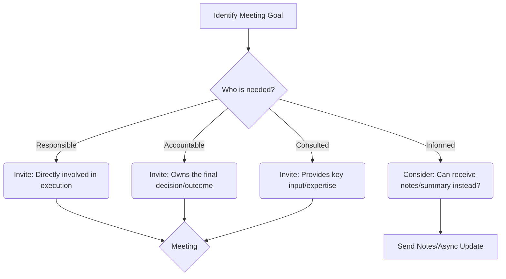
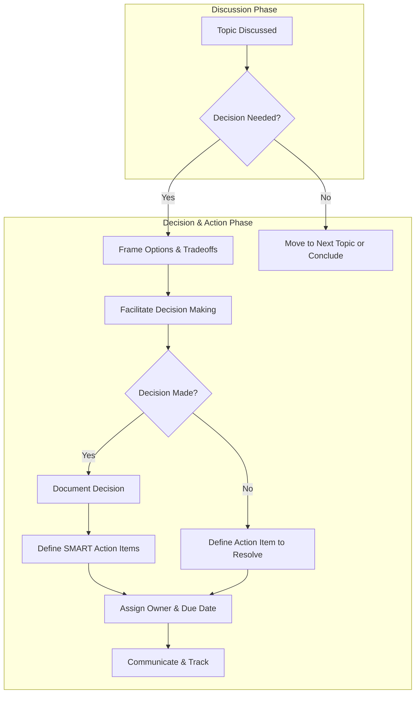
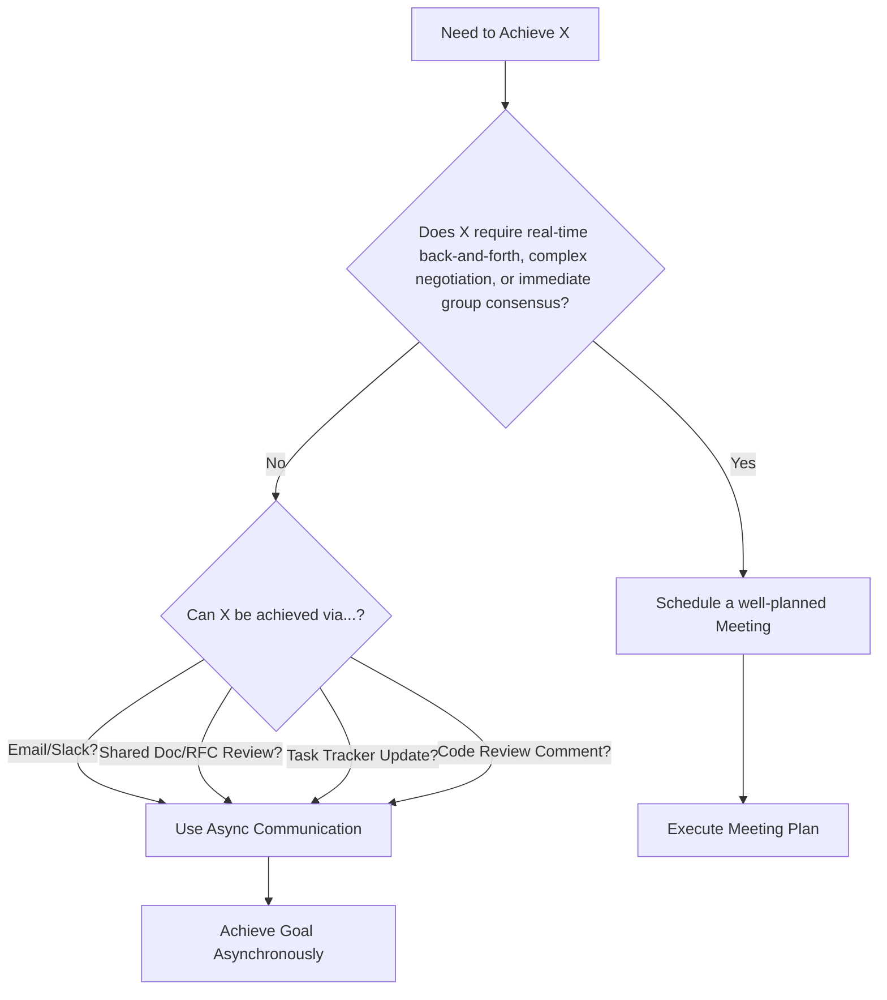

# Chapter 5: Running and Participating in High-Value Meetings

## Introduction: Transforming Time Sinks into Strategic Assets

Meetings. For many engineers, the word conjures images of wasted hours, circular discussions, and a frustrating drain on precious coding time. Yet, in the realm of senior engineering, meetings transform from a necessary evil into a critical arena for influence, collaboration, decision-making, and driving technical direction. The ability to effectively run _and_ participate in meetings is not just a soft skill; it's a strategic lever that distinguishes senior engineers who shape outcomes from those merely executing tasks.

Mid-level engineers often attend meetings primarily to gather information or provide specific input. Senior engineers, however, are expected to take a more proactive role. They understand that well-executed meetings are essential for aligning teams, resolving complex issues, making critical technical decisions, unblocking progress, and ensuring that engineering efforts directly contribute to business value. Conversely, poorly run meetings sow confusion, delay projects, erode morale, and represent a significant opportunity cost.

This chapter dives deep into the art and science of high-value meetings from the perspective of a senior software engineer. We'll move beyond basic etiquette and explore the nuanced roles you'll play, the techniques for maximizing effectiveness (whether you're leading or contributing), and the critical skill of knowing when asynchronous communication is the superior choice. Mastering meetings is mastering a key interface between technical depth and organizational impact.

## The Senior Engineer's Role in Meetings: Beyond Attendance

As a senior engineer, your presence in a meeting signifies more than just technical expertise. You are expected to operate dynamically, often shifting between several key roles, sometimes even within the same meeting. Understanding these roles allows you to contribute intentionally and effectively.

1.  **The Contributor:** This is the baseline role, but at a senior level, it carries significant weight.

    - **Deep Expertise:** Provide informed technical opinions, data points, and insights based on your experience and understanding of the systems involved.
    - **Constructive Critique:** Offer thoughtful analysis of proposed solutions, identifying potential risks, edge cases, and scalability concerns.
    - **Active Listening:** Fully absorb the perspectives of others (technical and non-technical) before formulating your response. (See Chapter 3)
    - **Clarifying Questions:** Ask questions that cut through ambiguity and ensure shared understanding.

2.  **The Facilitator:** Even if you aren't the _official_ meeting owner, you may need to step in to guide the discussion productively.

    - **Guardian of the Goal:** Keep the conversation focused on the meeting's stated objectives and agenda. Gently redirect tangents.
    - **Timekeeper:** Help the group adhere to the allocated time for agenda items.
    - **Inclusivity Champion:** Ensure all necessary voices are heard, actively soliciting input from quieter participants and managing dominant personalities.
    - **Synthesizer:** Summarize key points, areas of agreement, and points of contention to ensure clarity and forward momentum.

3.  **The Decision-Maker / Decision-Influencer:** Senior engineers are often pivotal in making or heavily influencing technical decisions.
    - **Framing Choices:** Clearly articulate the options being considered, including their respective trade-offs (cost, complexity, time-to-market, maintainability, etc.).
    - **Building Consensus:** Guide the group towards agreement where possible, leveraging data and logical reasoning. (See Chapter 7 on Influence)
    - **Driving to Closure:** Push for a clear decision or, if a decision can't be reached, ensure clear next steps are defined to resolve the impasse.
    - **Championing Technical Integrity:** Ensure decisions align with sound engineering principles, architectural vision, and long-term maintainability, even under pressure.

Understanding which hat(s) you need to wear in a given meeting is crucial. Is this a brainstorming session where diverse contribution is key? A decision-making meeting requiring clear articulation of trade-offs? A planning meeting needing facilitation to stay on track? Adapting your approach maximizes your impact.

## Planning Effective Meetings: Laying the Foundation for Success

The single most significant factor determining a meeting's success happens _before_ it even starts: **planning**. As a senior engineer, you should not only plan your own meetings meticulously but also advocate for (and help implement) better planning for meetings you attend.

**1. Define the Purpose and Desired Outcome (The "Why"):**

- **Be Specific:** Vague goals like "Discuss project X" lead to rambling conversations. Aim for concrete outcomes: "Decide on the primary data storage solution for Project X," "Gather feedback on RFC-123," "Identify the top 3 technical risks for the Q3 roadmap," "Finalize the API contract between Service A and Service B."
- **Is a Meeting Necessary?** Crucially, ask if the desired outcome _requires_ synchronous interaction. Could this be achieved via a document review, a Slack thread, or an email? (More on this later).

**2. Craft a Clear Agenda (The "What"):**

- **Structure:** List topics as questions to be answered or items to be decided.
- **Timing:** Allocate realistic time slots for each item. This forces prioritization and helps keep the meeting on track. Parkinson's Law ("Work expands so as to fill the time available for its completion") applies strongly to meetings.
- **Owners:** Assign owners to specific agenda items who will lead that part of the discussion.
- **Preparation Materials:** Link relevant documents, RFCs, data, or pre-reading materials. State clearly what preparation is expected _before_ the meeting. Sending materials _during_ the meeting disrespects attendees' time.
- **Publish in Advance:** Share the agenda with ample time for attendees to prepare (ideally 24 hours).

_Example Agenda Structure:_

- **Meeting Goal:** Decide on caching strategy for the recommendations service.
- **Desired Outcome:** Agreement on chosen caching approach (e.g., Redis vs. Memcached vs. In-memory) and key configuration parameters.
- **Attendees:** [List - see below]
- **Pre-Reading:** [Link to RFC comparing options], [Link to current performance metrics]
- **Agenda:**
  - (5 min) Welcome & Goal Recap (Facilitator)
  - (15 min) Review Performance Bottlenecks & Caching Requirements (Lead Engineer)
  - (20 min) Discussion: Pros/Cons of Redis vs. Memcached vs. In-Memory (All - guided by RFC)
  - (10 min) Decision & Key Configuration Parameters (Lead Engineer / Tech Lead)
  - (5 min) Action Items & Next Steps (Facilitator)

**3. Select the Right Attendees (The "Who"):**

- **Minimum Necessary People:** Invite only those who are essential for achieving the meeting's goal. Every extra person adds communication overhead and cost.
- **Clear Roles:** Consider who needs to _contribute_, who needs to _decide_, and who merely needs to be _informed_ (often, the informed group can receive meeting notes instead of attending).
- **The RACI Model:** While often used for projects, RACI (Responsible, Accountable, Consulted, Informed) can be a useful mental model for attendee selection. Who is Responsible for doing the work discussed? Who is Accountable for the decision? Who needs to be Consulted for input? Who just needs to be Informed of the outcome?

- **Empowerment:** Ensure the attendees have the authority to make the necessary decisions. If key decision-makers are absent, the meeting might become purely informational or require a follow-up.
- **Cross-Functional Needs:** Remember to include representatives from other functions (Product, Design, QA, Ops) if their input or alignment is critical.

**4. Logistics (The "Where/When"):**

- **Scheduling:** Use scheduling tools effectively, respect working hours and time zones (especially in remote/distributed teams). Avoid scheduling over lunch breaks.
- **Duration:** Keep meetings as short as possible. Default to 25 or 50 minutes instead of 30 or 60 to allow buffer time between meetings. Challenge the necessity of hour-long defaults.
- **Tools:** Ensure necessary tooling is set up (video conferencing links, shared whiteboards, document links).

By rigorously planning, you transform a potential time sink into a focused, purposeful interaction.

## Facilitation Techniques: Steering Towards Productivity

Whether you are the designated leader or stepping up to help a struggling meeting, effective facilitation is key.

- **Start Strong:** Begin on time. Briefly reiterate the meeting's purpose, desired outcome, and agenda. This aligns everyone.
- **Timeboxing:** Gently enforce the time limits for agenda items. "We have 5 minutes left on this topic, let's focus on reaching a conclusion or defining next steps."
- **Stay Focused:** Keep the discussion aligned with the agenda items and the overall goal.
  - **The Parking Lot:** Acknowledge off-topic but potentially important points by putting them in a "parking lot" (a designated space in notes or on a whiteboard) to be addressed later or in a different forum. "That's an interesting point about X, let's add it to the parking lot and revisit it after we've addressed the main agenda."
- **Active Listening & Synthesizing:** Pay close attention to understand different viewpoints. Periodically summarize the discussion: "So, it sounds like we agree on A and B, but there's still disagreement on C regarding the performance implications. Is that correct?" This ensures shared understanding and highlights areas needing resolution.
- **Managing Participation:**
  - **Encourage Quieter Voices:** Actively solicit opinions from those who haven't spoken. "Sarah, you have experience with system Y, what are your thoughts on this?" or "Let's go around the room quickly for initial thoughts." Create psychological safety where diverse opinions are welcomed. (See Chapter 4)
  - **Manage Dominant Voices:** Intervene politely if one or two people are monopolizing the conversation. "Thanks, David, for that perspective. I'd like to hear what others think before we dive deeper," or "Let's pause there and ensure we capture other viewpoints."
  - **Address Disruptions:** Handle side conversations or distractions respectfully but firmly. "Let's ensure we're all focused on the main discussion."
- **Use Visual Aids:** Leverage whiteboards (physical or virtual), shared documents, or diagrams to capture ideas, structure discussions, and track decisions visually.
- **Check for Understanding:** Don't assume silence means agreement. Explicitly ask: "Are there any concerns with this approach?" or "Does anyone see potential issues we haven't discussed?"

Effective facilitation isn't about rigid control; it's about creating a structure and environment where the group can collectively achieve its goal efficiently and inclusively.

## Driving to Decisions and Action Items: The Path to Impact

A meeting without clear decisions or actionable outcomes is often a waste of time. As a senior engineer, you play a critical role in ensuring discussions translate into tangible progress.

- **Clarify the Decision-Making Process:** Was the goal to reach consensus, have a specific person make the call after hearing input, or simply brainstorm options for a later decision? Ensure this is understood. If a decision _is_ expected, state it clearly: "By the end of this meeting, we need to decide on approach X or Y."
- **Frame the Decision:** When it's time to decide, clearly summarize the options, key trade-offs, and the recommendation (if one exists).
- **Call for the Decision:** Explicitly ask for the decision to be made. Don't let the conversation fizzle out. "Okay, based on our discussion, are we ready to commit to approach X?"
- **Document the Decision:** Once made, immediately document the decision clearly in the meeting notes, including the rationale if important.
- **Define Action Items:** For _every_ decision or unresolved issue requiring further work, define clear action items. Use the **SMART** framework:
  - **S**pecific: What exactly needs to be done?
  - **M**easurable: How will we know it's complete?
  - **A**chievable: Is it realistic?
  - **R**elevant: Does it align with the goal?
  - **T**ime-bound: What is the deadline?
- **Assign Owners:** Every action item MUST have a single, explicitly named owner. "Team A will do X" is not an action item; "Priya will draft the API spec for review by Friday" is.
- **Capture and Communicate:** Record action items (Owner, Action, Due Date) in the meeting notes and ensure they are communicated clearly to all attendees and stakeholders, often by sharing the notes promptly after the meeting.

Following up on action items is just as crucial as defining them. This might involve checking in with owners before deadlines or using task tracking systems. Failure to follow through undermines the entire process.

## Knowing When Not to Have a Meeting: The Power of Asynchronous Communication

One of the most potent skills a senior engineer can develop is recognizing when _not_ to call a meeting. Synchronous time is expensive (disrupting flow, requiring coordination across schedules/time zones). Always consider if the goal can be achieved asynchronously.

**When Async is Often Better:**

- **Information Dissemination:** Sharing status updates, announcements, or finalized decisions that don't require immediate discussion. Use email, Slack/Teams announcements, wikis, or documented RFCs.
- **Gathering Non-Urgent Feedback:** Requesting reviews on documents, designs, or code where immediate back-and-forth isn't essential. Google Docs comments, Slack threads, or code review tools work well.
- **Simple Q&A:** Asking specific questions that don't require extensive context building.
- **Brainstorming (Initial Stages):** Allowing individuals time to think deeply and contribute ideas independently via shared documents or brainstorming tools before a potential follow-up sync discussion.
- **Collaborative Document Editing:** Working together on specifications, designs, or retrospectives where turn-based contributions are effective.

**A Simple Decision Heuristic:**

**Benefits of Async:**

- **Respects Focus Time:** Allows engineers to engage when it fits their schedule, preserving deep work blocks.
- **Improves Thoughtfulness:** Gives individuals time to process information and formulate more considered responses.
- **Creates Documentation:** Async communication often produces a written record naturally.
- **Inclusive for Time Zones/Schedules:** Levels the playing field for distributed teams or those with different working hours.

Mastering asynchronous communication (clear writing, setting expectations for response times) is a complementary skill to mastering meetings. (See Chapter 3)

## Meeting Anti-Patterns and How to Avoid Them

Senior engineers should actively identify and counteract common meeting dysfunctions. Be the positive force that prevents or corrects these anti-patterns:

1.  **The Ambush Meeting:** A meeting called with no agenda, no context, and no defined purpose.

    - **Avoidance/Correction:** Politely decline or ask for an agenda/goal before accepting. "Could you share the agenda or key topics for this meeting so I can prepare effectively?" If facilitating, _never_ run a meeting like this.

2.  **The Meeting That Should Have Been an Email (or Slack Message):** A meeting held purely for status updates or information sharing that required no discussion.

    - **Avoidance/Correction:** Advocate for async updates. Suggest using team dashboards, status update threads, or concise summary emails. Question recurring meetings that consistently lack discussion. "Could we try handling status updates asynchronously this week and use this time slot only if specific discussion points arise?"

3.  **The Overcrowded Meeting:** Too many attendees, making focused discussion impossible and wasting the time of many.

    - **Avoidance/Correction:** When organizing, strictly adhere to inviting only essential personnel. When invited, question if your attendance is truly necessary or if you can delegate or receive notes. Use the Optional/Required distinction in invites.

4.  **The Decision-Less Discussion:** An endless loop of conversation with no clear path to a decision or defined next steps.

    - **Avoidance/Correction:** As a facilitator or participant, gently push for closure. "We seem to be circling this point. What information do we need to make a decision?" or "Can we define the specific action item needed to move forward here?" Explicitly state the need for a decision mechanism.

5.  **The Hijacked Meeting:** The discussion veers significantly off-topic from the stated agenda and goals.

    - **Avoidance/Correction:** Use the Parking Lot technique. Firmly but politely guide the conversation back. "That's an important topic for another time. Let's return to discussing X to ensure we meet today's goal."

6.  **The Unprepared Attendee Meeting:** Key participants haven't done the pre-reading or preparation, derailing productive discussion.

    - **Avoidance/Correction:** Clearly communicate preparation requirements well in advance. Consider rescheduling briefly if critical prep is missing, emphasizing the need for it. Lead by example by always being prepared yourself.

7.  **The Recurring Zombie Meeting:** A standing meeting that continues long after its original purpose has faded.
    - **Avoidance/Correction:** Regularly evaluate the necessity of recurring meetings. Ask the group: "Is this meeting still providing value? What is its current objective?" Propose cancellation or restructuring if it's no longer needed.

By recognizing these anti-patterns, you can actively steer meetings toward productivity and ensure they serve as valuable tools rather than frustrating obligations.

## Conclusion: Elevating Meetings from Chore to Craft

For the senior software engineer, meetings are not merely calendar entries; they are opportunities. Opportunities to lead, influence, solve complex problems, build consensus, mentor others, and drive technical excellence. Shifting your mindset from passive attendee to active participant, facilitator, and decision-driver is fundamental to operating effectively at this level.

By mastering the planning, facilitation, and follow-through techniques outlined in this chapter, and by judiciously choosing between synchronous and asynchronous communication, you transform meetings from a potential time sink into a powerful mechanism for amplifying your impact and the impact of your team. It's a craft that requires practice, self-awareness (Chapter 1), emotional intelligence (Chapter 2), and strong communication skills (Chapter 3), but the return on investment – in terms of project success, team alignment, and personal influence – is immense.
