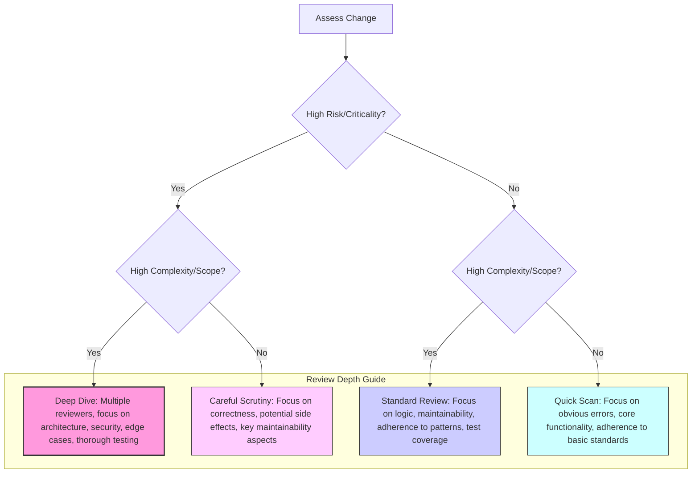

# Chapter 6: Mastering Code Reviews as a Social and Technical Process

Code Review (CR) stands as one of the most frequent and impactful collaborative activities in software engineering. For the junior engineer, it's often seen primarily as a gatekeeping mechanism to catch bugs. For the mid-level engineer, it becomes a tool for learning and ensuring adherence to basic standards. But for the **Senior Software Engineer**, code review transcends these functions. It becomes a critical nexus point where technical acumen, communication skills, mentorship capabilities, and team influence converge.

Mastering code review at the senior level isn't just about spotting subtle bugs or complex architectural flaws; it's about leveraging the process to elevate the entire team's output, foster a culture of quality and learning, and ensure the long-term health of the codebase. It is both a deeply technical _and_ a profoundly social activity. Excelling requires navigating intricate technical details while simultaneously managing interpersonal dynamics, providing constructive feedback, and strategically guiding technical direction. This chapter delves into the multifaceted nature of code reviews for the senior engineer, equipping you with the strategies and mindset to transform this routine practice into a powerful lever for individual and team growth.

## The Goals of Code Review (Beyond Finding Bugs)

While preventing bugs from reaching production is a fundamental goal, a senior engineer recognizes that effective code reviews serve a much broader and more strategic purpose. Limiting the focus solely to defect detection significantly undervalues the potential of this process. The true goals encompass:

1.  **Improving Code Quality & Design:** This goes beyond functional correctness. It includes assessing maintainability, readability, simplicity, testability, and adherence to architectural principles. Does the code elegantly solve the problem? Is it easy to understand and modify later?
2.  **Knowledge Sharing:** Code reviews are a primary mechanism for disseminating knowledge about the codebase, new patterns, libraries, business logic, and system architecture. Every review is an opportunity for both the author and reviewer(s) to learn. Seniors use reviews to ensure context isn't siloed.
3.  **Maintaining Codebase Consistency:** Ensuring that code adheres to established team/organizational style guides, patterns, and idioms. Consistency significantly reduces cognitive load when navigating the codebase.
4.  **Mentoring and Upskilling:** Reviews provide targeted, contextual opportunities to mentor junior and mid-level engineers, guiding them on best practices, design principles, and idiomatic language use. It's teaching "on the job."
5.  **Finding Better Solutions:** Collaborative review can uncover alternative approaches, simpler implementations, or more robust designs that the original author might have missed. "Two heads are better than one" often holds true.
6.  **Enhancing Team Cohesion and Collective Ownership:** Regular, constructive reviews foster a sense of shared responsibility for the codebase. It moves away from "my code" vs. "your code" towards "our code."
7.  **Early Defect Detection:** Yes, finding bugs is still crucial! Catching logical errors, edge case failures, potential security vulnerabilities, and performance issues before they impact users saves significant time and resources compared to fixing them post-deployment.
8.  **Risk Mitigation:** Identifying potential risks related to scalability, security, performance, or future maintainability early in the development cycle.
9.  **Enforcing Standards and Best Practices:** Ensuring compliance with security guidelines, accessibility requirements, performance benchmarks, and other non-functional requirements critical to the application.

A senior engineer keeps these multiple goals in mind during every review, understanding that a comment addressing readability is often just as valuable, if not more so in the long run, than one pointing out a minor typo.

## Giving Constructive, Actionable, and Kind Feedback

The _way_ feedback is delivered in a code review is paramount. Poorly delivered feedback, even if technically correct, can demotivate authors, damage trust, introduce friction, and ultimately hinder collaboration. Senior engineers excel at providing feedback that is:

- **Specific:** Vague comments like "This is confusing" or "Needs improvement" are unhelpful. Pinpoint the exact lines or concepts causing concern. Instead of "Clean this up," try "This function seems to be doing three distinct things (fetching data, transforming it, updating the UI). Could we refactor it into separate, more focused functions for better clarity and testability?"
- **Actionable:** The author should understand what needs to be done to address the feedback. Instead of "This isn't scalable," suggest _why_ and _what_ could be done: "This database query fetches all user records at once. As the user base grows, this could lead to performance issues. Could we implement pagination here, perhaps using `LIMIT` and `OFFSET` clauses?"
- **Kind and Respectful:** Tone matters immensely, especially in written communication where nuance is lost. Assume positive intent from the author. Frame feedback constructively, focusing on the code, not the person. Avoid judgmental language ("Why did you do this?" sounds accusatory; "Could you explain the reasoning behind this approach?" is collaborative). Use softening language where appropriate ("Maybe consider...", "Perhaps we could...", "What do you think about...?").
- **Focused on the Code, Not the Author:** Avoid personal attacks or implications of incompetence. "You made a mistake here" vs. "This logic might not handle null values correctly." The latter is objective and less likely to trigger defensiveness.
- **Suggestive, Not Prescriptive (Often):** Especially for non-critical issues or matters of style/preference, phrase feedback as suggestions or questions rather than commands. "What do you think about extracting this logic into a helper function?" empowers the author and opens a discussion, whereas "Extract this logic into a helper function" can feel dictatorial. However, for clear violations of standards or critical bugs, directness is necessary.
- **Prioritized:** Distinguish between critical changes required for approval (blockers) and suggestions for improvement or minor nitpicks. Use labels like `[BLOCKER]`, `[SUGGESTION]`, `[NITPICK]`, or `[QUESTION]` to clarify the importance and intent of your comments. This helps the author focus their efforts.
- **Explanatory (The "Why"):** Don't just state _what_ should change; explain _why_. Linking feedback to principles (SOLID, DRY), potential consequences (performance impact, maintenance burden), or team standards helps the author learn and internalizes the reasoning for future work.
- **Balanced:** Acknowledge good work too! If you see a particularly elegant solution, a well-written test, or significant improvement, say so. Positive reinforcement is motivating and builds rapport. "Great use of the Strategy pattern here, makes this much easier to extend!"

## Receiving Feedback Gracefully and Objectively

Just as important as giving good feedback is receiving it effectively. Seniority involves modeling maturity and a growth mindset when your own code is under review. Defensiveness inhibits learning and collaboration.

- **Pause and Assume Positive Intent:** Before reacting, take a breath. Assume the reviewer is trying to help improve the code and the product, even if the delivery isn't perfect. Separate your ego from your code.
- **Seek to Understand:** If feedback is unclear, ask clarifying questions. "Could you elaborate on why you think this approach might be problematic?" or "I'm not sure I understand the alternative you're suggesting, could you provide a small example?" Don't guess the reviewer's intent.
- **Be Grateful:** Thank reviewers for their time and effort. A simple "Thanks for the feedback!" or "Good catch, thanks!" goes a long way in fostering a positive review culture.
- **Don't Take it Personally:** Feedback is about the code artifact, not about your worth as an engineer or person. Everyone makes mistakes or overlooks things. View feedback as a gift – an opportunity to learn and improve.
- **Evaluate Objectively:** Consider the feedback on its merits. Does it improve the code based on the goals discussed earlier (quality, maintainability, etc.)? Does it align with team standards? Is the suggested change worth the effort involved?
- **Explain Your Rationale (If Necessary):** If you disagree with a suggestion or if there's context the reviewer might be missing, explain your reasoning calmly and respectfully. "Thanks for the suggestion! I initially considered that approach, but went this way because of [specific constraint or trade-off]. What are your thoughts given that context?"
- **Respond to Every Comment:** Acknowledge each piece of feedback, indicating whether you'll make the change, need clarification, or have a differing perspective. This shows engagement and respect for the reviewer's effort. Tools often allow resolving comments once addressed.
- **Know When to Discuss Offline/Sync:** If a point requires significant back-and-forth, complex explanation, or involves a sensitive disagreement, suggest a brief call or pairing session. "This is a great point and has a few trade-offs. Do you have 5 minutes to sync up quickly and discuss the options?"

## Reviewing for Maintainability, Scalability, and Understandability

Senior engineers look beyond immediate functionality. They review code with an eye towards its future lifecycle, considering how easily others (or their future selves) will interact with it.

- **Maintainability:**

  - **Readability:** Is the code clean, well-formatted, and easy to follow? Are variable and function names clear and meaningful? Is the logic straightforward or overly convoluted?
  - **Simplicity (KISS/YAGNI):** Is the solution overly complex for the problem? Is there unnecessary code or abstraction (You Ain't Gonna Need It)? Could it be simpler?
  - **Consistency:** Does the code adhere to established team/project style guides and patterns?
  - **Testability:** Is the code structured in a way that makes it easy to write unit, integration, and end-to-end tests? Are dependencies injectable? Are functions pure where possible? Are existing tests thorough and meaningful?
  - **Modularity & Decoupling:** Are components loosely coupled? Would changing one part unnecessarily break others? Are concerns well-separated?
  - **Documentation:** Are complex sections, non-obvious logic, or public APIs adequately commented? Is the commit message clear and descriptive? Does related documentation (e.g., READMEs, design docs) need updating?

- **Scalability:**

  - **Performance:** Are there obvious performance bottlenecks (e.g., N+1 queries, inefficient loops, excessive memory allocation)? Does the approach consider data volume growth?
  - **Resource Usage:** Is the code mindful of resource constraints (CPU, memory, network bandwidth)?
  - **Concurrency:** If concurrent operations are involved, are potential race conditions, deadlocks, or thread safety issues handled correctly?
  - **Architecture:** Does the chosen approach fit within the larger system architecture and its scalability goals? Will this pattern scale under anticipated load?

- **Understandability:**
  - **Clear Intent:** Can another engineer quickly grasp what the code is _trying_ to do?
  - **Logical Flow:** Is the control flow easy to follow? Are conditional statements clear?
  - **Abstraction Level:** Are abstractions used effectively to hide complexity, or do they add unnecessary indirection?
  - **Naming Conventions:** Are names descriptive, unambiguous, and consistent?
  - **Reducing Cognitive Load:** Does the code minimize the amount of context someone needs to hold in their head to understand it?

## Balancing Speed vs. Thoroughness in Reviews

Teams face constant pressure to deliver features quickly, yet thorough reviews take time. Senior engineers understand this tension and make conscious decisions about the appropriate level of review depth.

- **Factors Influencing Depth:**

  - **Risk:** Changes to critical paths, core infrastructure, security-sensitive areas, or complex business logic warrant more thorough reviews. Low-risk changes (e.g., typo fixes, minor UI tweaks) can often be reviewed more quickly.
  - **Complexity & Scope:** Large, intricate changes naturally require more time and scrutiny than small, self-contained ones. Encourage smaller Pull Requests (PRs) / Merge Requests (MRs).
  - **Author Experience:** Code from junior engineers might benefit from a more detailed review focusing on fundamentals and mentoring, while code from experienced peers might receive more focus on high-level design and subtle issues.
  - **Urgency:** An urgent hotfix for a production outage might undergo a faster (though still careful) review process than a routine feature addition. Define an expedited review process for emergencies.
  - **Team Capacity:** Reviewer workload and availability impact turnaround time.

- **Strategies for Balancing:**
  - **Prioritize Reviews:** Use labels or team conventions to signal review priority (e.g., P0 for hotfixes, P1 for blockers, P2 for routine reviews).
  - **Timeboxing:** Allocate specific time slots for reviews. For less critical changes, set a timer (e.g., 15-20 minutes) to encourage focused feedback on the most important aspects.
  - **Scope Focus:** Agree as a team what aspects are _essential_ for review (e.g., correctness, core logic, security) versus _nice-to-have_ (e.g., minor style nits if linters are in place).
  - **Tiered Reviews (Optional):** For very large or critical changes, consider multiple reviewers focusing on different aspects (e.g., one on logic, one on testing, one on architecture) or requiring multiple approvals.
  - **Leverage Automation:** Use linters, static analysis tools, and automated tests to catch stylistic issues, potential bugs, and regressions automatically, freeing up human reviewers to focus on higher-level concerns like design and logic.

Here's a conceptual model for deciding review depth:



_Diagram: Conceptual guide for determining code review depth based on risk and complexity._

## Establishing and Maintaining Team Code Review Norms

Consistent, documented code review practices are essential for efficiency, effectiveness, and psychological safety. Senior engineers often take the lead in defining, refining, and upholding these norms. Key areas to establish norms include:

- **Turnaround Time:** What's a reasonable expectation for how quickly reviews should be completed? (e.g., within X business hours). This helps authors plan and avoids PRs languishing.
- **PR/MR Size:** Encourage small, focused changes that are easier and faster to review. Define guidelines on what constitutes an acceptable size.
- **Commit Message Quality:** Establish standards for clear, informative commit messages (e.g., Conventional Commits). Good messages provide crucial context for reviewers.
- **PR/MR Description:** What information should be included? (e.g., link to ticket, summary of changes, testing steps, screenshots/GIFs for UI changes). A good description saves reviewers time.
- **Definition of "Done" / Approval:** How many approvals are needed? Who should approve (e.g., at least one peer, specific code owners)? What constitutes an acceptable level of outstanding non-blocking comments?
- **Handling Disagreements:** What's the process if the author and reviewer strongly disagree? (e.g., seek a third opinion, discuss synchronously, escalate to tech lead if necessary).
- **Comment Style:** Agree on conventions for comment prefixes (`[NITPICK]`, `[QUESTION]`), tone, and when to block vs. suggest.
- **Tool Usage:** Standardize on specific features of the code review tool (e.g., using "Suggest Changes," resolving comments).
- **Review Assignment:** How are reviewers assigned? (e.g., round-robin, code owners, volunteer).

**How to Establish Norms:**

1.  **Team Discussion:** Facilitate a team meeting dedicated to discussing current pain points and desired practices.
2.  **Drafting:** Collaboratively draft the norms based on the discussion.
3.  **Documentation:** Store the agreed-upon norms in a readily accessible place (e.g., team wiki, `CONTRIBUTING.md`).
4.  **Iteration:** Revisit and refine the norms periodically (e.g., quarterly, or during retrospectives) as the team evolves and learns what works best.
5.  **Modeling:** Senior engineers must consistently model the agreed-upon behaviors.

## Mentoring Through Code Review

Code reviews are arguably one of the most effective, scalable, and contextual mentoring opportunities available. Senior engineers intentionally use the review process to help less experienced team members grow.

- **Explain the "Why":** Don't just point out an error or suggest a change. Explain the underlying principle, pattern, or potential consequence. "Instead of modifying the input array directly, consider returning a new array. This follows the principle of immutability and can prevent unexpected side effects in other parts of the code that might hold a reference to the original array."
- **Suggest Patterns and Idioms:** Introduce more advanced or idiomatic ways of solving problems, providing links to documentation or examples. "This series of `if/else if` statements could be nicely refactored using the Strategy pattern, especially if we anticipate adding more conditions later. Here's an article explaining it..."
- **Ask Guiding Questions:** Instead of giving the answer, prompt the author to think critically. "What happens in this function if the `user` object is null?" or "Have you considered the performance implications if this list contains thousands of items?"
- **Praise Good Work and Effort:** Acknowledge improvements, well-applied patterns, or thoughtful solutions. Positive reinforcement builds confidence. "I see you applied the feedback from last time regarding error handling – great job!"
- **Tailor Feedback:** Adjust the depth and type of feedback based on the mentee's experience level. For a very junior engineer, focus on fundamentals. For a mid-level engineer, delve more into design trade-offs and architectural considerations.
- **Offer to Pair:** For complex feedback or foundational misunderstandings, offer a brief pairing session to work through it together. "There are a few concepts here that might be easier to discuss interactively. Do you have 15 minutes to pair on this section?"

## Code Review Etiquette Guide

Adhering to good etiquette makes the code review process smoother and more pleasant for everyone involved.

**For the Author:**

- **Review Your Own Code First:** Catch obvious mistakes before submitting.
- **Keep PRs/MRs Small and Focused:** Aim for single-purpose changes.
- **Write Clear Titles and Descriptions:** Provide context, link tickets, explain _why_ the change is needed and _how_ it was implemented. Document testing steps.
- **Ensure CI/Tests Pass:** Don't waste reviewer time on code that fails basic checks.
- **Annotate Complexities:** Use comments in the PR/MR itself (if the tool allows) or code comments to proactively explain non-obvious decisions or complex sections.
- **Respond Promptly and Respectfully:** Acknowledge comments, ask clarifying questions, and indicate how you'll address the feedback.
- **Don't Merge Prematurely:** Wait for the agreed-upon approvals and allow time for reviewers to respond to your changes.
- **Fix Issues in Separate Commits (Often):** This makes it easier for reviewers to see how you addressed their feedback, though sometimes squashing makes sense before the final merge. Discuss team preference.

**For the Reviewer:**

- **Be Timely:** Respect the team's turnaround time norms. If you can't review promptly, let the author know.
- **Understand the Context:** Read the PR/MR description and linked tickets before diving into the code.
- **Assume Positive Intent:** Start from a place of trusting the author's competence and intentions.
- **Provide Constructive Feedback:** Follow the principles outlined earlier (Specific, Actionable, Kind, etc.).
- **Use Comment Prefixes/Labels:** Distinguish between blocking issues, suggestions, questions, and nitpicks.
- **Suggest Alternatives Constructively:** Offer concrete examples or point towards better patterns.
- **Review the Tests:** Don't just review the implementation code; ensure the tests are meaningful, correct, and sufficient.
- **Balance Thoroughness and Speed:** Apply the appropriate level of scrutiny based on risk and complexity.
- **Acknowledge Good Work:** Praise positive aspects of the code.
- **Avoid Scope Creep:** Focus feedback on the changes presented, unless the changes touch upon a closely related, critical issue. Don't try to redesign unrelated parts of the system in the review.
- **Be Available for Clarification:** Be prepared to answer questions about your feedback.

## Conclusion

For the senior software engineer, code review is far more than a quality gate. It's a dynamic interplay of technical evaluation, communication, negotiation, teaching, and team building. By mastering the art of giving and receiving feedback, understanding the deeper goals of the process, reviewing strategically for long-term health, upholding team norms, and leveraging reviews as a mentoring platform, you transform this daily activity into a powerful engine for creating better software and stronger engineering teams. It is a core competency where technical leadership and soft skills are demonstrably put into practice every single day.

```

```
