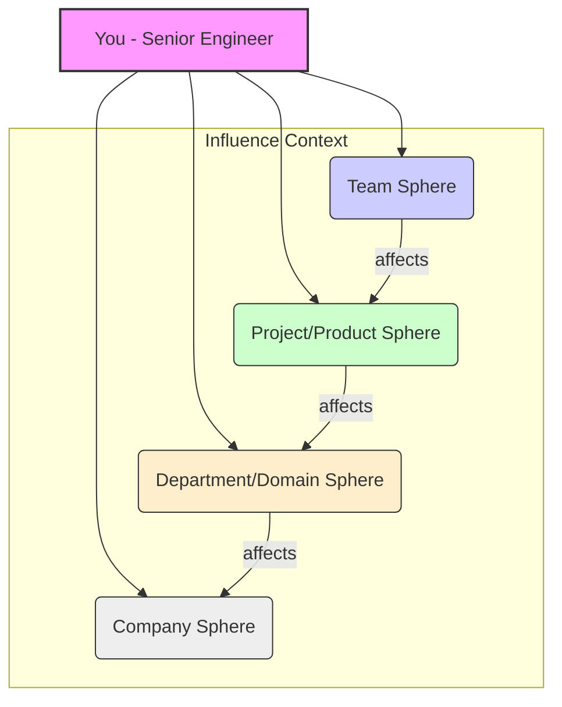
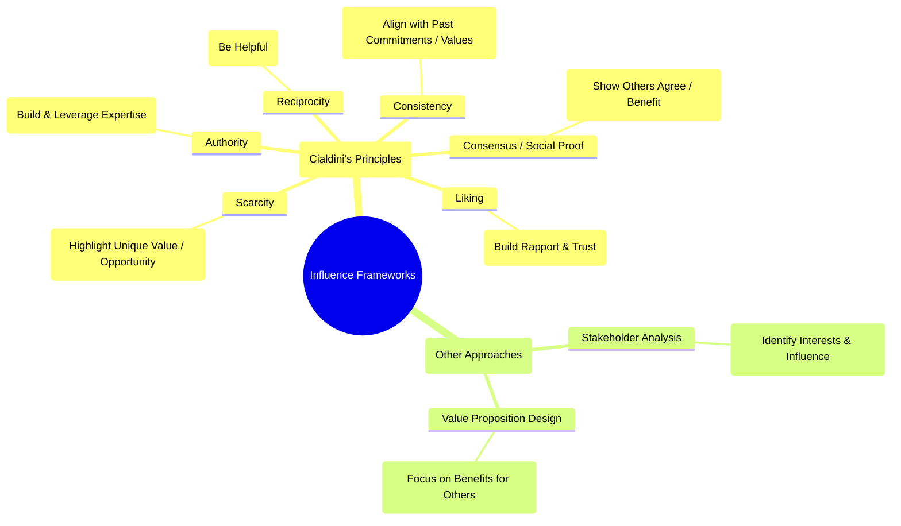

# Chapter 7: Leading Without Authority: The Art of Influence

> "Influence is the ability to change the hearts, minds, and actions of others. For a senior engineer, it's the engine that drives technical excellence, fosters collaboration, and ultimately delivers business value, often without a single direct report."

Welcome to one of the most critical, yet often least understood, aspects of senior software engineering: leading without formal authority. In many organizations, the path to greater impact isn't solely paved with management titles. Instead, it's built on your ability to influence peers, stakeholders, and even leadership through your expertise, communication, and strategic thinking.

As a senior engineer, you're expected to shape technical direction, mentor others, improve processes, and drive initiatives that extend beyond your immediate coding tasks. You won't have a manager's mandate to _tell_ people what to do. Instead, you need to _persuade_, _inspire_, and _guide_ them. This chapter is your guide to mastering the subtle but powerful art of influence.

## Understanding Your Spheres of Influence

Influence isn't monolithic; it operates within different contexts and at varying scales. Recognizing these "spheres" helps you tailor your approach and understand where you can realistically make an impact. As a senior engineer, your influence typically radiates outward:

1.  **The Team Sphere:** This is your immediate environment – the engineers you work with daily on a specific project or product area.

    - **Influence Focus:** Code quality standards, testing strategies, tool adoption within the team, local architectural decisions, pair programming practices, sprint commitments, fostering psychological safety.
    - **How:** Leading by example, constructive code reviews, facilitating team discussions, sharing knowledge, mentoring junior members.

2.  **The Project/Product Sphere:** This encompasses the broader group involved in delivering a specific feature or product, including product managers, designers, QA, potentially other engineering teams.

    - **Influence Focus:** Technical design choices, architectural patterns for the project, API contracts, cross-functional process improvements, release planning trade-offs, technology selection for the specific project scope.
    - **How:** Authoring clear RFCs/design docs, presenting technical options and trade-offs, actively participating in cross-functional meetings, building rapport with non-engineering roles.

3.  **The Department/Domain Sphere:** This level involves multiple teams working within a larger business or technical domain (e.g., all of backend engineering, the payments domain).

    - **Influence Focus:** Shared libraries or services, cross-team technical standards, interviewing and hiring practices, platform initiatives, advocating for large-scale refactoring or technical debt reduction, proposing new architectural paradigms.
    - **How:** Presenting at engineering-wide meetings or guilds, contributing to shared codebases or platforms, participating in architectural review boards, writing internal blog posts or documentation, mentoring across teams.

4.  **The Company Sphere:** This is the broadest level, potentially impacting the entire engineering organization or even company strategy.
    - **Influence Focus:** Overall technology stack choices, engineering culture initiatives, open-source strategy, build vs. buy decisions with significant impact, security policies, long-term technical vision.
    - **How:** Building a strong reputation for technical excellence and strategic thinking, presenting to senior leadership, participating in company-wide working groups, consistently demonstrating positive impact across multiple domains.

**Visualizing Your Spheres:**

**Action:** Regularly assess where your influence currently lies and where you _want_ it to lie. Identify opportunities to expand your impact into broader spheres by tackling cross-cutting concerns or sharing your expertise more widely.

## Building Credibility and Trust: The Foundation of Influence

You cannot influence those who do not trust you or respect your expertise. Credibility is the bedrock upon which all influence is built. It's a combination of _what_ you know (technical competence) and _who_ you are (character and reliability).

**Key Pillars of Credibility and Trust:**

1.  **Technical Excellence:**

    - **Be Demonstrably Competent:** Write clean, maintainable, well-tested code. Design robust and scalable systems. Understand the fundamentals deeply.
    - **Stay Current:** Continuously learn and adapt to new technologies and paradigms relevant to your domain.
    - **Solve Hard Problems:** Show you can tackle complex challenges effectively.
    - **Share Your Knowledge:** Explain complex topics clearly (See Chapter 3). Mentor others (See Chapter 8).

2.  **Reliability and Consistency:**

    - **Do What You Say You Will Do (DWYSYWD):** Meet commitments. If you foresee delays, communicate early and proactively.
    - **Be Consistent:** Apply principles and standards fairly and consistently in your work and interactions (e.g., in code reviews).
    - **Show Up:** Be present and engaged in meetings and discussions.

3.  **Integrity and Honesty:**

    - **Be Truthful:** Provide accurate status updates, even when the news isn't good. Don't hide problems.
    - **Admit Mistakes:** Own your errors, learn from them, and share the learnings. This builds trust far more than trying to appear infallible.
    - **Give Credit Where It's Due:** Acknowledge the contributions of others.
    - **Argue Fairly:** Focus on ideas and data, not personalities. (See Chapter 10 on Conflict Resolution).

4.  **Helpfulness and Collaboration:**

    - **Be Approachable:** Make time to help colleagues, especially more junior ones.
    - **Unblock Others:** Offer assistance when you see teammates struggling.
    - **Collaborate Genuinely:** Engage constructively in discussions and be willing to compromise when appropriate (See Chapter 4).

5.  **Transparency:**
    - **Explain Your Reasoning:** Articulate the "why" behind your technical decisions and suggestions.
    - **Share Information:** Keep relevant stakeholders informed about progress, challenges, and decisions. Avoid information hoarding.

Building trust is a long game. It requires consistent positive actions over time. Conversely, trust can be shattered quickly by a single act of dishonesty or unreliability.

## Persuasion vs. Manipulation: Influencing Ethically

Influence is a powerful tool, and like any tool, it can be used for good or ill. As a senior engineer upholding professional standards, it's crucial to distinguish between ethical persuasion and unethical manipulation.

- **Persuasion:** Aims to convince others through reasoned arguments, logical appeals, shared goals, and mutual understanding. It respects the autonomy of the other person and seeks win-win outcomes or the best outcome for the collective. Transparency is key.
- **Manipulation:** Involves using deception, emotional exploitation, withholding information, or leveraging power imbalances to coerce or trick someone into doing something that primarily benefits the manipulator, often at the other person's expense. It undermines trust and poisons relationships.

**Why Ethical Persuasion Matters:**

- **Long-Term Relationships:** Manipulation destroys trust, making future collaboration difficult or impossible. Persuasion builds lasting, positive working relationships.
- **Better Outcomes:** Decisions made through open discussion and genuine agreement are typically more robust and have broader buy-in.
- **Professional Integrity:** Ethical conduct is fundamental to being a respected senior engineer and leader.
- **Team Health:** Manipulation breeds resentment, fear, and cynicism within a team. Persuasion fosters psychological safety and open dialogue.

**Red Flags for Manipulation (Avoid These):**

- Using excessive FUD (Fear, Uncertainty, Doubt) without basis.
- Intentionally misrepresenting data or alternatives.
- Using personal attacks or gossip to undermine opposition.
- Applying undue pressure based on authority gradients (even perceived ones).
- Making requests contingent on unrelated personal favors.
- Withholding critical information needed for others to make an informed decision.
- Creating false urgency or scarcity.

Focus on presenting clear, data-backed arguments, understanding the other party's perspective and constraints (empathy!), appealing to shared objectives (team goals, business value), and being transparent about your own reasoning and potential biases.

## Making the Business Case for Technical Decisions

Senior engineers don't just make technical decisions; they make decisions that impact the business. Your ability to articulate _why_ a technical choice matters in terms of business outcomes is a powerful lever of influence, especially when communicating with product managers, executives, and other non-technical stakeholders.

**Shifting Your Frame:**

- **From:** "We should use microservices because it's modern."
- **To:** "Adopting a microservices architecture for the new payments module will allow independent team deployment, reducing release coordination overhead by ~30% and improving time-to-market for payment features, which aligns with our Q3 goal of increasing transaction volume."

**Key Elements of a Strong Business Case for Technical Work:**

1.  **Problem Statement:** Clearly define the _business_ problem or opportunity the technical work addresses (e.g., slow performance impacting user retention, high operational costs, inability to launch new features quickly, security risk).
2.  **Proposed Solution:** Describe the technical approach concisely and in terms understandable to the audience. Focus on _what_ it achieves, not just _how_.
3.  **Benefits (Quantify when possible):**
    - **Revenue:** Enables new features, improves conversion, increases uptime.
    - **Cost Savings:** Reduces infrastructure spend, lowers maintenance effort, decreases operational toil.
    - **Risk Reduction:** Mitigates security vulnerabilities, improves compliance, increases system stability, reduces disaster recovery time.
    - **Efficiency/Velocity:** Speeds up development, simplifies deployments, improves developer productivity.
    - **Strategic Alignment:** Supports key company objectives (OKRs), enables future business opportunities.
4.  **Costs & Resources:** Be realistic about implementation time, engineering effort, infrastructure costs, potential training needs, etc.
5.  **Alternatives Considered:** Briefly explain other options explored and why the proposed solution is superior (e.g., lower risk, better long-term value, faster delivery). This shows due diligence.
6.  **Risks & Mitigation:** Acknowledge potential technical or execution risks and how you plan to mitigate them.
7.  **Recommendation/Ask:** Clearly state what you are proposing and what decision or resources you need.

**Tailoring the Message (Link to Chapter 3):**

- **Engineers:** Can delve deeper into technical trade-offs.
- **Product Managers:** Focus on user impact, feature velocity, and business metrics.
- **Management/Executives:** Emphasize strategic alignment, ROI, risk, and high-level costs/benefits.

Building this skill requires understanding the business context your software operates within. Talk to your product manager, understand the company's goals, and think beyond the code.

## Negotiating Technical Priorities and Roadmaps

Resources are finite. Time is limited. There will always be more desirable technical improvements, features, and refactoring tasks than can be accomplished at once. As a senior engineer, you will inevitably need to negotiate priorities, influencing which technical items make it onto the roadmap and when.

This isn't about "winning" every argument but about collaborating to find the optimal path forward given constraints. (See Chapter 11 for deeper negotiation skills).

**Key Strategies for Negotiating Technical Priorities:**

1.  **Understand the Landscape:** Know the overall business priorities, product roadmap, team capacity, and existing technical debt.
2.  **Articulate Value Clearly:** Use the business case framework (discussed above) to explain the importance of the technical work you're advocating for. Why does this matter _now_?
3.  **Quantify Impact:** Use data whenever possible. "Fixing this N+1 query issue will reduce average page load time by 200ms for our highest-traffic page" is more compelling than "This query is inefficient."
4.  **Explain Trade-offs Explicitly:** If you advocate for prioritizing tech debt removal, explain what features might be delayed and why the long-term benefit outweighs the short-term cost. Conversely, understand the trade-offs if a feature is prioritized over technical improvements.
5.  **Focus on Shared Goals:** Frame your proposals in terms of team, product, or company objectives. "Addressing this scaling bottleneck is crucial for handling the projected Q4 traffic increase and meeting our reliability SLOs."
6.  **Propose Phased Approaches:** Sometimes, a large technical initiative can be broken down. Negotiate for tackling the highest-value or highest-risk parts first.
7.  **Be Data-Informed, Not Data-Dictated:** Data is crucial, but sometimes judgment and foresight about future problems are needed. Articulate these qualitative factors clearly.
8.  **Build Alliances:** Discuss your proposals with other engineers and stakeholders beforehand to build consensus and refine your arguments.
9.  **Be Prepared to Compromise (Principled Negotiation):** Understand your BATNA (Best Alternative To a Negotiated Agreement - See Chapter 11). Know what's truly essential versus nice-to-have. Focus on underlying interests, not just fixed positions.
10. **Document Agreements:** Once priorities are agreed upon, ensure they are clearly documented and communicated.

Effective negotiation here relies heavily on your credibility, communication skills, and ability to see the bigger picture beyond your immediate technical interests.

## Championing Best Practices and Technical Initiatives

Senior engineers are custodians of quality and technical excellence. A key way you lead without authority is by identifying, advocating for, and helping implement better ways of working – whether it's adopting a new testing framework, improving code review norms, introducing Infrastructure as Code, or standardizing logging.

**Steps to Effectively Champion Change:**

1.  **Identify the Need & Define the "Why":** Don't push for a practice just because it's trendy. Clearly articulate the problem the new practice solves and the benefits it brings (efficiency, quality, maintainability, security, developer happiness). Use data or concrete examples.
2.  **Start Small & Build Momentum:**
    - **Pilot Project:** Introduce the practice within a limited scope (e.g., your team, a non-critical module).
    - **Lead by Example:** Be the first to adopt the practice yourself. Demonstrate its value through your own work.
    - **Show, Don't Just Tell:** Create demos, write clear documentation, present results from the pilot.
3.  **Educate and Evangelize:**
    - **Explain Clearly:** Break down the concept and its benefits in terms your colleagues understand.
    - **Share Resources:** Provide tutorials, articles, documentation, or internal workshops.
    - **Address Concerns:** Actively listen to objections and concerns. Be prepared to discuss trade-offs and potential challenges.
4.  **Build Coalitions:**
    - **Find Early Adopters:** Identify other engineers who are enthusiastic or see the value. Empower them to become champions too.
    - **Gain Stakeholder Buy-in:** If the change impacts product or management (e.g., requires time allocation), make the business case.
5.  **Provide Support & Reduce Friction:**
    - **Tooling & Automation:** Can you automate parts of the new practice?
    - **Templates & Guides:** Provide clear starting points.
    - **Mentorship:** Offer help to those struggling to adopt the new way.
6.  **Be Patient and Persistent:** Significant changes take time. Don't get discouraged by initial resistance. Continue advocating, demonstrating value, and refining the approach based on feedback.
7.  **Measure and Communicate Success:** Track metrics (if possible) that show the positive impact of the change (e.g., reduced bugs, faster builds, improved code coverage). Share these successes.

Championing change requires passion, persistence, empathy for those resistant to change, and strong communication skills.

## Presenting to Influence: Tailoring for Impact

Whether it's a design review, a demo, a proposal for a new technology, or a post-mortem analysis, how you present information significantly impacts your ability to influence. It's not just _what_ you say, but _how_ you say it. (Connects strongly with Chapter 3).

**Key Principles for Influential Presentations:**

1.  **Know Your Audience:** Who are you presenting to? What are their roles, priorities, technical depth, and concerns? Tailor your content, language, and level of detail accordingly.
2.  **Define Your Objective:** What is the single most important thing you want your audience to take away or do after your presentation? Structure your entire presentation around achieving this goal.
3.  **Structure for Clarity:**
    - **Opening:** State the purpose/problem clearly. Grab their attention.
    - **Body:** Present your points logically. Use data, examples, and visuals. Address potential counter-arguments proactively.
    - **Closing:** Summarize key takeaways. State your recommendation or call to action clearly.
4.  **Data is Your Ally:** Use relevant metrics, charts, and evidence to support your claims. Visualize data effectively.
5.  **Tell a Story (When Appropriate):** Frame the problem, the journey to the solution, and the resulting benefits as a narrative. This makes the information more engaging and memorable.
6.  **Keep it Concise:** Respect your audience's time. Focus on the most critical information. Avoid unnecessary jargon or excessive detail.
7.  **Visual Aids Matter:** Use clear, uncluttered slides. Diagrams (like Mermaid!) can simplify complex ideas. Avoid walls of text.
8.  **Anticipate Questions & Objections:** Think beforehand about what questions might arise or what resistance you might encounter. Prepare thoughtful answers.
9.  **Practice Your Delivery:** Rehearse to ensure smooth flow, clear articulation, and good timing. Pay attention to non-verbal cues (body language, tone of voice) even in remote settings (See Chapter 3).
10. **Manage Q&A Effectively:** Listen carefully to questions. Answer directly. If you don't know, say so and offer to follow up. Handle challenging questions calmly and respectfully.

Presenting is a skill that improves with practice. Seek opportunities to present, solicit feedback, and continuously refine your approach.

## Frameworks for Building Influence

While influence often feels intuitive, several frameworks can help you think strategically about how to build and wield it effectively. One of the most well-known is Dr. Robert Cialdini's "Principles of Persuasion." Understanding these can help you recognize opportunities and ethically apply techniques.

**Cialdini's 6 Principles of Persuasion (Ethical Application in Engineering):**

1.  **Reciprocity:** People feel obligated to return favors.
    - **Application:** Be genuinely helpful. Offer your expertise, mentor others, unblock teammates, share useful tools or articles. When you need support later, people are more likely to reciprocate. _Avoid:_ Keeping score or making help feel transactional.
2.  **Scarcity:** People value things that are perceived as rare or limited.
    - **Application:** Highlight the unique benefits of your proposed solution, the limited window of opportunity to address a problem, or the specific expertise you bring. _Avoid:_ Creating false scarcity or urgency (manipulation).
3.  **Authority:** People tend to follow the lead of credible, knowledgeable experts.
    - **Application:** Build your credibility through technical excellence, reliability, and clear communication (as discussed earlier). Share your successes and expertise appropriately (e.g., tech talks, documentation). _Avoid:_ Arrogance or dismissing others' input. True authority invites discussion.
4.  **Consistency and Commitment:** People like to be consistent with things they have previously said or done.
    - **Application:** Frame your proposals in alignment with previously agreed-upon team goals, company values, or technical principles. Gain small agreements ("micro-commitments") first that lead towards a larger consensus. _Avoid:_ Trapping people with past statements unfairly.
5.  **Liking:** People are more easily persuaded by people they like.
    - **Application:** Build rapport (Chapter 2 on EQ). Find common ground. Be complimentary (genuinely). Practice active listening and show empathy. Be pleasant and collaborative to work with. _Avoid:_ Insincere flattery or trying to be everyone's best friend. Authenticity matters.
6.  **Consensus (Social Proof):** People look to the actions and behaviors of others to determine their own, especially in situations of uncertainty.
    - **Application:** Show that other respected engineers, teams, or even companies have adopted a similar approach or practice successfully. Highlight positive testimonials or results from pilot projects. Build coalitions (as discussed in Championing Change). _Avoid:_ Bandwagon fallacies ("everyone is doing it" without context) or misrepresenting consensus.

**Visualizing the Principles:**

**Beyond Cialdini:**

- **Stakeholder Analysis:** Identify key individuals, understand their interests and concerns regarding your initiative, and tailor your influence strategy accordingly.
- **Focusing on "WIIFM" (What's In It For Me?):** Frame your proposals by highlighting the benefits for the person or group you are trying to influence. How does your idea help _them_ achieve _their_ goals?

## Conclusion: Influence as a Core Senior Engineering Competency

Leading without authority through influence is not a "nice-to-have" soft skill; it is a fundamental requirement for operating effectively as a senior software engineer. It's how you amplify your technical contributions, drive positive change, foster a collaborative environment, and ultimately deliver greater value.

Mastering influence requires a blend of technical credibility, emotional intelligence (Chapter 2), advanced communication (Chapter 3), strategic thinking, and ethical conduct. It's a continuous practice – observe influential people around you, reflect on your own interactions, seek feedback, and intentionally apply the principles discussed in this chapter. By honing your ability to influence, you transition from being just a strong individual contributor to becoming a true technical leader, regardless of your official title.

**Key Takeaways:**

- Influence operates in expanding spheres: Team, Project, Department, Company.
- Credibility and Trust (built on competence, reliability, integrity) are essential foundations.
- Ethical Persuasion > Manipulation. Focus on transparency and mutual benefit.
- Translate technical decisions into business value.
- Negotiate priorities strategically, focusing on shared goals and trade-offs.
- Champion best practices methodically: start small, educate, build coalitions, support adoption.
- Tailor presentations for maximum impact based on audience and objective.
- Leverage frameworks like Cialdini's principles ethically and strategically.

Influence is your lever to scale your impact far beyond the code you write yourself. Embrace it, practice it, and watch your effectiveness as a senior engineer soar.
