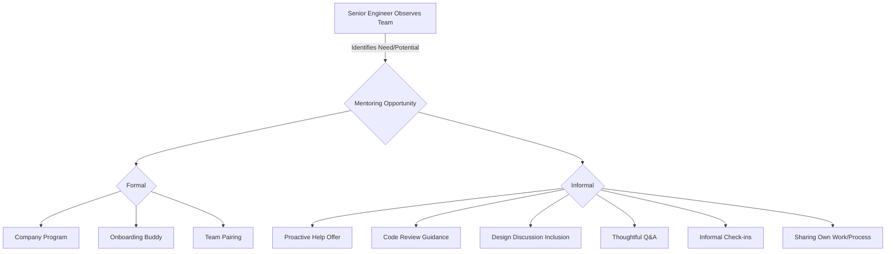
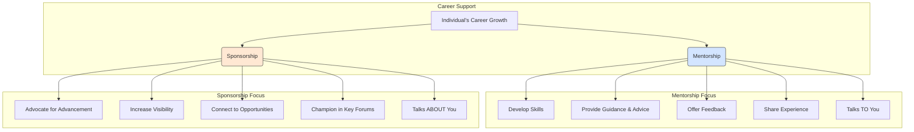

# Chapter 8: Mentorship and Sponsorship: Lifting Others As You Climb

_(Introductory Quote Idea: "The best way to predict the future is to create it. The best way to scale your impact is to empower others." - Adaptable)_

As engineers progress to senior levels, their sphere of influence naturally expands beyond their own keyboard. While technical excellence remains crucial, true seniority involves multiplying your impact by elevating the skills, visibility, and careers of those around you. Mentorship and sponsorship are not just "nice-to-haves"; they are fundamental responsibilities and powerful tools for building high-performing teams, fostering a healthy engineering culture, and scaling your own leadership capabilities. This chapter delves into the nuances of effective mentorship and sponsorship, equipping you with the mindset and techniques to lift others as you continue your own ascent.

## The Senior Engineer's Responsibility to Mentor

Mentorship, at its core, is about guiding and supporting the growth of less experienced individuals. For a Senior Software Engineer, this transcends occasional helpful advice; it becomes an integral part of the role for several critical reasons:

1.  **Scaling Knowledge and Best Practices:** You cannot be everywhere or review every line of code. Mentoring allows you to embed your knowledge, experience, and adherence to best practices within the team, ensuring quality and consistency scale beyond your direct involvement.
2.  **Team Velocity and Capability:** By upskilling junior and mid-level engineers, you increase the overall throughput and problem-solving capacity of the team. Well-mentored engineers become autonomous faster, freeing up senior members for more complex challenges.
3.  **Building a Learning Culture:** Actively mentoring signals that growth, learning, and mutual support are valued within the team and organization. This attracts and retains talent.
4.  **Succession Planning:** Identifying and nurturing potential future leaders ensures the team's long-term health and resilience. Today's mentees are tomorrow's seniors and tech leads.
5.  **Personal Leadership Development:** Mentoring hones your communication, empathy, feedback, and leadership skills – essential attributes for further career progression, whether on a technical or managerial track.
6.  **Reducing the "Bus Factor":** Spreading knowledge prevents critical information from residing solely with one or two individuals.

Ignoring the responsibility to mentor limits your own impact and hinders the team's potential. It's an investment, not a cost – an investment that pays dividends in team capability, project success, and a more robust engineering organization.

## Identifying Mentoring Opportunities (Formal and Informal)

Mentorship doesn't always require a formal program. Senior engineers should cultivate an awareness of opportunities to guide others in various contexts:

**Formal Mentoring:**

- **Company Mentorship Programs:** Often structured programs pairing seniors with juniors/new hires. Participate actively if available.
- **Onboarding Buddies:** Guiding new hires through their initial weeks/months is a crucial form of mentorship.
- **Team-Designated Pairings:** Sometimes teams explicitly pair engineers for knowledge transfer on specific projects or domains.

**Informal Mentoring (Often More Impactful):**

- **Proactive Observation:** Notice when someone is struggling with a concept, a tool, or a complex task. Offer help constructively ("Hey, I noticed you're working on X, I ran into something similar last quarter. Want to chat about it for 15 minutes?").
- **Thoughtful Code Reviews:** Go beyond just finding bugs. Use reviews to explain _why_ a certain pattern is preferred, suggest alternative approaches with trade-offs, and point to relevant documentation or examples (See Chapter 6).
- **Design Discussions:** Invite less experienced engineers to participate in technical design sessions. Actively solicit their opinions and guide their thinking.
- **Answering Questions:** When asked a question, don't just give the answer. Explain the underlying principles, show how you found the answer, or guide them to discover it themselves.
- **"Virtual Coffee Chats":** Regularly schedule brief, informal check-ins with more junior team members to build rapport and offer a safe space for them to ask questions they might hesitate to ask in a larger forum.
- **Sharing Your Work:** Be transparent about your own thought processes, challenges, and mistakes. Narrate your debugging process or design choices occasionally.



The key is shifting from a reactive ("I'll help if asked") to a proactive mindset ("Where can I offer guidance to accelerate someone's growth?").

## Effective Mentoring Techniques: Guiding vs. Directing

One of the most common pitfalls in mentoring is simply telling the mentee what to do. While sometimes necessary, overuse of _directing_ stifles learning and critical thinking. _Guiding_ empowers the mentee to find their own solutions, fostering deeper understanding and self-sufficiency.

**Directing (Use Sparingly):**

- **What it looks like:** Providing explicit instructions, giving the definitive answer, fixing the code yourself.
- **When appropriate:** Time-critical situations, blocked tasks after exploration, establishing non-negotiable standards (e.g., security protocols), correcting fundamental misunderstandings.
- **Risks:** Creates dependency, inhibits problem-solving skills, mentee doesn't internalize the 'why'.

**Guiding (Preferred Approach):**

- **What it looks like:** Asking open-ended questions, exploring trade-offs together, suggesting avenues for investigation, sharing your thought process, pointing to resources, pair programming (with the mentee driving), Socratic questioning.
- **When appropriate:** Most learning situations, debugging non-critical issues, design exploration, skill development.
- **Benefits:** Develops critical thinking, builds confidence, fosters ownership, leads to deeper understanding.

```mermaid
graph LR
    subgraph Mentoring Styles
        direction LR
        A[Mentoring Situation] --> B{Goal: Empower Mentee Growth};
        B --> C(Guiding);
        B --> D(Directing);
    end

    subgraph Guiding Techniques
        direction TB
        C --> C1[Ask Probing Questions];
        C --> C2[Explore Trade-offs];
        C --> C3[Suggest Resources];
        C --> C4[Share Thought Process];
        C --> C5[Pair Programming (Mentee Drives)];
    end

    subgraph Directing Techniques
        direction TB
        D --> D1[Provide Specific Answer];
        D --> D2[Give Explicit Instructions];
        D --> D3[Fix Problem Directly (Explain Why!)];
    end

    style C fill:#d4fcd4,stroke:#333,stroke-width:2px;
    style D fill:#fcc8c8,stroke:#333,stroke-width:2px;
```

**Examples of Guiding Questions:**

- "What have you tried so far?"
- "What do you think the root cause might be?"
- "What are the potential trade-offs between approach A and approach B?"
- "Where could you look to find more information about this?"
- "How could we test that assumption?"
- "What would happen if we tried X?"
- "Can you walk me through your current understanding of the problem?"

Mastering the balance between guiding and directing is key. Default to guiding, but recognize when direction is needed to prevent prolonged frustration or significant errors. Always explain the reasoning behind any direction given.

## Providing Growth-Oriented Feedback to Mentees

Feedback is the cornerstone of development. As a mentor, your feedback should be tailored to foster growth, not just point out errors. (Refer also to Chapter 1 on Seeking and Internalizing Feedback, and Chapter 6 on Code Reviews).

**Principles of Growth-Oriented Feedback:**

1.  **Connect to Goals:** Frame feedback in the context of the mentee's stated career goals or desired skill development areas. _"You mentioned wanting to improve your system design skills. In the recent RFC for service X, exploring alternative database choices with pros/cons would have strengthened your proposal."_
2.  **Focus on Behavior and Impact:** Describe specific, observable actions and their consequences (positive or negative), rather than making judgments about personality. _"Instead of saying 'Your code is confusing,' try 'When functions have multiple responsibilities like in `process_data()`, it makes it harder for others (and your future self) to understand and modify safely. Consider splitting it into smaller, single-purpose functions.'"_
3.  **Balance Strengths and Areas for Development:** Acknowledge progress and highlight strengths alongside areas needing improvement. This builds confidence and makes constructive feedback easier to receive.
4.  **Be Specific and Actionable:** Vague feedback ("Do better next time") is useless. Provide concrete examples and suggest specific actions the mentee can take. _"Your presentation was good, but to make it more impactful for the leadership audience, try starting with the key business outcome and then dive into the technical details, rather than the other way around."_
5.  **Timely and Regular:** Provide feedback close to the event when possible. Regular, smaller feedback loops are more effective than infrequent, large dumps.
6.  **Kind and Empathetic Delivery:** Choose the right time and place (usually private). Deliver feedback constructively, focusing on shared goals and improvement, not blame. Acknowledge the effort made.
7.  **Check for Understanding:** After giving feedback, ask the mentee to summarize their understanding or ask clarifying questions to ensure the message landed correctly.

Remember, the goal is to build the mentee up, helping them see their potential and the path to reach it.

## Understanding the Difference Between Mentorship and Sponsorship

While often conflated, mentorship and sponsorship serve distinct but complementary roles in career development. As a senior engineer, understanding this difference is crucial both for seeking support for your _own_ career and for effectively championing others.

- **Mentorship:** Focuses on **developing** the individual. Mentors offer advice, guidance, feedback, share experiences, and help navigate challenges. They _talk to_ the mentee. The relationship is primarily focused on skill-building and personal growth.
- **Sponsorship:** Focuses on **advancing** the individual. Sponsors are typically senior leaders who use their influence and capital to advocate for their protégé's visibility and career progression. They _talk about_ the protégé in rooms where decisions are made (e.g., promotion committees, project staffing). The relationship is transactional, based on performance and potential.



**Why the Distinction Matters for Senior Engineers:**

- **Mentoring Others (Your Role):** You primarily act as a _mentor_, focusing on skill development and guidance.
- **Becoming a Sponsor (Your Role):** As you gain influence, you can start acting as a _sponsor_ for high-potential individuals you've likely mentored.
- **Seeking Support (For Yourself):** Recognize that you need _both_ mentors (for guidance) and sponsors (for advocacy) for your own continued trajectory.

## Finding Sponsors and Becoming a Sponsor for Others

**Finding Sponsors (for yourself - briefly, as context for becoming one):**

- **Deliver Excellence:** Sponsorship is earned through consistent high performance and demonstrated potential.
- **Build Relationships:** Network strategically with influential leaders beyond your direct manager.
- **Increase Visibility:** Volunteer for high-impact projects, present your work, share expertise.
- **Articulate Your Goals:** Make your career aspirations known to potential sponsors.
- **Seek Advocates:** Identify individuals who believe in your potential and are willing to speak up for you.

**Becoming a Sponsor (The Senior Engineer's Role):**

This is a powerful way to amplify your impact and shape the future leadership of the organization.

1.  **Identify High Potential:** Look for individuals (often those you mentor or observe closely) who consistently exceed expectations, demonstrate leadership qualities (even informally), tackle complex problems effectively, and align with company values.
2.  **Advocate Actively:** When opportunities arise (project assignments, promotion discussions, talent reviews), use your credibility to speak positively and specifically about the individual's accomplishments and potential. _"I strongly recommend Sarah for the tech lead role on Project Phoenix. Her work on the recent data pipeline refactor demonstrated not only deep technical skill but also excellent cross-team coordination. She's ready for that next step."_
3.  **Create Visibility:** Provide opportunities for your protégé to showcase their talents to a wider audience. This could mean co-presenting with them, suggesting they lead a technical demo, or connecting them with key stakeholders.
4.  **Provide Stretch Opportunities:** Use your influence to help them get assigned to challenging projects that push their boundaries and allow them to demonstrate readiness for the next level. Endorse their capability to take on such roles.
5.  **Offer Insider Insight:** Help them understand the unwritten rules, navigate organizational politics, and identify key opportunities or pitfalls.
6.  **Be Ethical and Fair:** Sponsor based on merit and observed potential, not personal affinity or bias. Be mindful of providing equitable opportunities.

Sponsorship requires positional power or significant influence. While mentoring can start early, effective sponsorship often becomes more feasible and expected at the senior and higher levels.

## The Impact of Mentorship on Team Health and Retention

Investing time in mentorship yields significant returns for the entire team and organization:

- **Improved Team Cohesion & Psychological Safety:** Mentorship fosters trust and rapport. Knowing support is available encourages engineers to ask questions and take calculated risks.
- **Faster Onboarding & Integration:** New hires become productive more quickly and feel connected to the team sooner when they have dedicated mentors.
- **Increased Knowledge Sharing & Reduced Silos:** Mentorship naturally facilitates the transfer of tacit knowledge, domain expertise, and best practices across the team.
- **Enhanced Skill Development:** Creates a structured way for engineers to level up, leading to a more capable and versatile team.
- **Higher Morale & Engagement:** Feeling invested in and seeing a clear path for growth significantly boosts morale.
- **Significantly Improved Retention:** Engineers who feel supported, challenged, and see opportunities for growth are far less likely to leave. Good mentorship is a powerful retention tool. Conversely, a lack of mentorship and growth opportunities is a common reason for attrition.
- **Stronger Engineering Culture:** A culture where seniors actively mentor juniors attracts talent and sets a positive standard for collaboration and continuous improvement.

Neglecting mentorship contributes to knowledge silos, slower growth for junior members, reduced team velocity, and potential attrition – all of which negatively impact the team's health and effectiveness.

## Mentoring Session Structure and Question Guide

While mentoring can happen informally, structured sessions can be highly beneficial, especially in formal pairings or when addressing specific development goals. Here’s a flexible structure and question guide:

**Suggested Mentoring Session Structure (e.g., 30-60 minutes):**

1.  **Check-in & Rapport Building (5 min):** Start with informal conversation. "How has your week been?" "Anything interesting happen since we last chatted?"
2.  **Mentee's Agenda & Priorities (10-15 min):** Let the mentee lead. "What's top of mind for you today?" "What challenges are you facing?" "What specific areas would you like to discuss?"
3.  **Deep Dive & Exploration (15-30 min):** Focus on 1-2 key topics identified by the mentee. Use guiding questions (see below). Explore options, brainstorm solutions, discuss trade-offs.
4.  **Mentor's Input & Experience Sharing (5-10 min):** Briefly share relevant experiences, insights, or resources _after_ the mentee has explored their own thoughts. Avoid dominating the conversation.
5.  **Action Items & Next Steps (5 min):** Collaboratively define concrete, achievable actions the mentee can take before the next session. "What's one thing you'll try based on our discussion?" "Shall we review the outcome next time?"
6.  **Feedback & Schedule Follow-up (5 min):** Briefly ask for feedback on the session itself. Confirm the next meeting time/date.

**Guiding Question Categories for Mentors:**

- **Goal Setting & Clarification:**
  - "What are your main goals for the next [period]?"
  - "What does success look like for you in [area/project]?"
  - "What skills are you most interested in developing right now?"
  - "Where do you see yourself in [timeframe], and how can I help you get there?"
- **Problem Solving & Analysis:**
  - "Can you walk me through the problem as you see it?"
  - "What approaches have you considered?"
  - "What are the biggest obstacles you're encountering?"
  - "What information are you missing?"
  - "What are the potential risks or trade-offs involved?"
- **Skill Development & Learning:**
  - "How confident do you feel about [specific skill]?"
  - "What aspect of [technology/process] would you like to understand better?"
  - "How could you practice or apply this skill in your current work?"
  - "Are there any resources (books, courses, people) that might help?"
- **Reflection & Learning:**
  - "What did you learn from that experience?"
  - "What went well? What would you do differently next time?"
  - "How did that outcome compare to your expectations?"
- **Career & Impact:**
  - "What kind of impact do you want to have on the team/project?"
  - "What parts of your work do you find most energizing/draining?"
  - "Are there opportunities you'd like to pursue?"

**Key Mentoring Principles:**

- **Listen Actively:** Pay full attention, paraphrase to confirm understanding, ask clarifying questions.
- **Be Patient:** Learning takes time. Allow space for the mentee to think and articulate.
- **Maintain Confidentiality:** Build trust by respecting the privacy of your conversations (unless there's a serious ethical or policy violation).
- **Be Reliable:** Show up prepared and follow through on any commitments you make.
- **Empower, Don't Prescribe:** Your goal is to help them find _their_ path, not dictate it.

By embracing the roles of mentor and, eventually, sponsor, senior engineers move beyond individual contribution to become force multipliers, shaping not only codebases but also the careers of their colleagues and the future of their engineering organizations. It's a challenging but deeply rewarding aspect of technical leadership.
