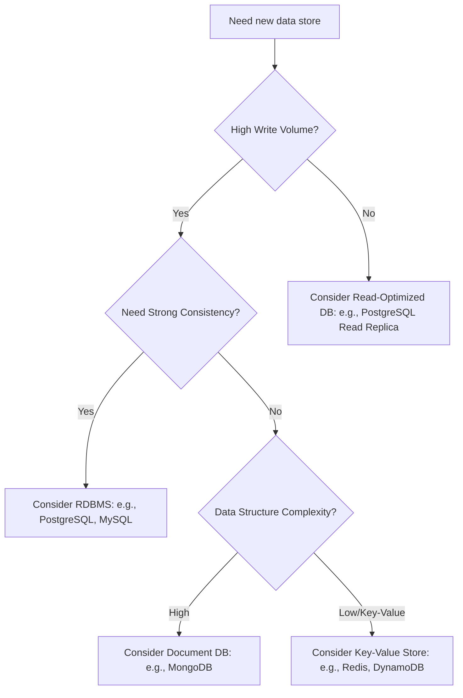
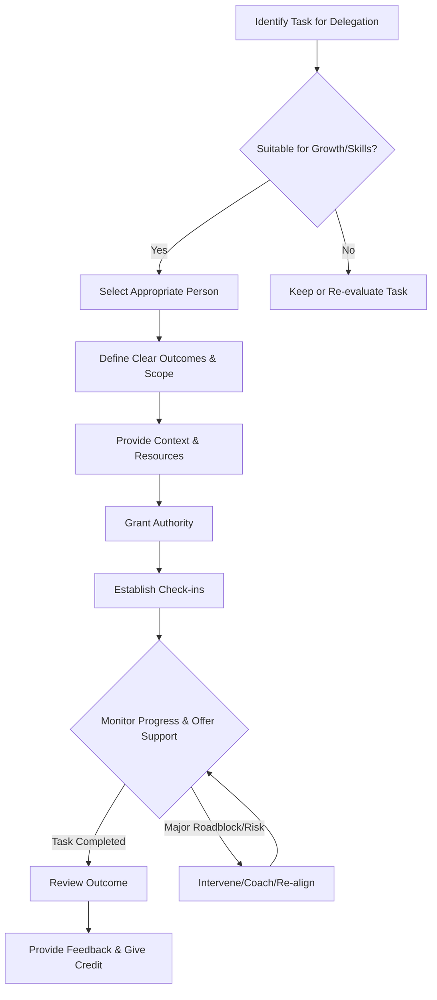

# Chapter 9: Technical Leadership in Practice

**(Introduction)**

Welcome to the crucible where technical expertise meets influence and responsibility. As a Senior Software Engineer, your impact transcends the lines of code you write; it extends to shaping the technical direction of projects, empowering your team, and ensuring the delivery of robust, scalable, and maintainable systems. Technical leadership, in the context of a Senior IC (Individual Contributor), isn't about formal authority or managing people's careers; it's about **guiding technical execution, fostering excellence, and taking ownership of the technical landscape.** It's earned through credibility, demonstrated expertise, and the consistent application of the soft skills we've discussed – communication, collaboration, influence, and emotional intelligence – within the technical domain.

This chapter delves into the practical application of technical leadership. We'll move beyond theory and explore the day-to-day actions and mindsets that distinguish a Senior Engineer who merely executes tasks from one who truly leads technical efforts. You'll learn how to define vision, navigate uncertainty, delegate effectively, drive alignment, manage risk, and ultimately, amplify your impact and the impact of those around you.

---

## Defining Technical Vision and Strategy for Projects/Features

Technical leadership begins with understanding the _why_ and charting the _how_. Simply building features as specified isn't enough at the senior level. You need to contribute to, and sometimes define, the technical approach that ensures long-term success.

**What are Technical Vision and Strategy?**

- **Technical Vision:** A clear, concise, and inspiring picture of the desired future state of a technical system, component, or feature. It answers: "What are we building from a technical perspective, and why does it matter?" It aligns with product goals but focuses on the _how_ – architecture, key technologies, non-functional requirements (scalability, performance, maintainability).
- **Technical Strategy:** The high-level plan and set of principles guiding _how_ the vision will be achieved. It outlines the key technical decisions, architectural patterns, technology choices, phasing, and approaches needed to realize the vision. It addresses trade-offs explicitly.

**Why It Matters for Senior Engineers:**

- **Alignment:** Provides a north star for the engineering team, ensuring everyone pulls in the same technical direction.
- **Informed Decisions:** Creates a framework for making consistent, lower-level technical choices.
- **Efficiency:** Prevents wasted effort on approaches incompatible with the long-term goals.
- **Scalability & Maintainability:** Encourages thinking beyond immediate requirements to build sustainable systems.
- **Motivation:** A compelling vision can inspire the team and provide context for their work.

**How to Define and Communicate Vision/Strategy:**

1.  **Understand the 'Why':** Deeply internalize the business goals, user needs, and product requirements. Ask clarifying questions until the objectives are crystal clear.
2.  **Explore the Landscape:** Research existing systems, potential technologies, architectural patterns, and industry best practices relevant to the problem.
3.  **Identify Key Technical Challenges & Goals:** What are the critical non-functional requirements (performance targets, scalability needs, security constraints)? What are the major technical hurdles?
4.  **Evaluate Options & Trade-offs:** No solution is perfect. Analyze different approaches, considering factors like:
    - Complexity (development, operational)
    - Cost (development time, infrastructure, licensing)
    - Performance & Scalability
    - Maintainability & Testability
    - Team Skillset & Familiarity
    - Time-to-Market
    - Future Flexibility
5.  **Formulate the Vision:** Articulate the target state. _Example: "We will build a modular, event-driven service using asynchronous processing to handle peak loads of 10,000 requests per second, allowing independent scaling of ingestion and processing components."_
6.  **Develop the Strategy:** Outline the path. _Example: "Phase 1: Build core ingestion API and message queue interface. Phase 2: Develop initial processor using current database. Phase 3: Refactor processor for optimized NoSQL storage and parallel processing. Key Tech: Kafka, Python (FastAPI), PostgreSQL -> Cassandra."_
7.  **Document Concisely:** Use lightweight RFCs (Request for Comments), ADRs (Architecture Decision Records), or design documents. Focus on clarity, rationale, and key decisions. Visuals (diagrams) are crucial.
8.  **Communicate and Iterate:** Present the vision and strategy to the team and stakeholders. Actively solicit feedback, address concerns, and refine the plan. This is not a one-time event; revisit and adapt as new information emerges.

**Pitfalls to Avoid:**

- **Over-Engineering:** Designing for hypothetical future problems that may never materialize.
- **Under-Engineering:** Focusing solely on immediate needs, creating future bottlenecks.
- **Ivory Tower Design:** Defining a strategy without consulting the engineers who will implement it.
- **Analysis Paralysis:** Getting stuck endlessly evaluating options without making a decision.
- **Poor Communication:** Failing to clearly articulate the vision, strategy, and rationale.

---

## Making Sound Technical Decisions Under Uncertainty

Senior engineers rarely operate with perfect information. Deadlines loom, requirements evolve, and technical unknowns are common. The ability to make _sound_ decisions – well-reasoned, risk-aware, and adaptable – even amidst ambiguity, is a hallmark of technical leadership.

**The Nature of Uncertainty in Engineering:**

- Incomplete requirements
- Evolving dependencies (internal/external)
- Unforeseen technical challenges (performance bottlenecks, integration issues)
- Shifting business priorities
- Limitations of current knowledge/prototypes

**Why Sound Decision-Making Matters:**

- **Unblocks Progress:** Prevents teams from getting stuck in indecision.
- **Manages Risk:** Identifies potential downsides and incorporates mitigation strategies.
- **Builds Trust:** Demonstrates thoughtful leadership to the team and stakeholders.
- **Optimizes Outcomes:** Increases the likelihood of achieving desired results, even if the path isn't perfectly clear.

**Frameworks and Techniques:**

1.  **Gather Maximum Context:** Talk to product managers, designers, other engineers, and operations. Read existing documentation. Understand the constraints (time, budget, people).
2.  **Identify Knowns and Unknowns:** Explicitly list what you know for sure and what assumptions or unknowns you're dealing with.
3.  **Define Decision Criteria:** What factors are most important? (e.g., speed of delivery, long-term maintainability, performance, cost, security). Weight them if necessary.
4.  **Generate Options:** Brainstorm potential solutions or paths forward. Don't settle on the first idea.
5.  **Evaluate Options Systematically:**
    - **Pros and Cons:** Classic, simple evaluation.
    - **Cost-Benefit Analysis:** Quantify where possible.
    - **Risk Assessment:** Analyze potential downsides for each option (see Section 9.6).
    - **Proof-of-Concept (Spike):** Build a small prototype to de-risk technical unknowns for critical options.
    - **Decision Matrix (e.g., Pugh Matrix):** Score options against weighted criteria.
6.  **Timebox the Decision:** Avoid analysis paralysis. Set a deadline for making the call, even if it's based on the best _available_ information.
7.  **Choose and Articulate Rationale:** Make the decision and clearly explain _why_ that option was chosen over others, referencing the criteria and trade-offs. Document this (ADRs are excellent here).
8.  **Identify Reversibility / Mitigation:** Can the decision be easily reversed if it proves wrong? If not, what's the plan B? How can potential negative consequences be mitigated (e.g., feature flags, monitoring)?
9.  **Communicate and Commit:** Inform the team and stakeholders. Ensure everyone understands the chosen path and the reasoning. Embrace the "disagree and commit" principle if necessary.

**MermaidJS Diagram: Simple Decision Tree Example**



**Key Mindset:** Focus on making the _best possible decision with the available information_, not on achieving impossible certainty. Emphasize learning and adaptation; be willing to revisit decisions if significant new information arises.

---

## Delegating Effectively: Trusting and Empowering Others

As a senior engineer, you cannot (and should not) do everything yourself. Your ability to scale your impact hinges on effective delegation. This isn't just offloading tasks; it's about entrusting ownership, fostering growth in others, and freeing yourself up for higher-leverage activities like strategic planning and complex problem-solving.

**Delegation vs. Task Assignment:**

- **Task Assignment:** "Implement function X according to these exact steps." (Focus on the 'how')
- **Delegation:** "We need a reliable way to process these incoming events (goal). Can you own designing and implementing the solution? Let's sync on the high-level approach." (Focus on the 'what' and 'why', empowering the 'how')

**Why Effective Delegation is Crucial:**

- **Scalability:** You become a bottleneck if all complex work flows through you.
- **Team Growth:** Provides opportunities for junior and mid-level engineers to learn new skills and take on more responsibility.
- **Empowerment & Motivation:** Builds trust and gives team members a sense of ownership, increasing engagement.
- **Efficiency:** Allows the right person with the right context or interest to tackle a problem.
- **Focus:** Frees you to concentrate on tasks requiring your specific expertise or strategic oversight.

**Steps to Effective Delegation:**

1.  **Identify the Right Task:** Choose tasks that offer growth opportunities, align with someone's interests or development goals, or can be handled effectively by someone else. Don't just delegate grunt work.
2.  **Select the Right Person:** Consider their skills, experience level, current workload, and interest. Are they ready for this challenge (perhaps with support)?
3.  **Define Clear Outcomes and Scope:** Be explicit about the desired result, success criteria, constraints, and boundaries. What does "done" look like?
4.  **Provide Context and Resources:** Explain the 'why' behind the task. Ensure they have access to necessary information, tools, and contacts.
5.  **Grant Authority:** Give them the autonomy to make decisions within the defined scope. Avoid prescribing the exact implementation details unless necessary for critical constraints.
6.  **Establish Check-in Points (Don't Micromanage):** Agree on a cadence for updates or specific milestones for review. Offer support and guidance, but let them drive the work. Focus on progress and roadblocks, not minute details.
7.  **Allow for Learning (and Failure):** Recognize that others might approach the problem differently or make mistakes. Use these as coaching opportunities, intervening only if the risk becomes critical.
8.  **Give Credit and Recognition:** Publicly and privately acknowledge their effort and success upon completion.

**MermaidJS Diagram: Delegation Process Flow**



**Common Delegation Traps:**

- **Micromanagement:** Constantly overseeing and correcting implementation details.
- **"Dump and Run":** Delegating without adequate context, support, or check-ins.
- **Taking Back Work:** Reclaiming a task at the first sign of difficulty, undermining confidence.
- **Unclear Expectations:** Leading to frustration and incorrect outcomes.
- **Delegating Only Undesirable Tasks:** Reserving all interesting work for yourself.

Delegation is a skill that requires practice and trust. Start small, provide support, and focus on the long-term benefits for both you and your team members.

---

## Owning Technical Outcomes: Accountability and Responsibility

Technical leadership means taking ownership beyond your individual contributions. It involves embracing accountability for the technical success (or failure) of the projects and systems you influence, regardless of who wrote the specific lines of code.

**Accountability vs. Responsibility vs. Blame:**

- **Responsibility:** You are assigned or take on the duty to perform certain tasks or ensure certain functions work. (e.g., "I am responsible for implementing the caching layer.")
- **Accountability:** You are answerable for the _outcome_ resulting from those responsibilities, whether you performed the tasks directly or delegated them. It involves proactive monitoring, reporting, and taking corrective action. (e.g., "I am accountable for the performance and reliability of the caching layer.")
- **Blame:** Focuses on fault-finding after something has gone wrong. It's often counter-productive. Accountability focuses on learning and improvement.

**Why Owning Outcomes is Essential:**

- **Builds Trust:** Demonstrates reliability and commitment to stakeholders and the team.
- **Drives Quality:** Encourages proactive measures to ensure success, not just task completion.
- **Fosters Learning:** Owning failures leads to deeper analysis and prevention of recurrence.
- **Sets the Standard:** Encourages a culture of accountability within the team.
- **Ensures Closure:** Prevents issues from falling through the cracks after initial implementation.

**How to Practice Ownership:**

1.  **Proactive Monitoring:** Don't wait for things to break. Understand how the system _should_ behave and monitor its key metrics (performance, error rates, resource utilization).
2.  **Define Success Metrics:** Work with product and the team to define what success looks like technically (e.g., latency targets, uptime goals, error budgets).
3.  **Anticipate Problems:** Think ahead about potential failure modes, scalability limits, and operational issues (related to risk management).
4.  **Transparent Communication:** Report honestly on progress, successes, and setbacks. Don't hide problems; surface them early with potential solutions or mitigation plans.
5.  **Embrace Failure as Learning:** When things go wrong, focus on the "what" and "how" of the failure and the "how" of preventing recurrence, not the "who." Lead the post-mortem process constructively.
6.  **Own the Fix:** Ensure that bugs, performance issues, or operational problems related to your area of influence are addressed, even if you delegate the implementation of the fix. Track it to completion.
7.  **Celebrate Team Successes:** While you are accountable, ensure the team members who contributed get the credit for successes. Your ownership supports their achievements.
8.  **Understand the Full Lifecycle:** Consider deployment, operations, monitoring, and decommissioning as part of your technical ownership, not just development.

**Key Takeaway:** Ownership isn't about being the hero who fixes everything; it's about ensuring things _get_ fixed and that the system remains healthy and effective over its lifetime. It's a commitment to the end result.

---

## Driving Technical Alignment Across Teams

Modern software development rarely happens in isolation. Features often span multiple teams, services, or platforms. A senior engineer acting as a technical leader plays a crucial role in ensuring these different parts work together harmoniously, preventing technical silos and integration chaos.

**What is Technical Alignment?**

Ensuring that different teams or individuals working on related components or systems:

- Share a common understanding of the overall technical architecture.
- Make compatible technical decisions.
- Adhere to agreed-upon standards, patterns, and interfaces.
- Are aware of each other's dependencies and timelines.
- Leverage shared infrastructure or platforms effectively.

**Why Drive Alignment?**

- **Reduces Integration Friction:** Prevents costly and time-consuming problems when different components need to connect.
- **Avoids Duplication of Effort:** Encourages reuse of solutions and platforms.
- **Maintains Architectural Coherence:** Ensures the overall system remains logical, scalable, and maintainable.
- **Facilitates Collaboration:** Builds bridges between teams and fosters a shared understanding.
- **Improves Velocity:** Reduces cross-team roadblocks and surprises.

**Strategies for Driving Alignment:**

1.  **Understand the Ecosystem:** Map out the dependencies between your team's work and other teams/systems. Who consumes your APIs? Whose APIs do you consume? What shared platforms are involved?
2.  **Build Relationships:** Get to know the technical leaders and key engineers on related teams. Informal communication channels are often the most effective.
3.  **Initiate Cross-Team Discussions Early:** Don't wait until integration time. Bring relevant people together during the design phase of new features or architectural changes.
4.  **Utilize Shared Documentation:**
    - **RFCs/Design Docs:** Circulate proposals that impact other teams and actively solicit their feedback.
    - **ADRs:** Make key architectural decisions visible across teams.
    - **API Contracts:** Use clear, well-documented contracts (e.g., OpenAPI/Swagger).
5.  **Promote and Adhere to Standards:** Champion the use of agreed-upon coding standards, architectural patterns, communication protocols, and library choices. Lead by example.
6.  **Facilitate Technical Guilds or Communities of Practice:** Create forums for engineers working on similar problems across different teams to share knowledge and establish common approaches.
7.  **Advocate for Platform Thinking:** Identify opportunities to build reusable components or services that multiple teams can leverage.
8.  **Mediate Technical Disagreements:** When conflicts arise between teams on technical approaches, act as a neutral facilitator, focusing on technical merits and overall system goals (see Chapter 10).
9.  **Communicate Proactively:** Share your team's technical roadmap, significant changes, and potential impacts with dependent teams. Ask them to do the same.

**Challenges:**

- **Organizational Silos:** Teams may have different priorities, processes, or cultures.
- **Lack of Visibility:** Difficulty knowing what other teams are working on.
- **"Not Invented Here" Syndrome:** Resistance to adopting solutions or standards from other teams.
- **Time Constraints:** Finding time for cross-team communication and alignment amidst project pressures.

Driving alignment requires strong communication, negotiation, and influencing skills. It's about building consensus and shared understanding for the benefit of the larger technical ecosystem.

---

## Identifying and Mitigating Technical Risks Proactively

Senior engineers don't just solve problems; they anticipate them. Proactive risk management involves identifying potential technical threats _before_ they materialize into crises and implementing strategies to reduce their likelihood or impact.

**Types of Technical Risks:**

- **Scalability/Performance:** Will the system handle future load? Will latency targets be met?
- **Reliability/Availability:** What are the single points of failure? How resilient is the system to infrastructure issues or dependencies failing?
- **Security:** Are there vulnerabilities (e.g., injection attacks, data leaks, improper authentication)?
- **Maintainability:** Will the code be easy to understand, modify, and debug in the future? Is there excessive technical debt?
- **Dependencies:** Are we reliant on unstable third-party services, libraries, or internal teams?
- **Data Integrity/Loss:** How do we prevent data corruption or loss?
- **Deployability/Operability:** Can we deploy changes safely and frequently? Is the system easy to monitor and operate?
- **Technology Obsolescence:** Are we using outdated or unsupported technologies?

**Why Proactive Risk Management Matters:**

- **Reduces Firefighting:** Prevents emergencies and costly outages.
- **Improves Predictability:** Leads to more reliable delivery timelines.
- **Increases Quality & Stability:** Builds more robust and resilient systems.
- **Saves Time & Money:** Fixing issues proactively is almost always cheaper than reacting to failures.
- **Builds Confidence:** Demonstrates foresight and diligence to stakeholders.

**Techniques for Identification and Mitigation:**

1.  **Risk Brainstorming / Pre-mortems:** Before starting a project or major feature, ask: "Imagine this project has failed spectacularly six months after launch. What could have caused it?" Brainstorm potential failure modes.
2.  **Architectural Reviews:** Systematically review designs for potential weaknesses in scalability, reliability, security, etc. Use checklists or frameworks (e.g., STRIDE for security).
3.  **Threat Modeling:** Specifically focus on security risks by identifying assets, threats, vulnerabilities, and countermeasures.
4.  **Analyze Dependencies:** Map out external and internal dependencies. Assess their stability and have contingency plans if they fail.
5.  **Monitor Trends:** Watch performance metrics, error logs, and resource utilization to spot degrading trends before they cause outages.
6.  **Review Technical Debt:** Regularly assess and prioritize the backlog of technical debt. Understand the risks associated with not addressing it.
7.  **Prototype High-Risk Areas:** Use spikes or PoCs to validate assumptions about new technologies or complex integrations.
8.  **Implement Mitigation Strategies:**
    - **Redundancy:** Eliminate single points of failure.
    - **Circuit Breakers/Bulkheads:** Isolate failures to prevent cascading effects.
    - **Feature Flags:** Allow enabling/disabling features quickly without deployment.
    - **Automated Testing:** Catch regressions and bugs early.
    - **Rollback Plans:** Ensure you can revert deployments quickly if issues arise.
    - **Monitoring & Alerting:** Detect problems quickly.
    - **Rate Limiting/Throttling:** Protect services from overload.
    - **Security Best Practices:** Input validation, parameterized queries, least privilege, etc.
9.  **Risk Matrix:** Quantify risks by likelihood and impact to prioritize mitigation efforts.

**MermaidJS Diagram: Simple Risk Matrix Representation**

```mermaid
graph TD
    subgraph Risk Matrix
        direction TB
        A[High Impact / High Likelihood<br/>(Mitigate Urgently)] -- Connects --> B
        B[High Impact / Low Likelihood<br/>(Contingency Plan)] -- Connects --> C
        C[Low Impact / High Likelihood<br/>(Monitor/Optimize)] -- Connects --> D
        D[Low Impact / Low Likelihood<br/>(Accept/Monitor)]
    end

    subgraph Examples
        X1[Potential Risk: DB Overload] --> A
        X2[Potential Risk: Cloud Provider Outage] --> B
        X3[Potential Risk: Minor UI Glitch] --> C
        X4[Potential Risk: Rare Edge Case Bug] --> D
    end

    style A fill:#f9d,stroke:#333,stroke-width:2px
    style B fill:#fcf,stroke:#333,stroke-width:2px
    style C fill:#cdf,stroke:#333,stroke-width:2px
    style D fill:#dfd,stroke:#333,stroke-width:2px
```

_(Note: Mermaid doesn't create true matrix visuals easily, this represents the categories)_

**Key Principle:** Risk management is an ongoing process, not a one-time checklist. Revisit risks regularly, especially when designs change or new information becomes available.

---

## Profiles of Different Technical Leadership Styles

Just as there isn't one "right" way to write code, there isn't a single mold for effective technical leadership. Recognizing different styles – both in yourself and others – allows you to adapt your approach, understand team dynamics better, and appreciate diverse forms of contribution. Effective leaders often blend elements of multiple styles depending on the situation.

**Common Technical Leadership Archetypes:**

1.  **The Visionary/Strategist:**

    - **Focus:** Long-term technical direction, architectural coherence, identifying future trends and opportunities.
    - **Strengths:** Big-picture thinking, articulating compelling technical futures, guiding major architectural decisions.
    - **Potential Weaknesses:** May overlook immediate details, can sometimes seem detached from day-to-day implementation struggles.
    - **Best Suited For:** Defining new systems, major refactoring efforts, setting departmental technical strategy.

2.  **The Coach/Mentor:**

    - **Focus:** Growing the skills and capabilities of the team, providing guidance and support, fostering a learning environment (ties into Chapter 8).
    - **Strengths:** Empathetic, patient, excellent at explaining concepts, invested in team development.
    - **Potential Weaknesses:** May sometimes prioritize teaching over immediate delivery speed, might struggle with making tough unpopular decisions.
    - **Best Suited For:** Onboarding new members, leveling up junior/mid-level engineers, improving team practices through guidance.

3.  **The Servant Leader:**

    - **Focus:** Removing obstacles for the team, ensuring they have the tools and context they need, facilitating collaboration, protecting the team from external distractions.
    - **Strengths:** Highly supportive, great facilitator, builds psychological safety, focuses on team enablement.
    - **Potential Weaknesses:** May sometimes be overly consensus-driven, might not assert strong technical opinions when needed.
    - **Best Suited For:** Improving team processes, running complex cross-functional projects smoothly, fostering a healthy team environment.

4.  **The Deep Technical Expert/Architect:**

    - **Focus:** Deep understanding of specific technologies or system components, solving the hardest technical problems, ensuring technical excellence in implementation.
    - **Strengths:** Unrivaled technical depth, high credibility in their domain, sets high standards for quality.
    - **Potential Weaknesses:** Communication might be overly technical, may sometimes become a bottleneck for their specific area, might undervalue simpler solutions.
    - **Best Suited For:** Critical system components, complex algorithmic work, performance optimization, security hardening.

5.  **The Pragmatist/Executor:**

    - **Focus:** Getting things done efficiently, making practical trade-offs, focusing on delivery and execution, navigating constraints effectively.
    - **Strengths:** Results-oriented, decisive, good at unblocking issues, skilled at estimation and delivery planning.
    - **Potential Weaknesses:** May sometimes prioritize speed over long-term design, might accumulate technical debt if not careful.
    - **Best Suited For:** Projects with tight deadlines, stabilizing existing systems, driving features to completion.

6.  **The Consensus Builder/Diplomat:**
    - **Focus:** Building agreement across teams and stakeholders, ensuring everyone feels heard, navigating organizational politics effectively (related to Chapter 7 & 10).
    - **Strengths:** Excellent communication and negotiation skills, builds bridges, effective at driving cross-team alignment.
    - **Potential Weaknesses:** Decision-making can be slow, may sometimes compromise too much on technical vision to achieve harmony.
    - **Best Suited For:** Large cross-functional initiatives, situations requiring buy-in from many groups, resolving technical disagreements between teams.

**Self-Awareness and Adaptability:**

- **Identify Your Natural Style:** Which of these descriptions resonates most with you? Understanding your default tendencies is the first step.
- **Recognize Others' Styles:** Appreciate the different ways your colleagues lead and contribute technically.
- **Adapt Your Approach:** The most effective leaders adjust their style based on the needs of the situation, the project, and the team members involved. A crisis might require a more directive, pragmatic approach, while mentoring calls for a coaching style. Defining a new architecture needs visionary thinking, while integrating requires diplomacy.

**Key Takeaway:** Embrace your strengths, but consciously develop skills from other leadership styles to become more versatile and impactful. Technical leadership is multifaceted, and the best leaders have a diverse toolkit.

---

**(Chapter Conclusion)**

Technical leadership in practice is not a title automatically conferred with seniority; it's a continuous demonstration of ownership, foresight, influence, and enablement within the technical realm. It involves stepping up to define technical direction, making sound judgments under pressure, empowering your colleagues through effective delegation, ensuring alignment across boundaries, proactively managing risks, and ultimately taking accountability for the technical outcomes.

By mastering the practices outlined in this chapter – defining vision, navigating uncertainty, delegating wisely, owning results, driving alignment, mitigating risks, and understanding different leadership styles – you transition from being just a skilled coder to a force multiplier for your team and organization. These actions, underpinned by the foundational soft skills discussed throughout this book, are what truly define technical leadership in action and pave the way for becoming an indispensable Senior Engineer.
