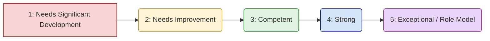

# Appendix A: Soft Skills Self-Assessment Checklist for Senior Software Engineers

## Introduction: Your Personal Soft Skills Audit

This self-assessment checklist is designed to be a powerful tool for introspection and growth, aligning directly with the concepts explored throughout this book. Seniority in software engineering isn't just about technical depth; it's fundamentally about the _impact_ you have, which is heavily amplified (or limited) by your soft skills.

**Purpose:**

- To provide an honest, structured snapshot of your current soft skill proficiency across key areas relevant to senior engineering roles.
- To identify specific areas of strength to leverage and areas requiring focused development.
- To serve as a baseline for tracking your growth over time as you apply the principles in this book.

**How to Use This Checklist:**

1.  **Be Honest:** The value of this exercise lies in accurate self-reflection. Consider specific examples from your recent experience (last 6-12 months) as you rate yourself.
2.  **Use the Scale:** Rate yourself on each statement using the following scale:
    - **1 = Needs Significant Development:** This is a major weak area for me, or I rarely demonstrate this skill effectively.
    - **2 = Needs Improvement:** I demonstrate this skill inconsistently or only in comfortable situations. I recognize the need to improve.
    - **3 = Competent:** I generally demonstrate this skill effectively in most standard situations. Meets expectations.
    - **4 = Strong:** I consistently demonstrate this skill effectively, even in challenging situations. Often seen as a strength by others.
    - **5 = Exceptional / Role Model:** This is a core strength. I not only excel but often help others develop this skill. Consistently exceeds expectations.
3.  **Add Notes:** Use the (optional) "Notes/Examples" space to jot down specific situations or evidence that support your rating. This adds depth to your reflection.
4.  **Review & Plan:** After completing the assessment, review your scores (overall and per section). Identify 1-3 key areas to focus on for development. Refer back to the relevant chapters in this book to create a personal action plan.
5.  **Revisit Regularly:** Soft skills are developed over time. Revisit this assessment every 6-12 months to track your progress and adjust your focus.

**Scoring Visualization (Conceptual):**



> **Note:** This checklist directly corresponds to the chapters in this book. If you identify an area for development, refer back to the relevant chapter(s) for detailed strategies, techniques, and examples.

---

## The Assessment Checklist

---

### Part I: Foundational Pillars of Senior Engineering Effectiveness

**(Reference: Chapters 1-3)**

| Statement                                                                                                                              | Rating (1-5) | Notes/Examples (Optional) | Relevant Chapter(s) |
| :------------------------------------------------------------------------------------------------------------------------------------- | :----------: | :------------------------ | :-----------------: |
| **Chapter 1: Mastering Self-Awareness**                                                                                                |              |                           |          1          |
| 1.1 I can accurately identify my core technical and non-technical strengths and articulate how they benefit the team/project.          |              |                           |          1          |
| 1.2 I recognize my key weaknesses or blind spots and actively seek strategies or feedback to mitigate their negative impact.           |              |                           |          1          |
| 1.3 I am aware of my inherent biases (e.g., confirmation bias, anchoring) and consciously try to counteract them in decisions.         |              |                           |          1          |
| 1.4 I understand my primary communication style(s) (e.g., analytical, driver, amiable, expressive) and adapt it based on audience.     |              |                           |          1          |
| 1.5 I can identify my emotional triggers in high-pressure situations (e.g., tight deadlines, production issues, disagreements).        |              |                           |          1          |
| 1.6 When triggered, I generally manage my emotional responses constructively rather than reactively.                                   |              |                           |          1          |
| 1.7 I actively solicit constructive feedback on my performance and behavior, even when it might be critical.                           |              |                           |          1          |
| 1.8 I process critical feedback objectively, seeking to understand the core message rather than becoming defensive.                    |              |                           |          1          |
| 1.9 I demonstrate a growth mindset: viewing challenges as opportunities, persisting through setbacks, and valuing effort/learning.     |              |                           |          1          |
| **Chapter 2: Emotional Intelligence (EQ)**                                                                                             |              |                           |          2          |
| 2.1 I accurately perceive my own emotions as they happen (Self-Awareness).                                                             |              |                           |          2          |
| 2.2 I effectively manage my impulses and regulate my emotional state, especially under stress (Self-Regulation).                       |              |                           |          2          |
| 2.3 I am driven by intrinsic factors (e.g., mastery, purpose) and maintain optimism even when facing difficulties (Motivation).        |              |                           |          2          |
| 2.4 I accurately perceive and understand the emotions and perspectives of others, even if different from my own (Empathy).             |              |                           |          2          |
| 2.5 I effectively build rapport, manage relationships, find common ground, and build networks (Social Skills).                         |              |                           |          2          |
| 2.6 I can "read the room" during meetings or discussions, sensing unspoken concerns or group dynamics.                                 |              |                           |          2          |
| 2.7 When faced with technical roadblocks or project delays, I manage my frustration productively and focus on solutions.               |              |                           |          2          |
| 2.8 I proactively build trust and psychological safety with junior engineers, peers, and stakeholders.                                 |              |                           |          2          |
| 2.9 I make a conscious effort to understand the viewpoints of non-technical stakeholders (Product, Design, Sales, etc.).               |              |                           |          2          |
| **Chapter 3: The Articulate Engineer**                                                                                                 |              |                           |          3          |
| 3.1 I effectively tailor my communication (level of detail, language, medium) for different audiences (executives, peers, juniors).    |              |                           |          3          |
| 3.2 I can explain complex technical systems, trade-offs, or decisions clearly and concisely to non-technical audiences.                |              |                           |          3          |
| 3.3 My design documents (RFCs, ADRs) are well-structured, clear, comprehensive, and facilitate good decision-making.                   |              |                           |          3          |
| 3.4 My code reviews provide specific, actionable, and constructive feedback, focusing on principles over preferences.                  |              |                           |          3          |
| 3.5 My code comments clarify the _why_ behind complex logic, not just the _what_.                                                      |              |                           |          3          |
| 3.6 My emails and instant messages (Slack, Teams) are clear, concise, and professional, with clear calls to action when needed.        |              |                           |          3          |
| 3.7 My status updates accurately reflect progress, highlight risks/blockers, and are appropriately detailed for the audience.          |              |                           |          3          |
| 3.8 I practice active listening: focusing fully, understanding context, asking clarifying questions, and summarizing key points.       |              |                           |          3          |
| 3.9 I ask insightful, open-ended questions that stimulate deeper thinking and uncover hidden assumptions or requirements.              |              |                           |          3          |
| 3.10 I clearly articulate the trade-offs (e.g., speed vs. reliability, cost vs. features) and risks associated with technical options. |              |                           |          3          |
| 3.11 I can persuasively present technical ideas or proposals, connecting them to business value or strategic goals.                    |              |                           |          3          |
| 3.12 I am aware of my non-verbal communication (body language, tone) and use it effectively to enhance my message (in-person/remote).  |              |                           |          3          |

---

### Part II: Collaboration and Team Dynamics at Scale

**(Reference: Chapters 4-6)**

| Statement                                                                                                                              | Rating (1-5) | Notes/Examples (Optional) | Relevant Chapter(s) |
| :------------------------------------------------------------------------------------------------------------------------------------- | :----------: | :------------------------ | :-----------------: |
| **Chapter 4: High-Impact Collaboration**                                                                                               |              |                           |          4          |
| 4.1 I understand and effectively participate in/lead various collaboration models (e.g., pairing, mobbing, async design discussions).  |              |                           |          4          |
| 4.2 I facilitate technical discussions effectively, ensuring all relevant viewpoints are heard and the group stays focused.            |              |                           |          4          |
| 4.3 I actively work towards building consensus on technical decisions, but know when to "disagree and commit" for team velocity.       |              |                           |          4          |
| 4.4 I navigate differences in opinion constructively, focusing on technical merit and shared goals rather than personal positions.     |              |                           |          4          |
| 4.5 I collaborate effectively with colleagues across different time zones and cultural backgrounds, adapting my communication style.   |              |                           |          4          |
| 4.6 I proactively manage dependencies with other teams (Product, Design, QA, Ops, Data) ensuring alignment and smooth integration.     |              |                           |          4          |
| 4.7 I contribute to a team environment where members feel safe to ask questions, admit mistakes, and challenge ideas respectfully.     |              |                           |          4          |
| **Chapter 5: High-Value Meetings**                                                                                                     |              |                           |          5          |
| 5.1 I understand my role in different meetings (e.g., leading, contributing expertise, making decisions) and participate accordingly.  |              |                           |          5          |
| 5.2 When organizing meetings, I ensure clear goals, a focused agenda, and only necessary attendees are invited.                        |              |                           |          5          |
| 5.3 When facilitating meetings, I keep discussions on track, manage time effectively, and ensure participation from all attendees.     |              |                           |          5          |
| 5.4 I actively encourage quieter team members to share their perspectives during group discussions.                                    |              |                           |          5          |
| 5.5 I ensure meetings conclude with clear decisions, documented action items, and assigned owners.                                     |              |                           |          5          |
| 5.6 I critically evaluate the need for meetings and proactively suggest asynchronous communication methods when appropriate.           |              |                           |          5          |
| 5.7 I recognize and help steer the team away from common meeting anti-patterns (e.g., lack of agenda, decision paralysis).             |              |                           |          5          |
| **Chapter 6: Mastering Code Reviews**                                                                                                  |              |                           |          6          |
| 6.1 I understand code reviews aim for knowledge sharing, consistency, and maintainability, not just bug finding.                       |              |                           |          6          |
| 6.2 When reviewing code, my feedback is constructive, specific, actionable, kind, and focused on the code, not the author.             |              |                           |          6          |
| 6.3 When receiving code review feedback, I respond gracefully, seek to understand the reviewer's perspective, and avoid defensiveness. |              |                           |          6          |
| 6.4 I review code considering long-term maintainability, scalability, readability, and testability, not just immediate functionality.  |              |                           |          6          |
| 6.5 I effectively balance the need for thorough code reviews with the team's need for velocity and timely feedback.                    |              |                           |          6          |
| 6.6 I actively contribute to establishing and upholding clear, consistent code review norms and standards within the team.             |              |                           |          6          |
| 6.7 I use code reviews as an opportunity to mentor junior engineers, explaining the "why" behind suggestions.                          |              |                           |          6          |

---

### Part III: Influence, Mentorship, and Technical Leadership

**(Reference: Chapters 7-9)**

| Statement                                                                                                                                         | Rating (1-5) | Notes/Examples (Optional) | Relevant Chapter(s) |
| :------------------------------------------------------------------------------------------------------------------------------------------------ | :----------: | :------------------------ | :-----------------: |
| **Chapter 7: Leading Without Authority (Influence)**                                                                                              |              |                           |          7          |
| 7.1 I understand my potential spheres of influence (team, project, cross-team, department) and act accordingly.                                   |              |                           |          7          |
| 7.2 I build credibility through consistent technical excellence, reliability, and thoughtful communication.                                       |              |                           |          7          |
| 7.3 I influence technical direction and decisions through reasoned arguments, data, and persuasion, rather than authority or force.               |              |                           |          7          |
| 7.4 I effectively articulate the business value or impact of technical proposals, initiatives, or debt remediation.                               |              |                           |          7          |
| 7.5 I can negotiate effectively on technical priorities, scope, and timelines with stakeholders (e.g., Product Managers, other teams).            |              |                           |          7          |
| 7.6 I proactively champion technical best practices, architectural improvements, or process changes within my sphere of influence.                |              |                           |          7          |
| 7.7 When presenting technical topics, I tailor my message and delivery style to maximize influence and impact on the audience.                    |              |                           |          7          |
| **Chapter 8: Mentorship and Sponsorship**                                                                                                         |              |                           |          8          |
| 8.1 I recognize and embrace the responsibility of a senior engineer to mentor and guide less experienced team members.                            |              |                           |          8          |
| 8.2 I proactively identify informal and formal mentoring opportunities within the team and organization.                                          |              |                           |          8          |
| 8.3 In mentoring, I focus on asking guiding questions and empowering mentees to find solutions, rather than just providing answers.               |              |                           |          8          |
| 8.4 I provide specific, actionable, and growth-oriented feedback to mentees, focusing on both strengths and areas for development.                |              |                           |          8          |
| 8.5 I understand the distinction between mentorship (guidance) and sponsorship (advocacy) and seek/provide both where appropriate.                |              |                           |          8          |
| 8.6 I actively look for opportunities to advocate for (sponsor) deserving junior colleagues, highlighting their contributions.                    |              |                           |          8          |
| 8.7 I understand how effective mentorship contributes positively to team morale, skill development, and retention.                                |              |                           |          8          |
| **Chapter 9: Technical Leadership in Practice**                                                                                                   |              |                           |          9          |
| 9.1 I contribute significantly to defining the technical vision and strategy for projects or complex features I'm involved in.                    |              |                           |          9          |
| 9.2 I make sound technical decisions, balancing short-term needs with long-term goals, even when faced with ambiguity or incomplete data.         |              |                           |          9          |
| 9.3 I delegate technical tasks effectively, providing sufficient context and autonomy while ensuring accountability.                              |              |                           |          9          |
| 9.4 I take ownership of the technical outcomes of my work and the initiatives I lead, including addressing failures constructively.               |              |                           |          9          |
| 9.5 I work to drive technical alignment and consistency across different teams or components when necessary.                                      |              |                           |          9          |
| 9.6 I proactively identify potential technical risks (e.g., scalability bottlenecks, security flaws, integration issues) and propose mitigations. |              |                           |          9          |
| 9.7 I adapt my leadership style based on the situation and the needs of the team or individuals involved.                                         |              |                           |          9          |

---

### Part IV: Navigating Complexity and Conflict

**(Reference: Chapters 10-12)**

| Statement                                                                                                                                       | Rating (1-5) | Notes/Examples (Optional) | Relevant Chapter(s) |
| :---------------------------------------------------------------------------------------------------------------------------------------------- | :----------: | :------------------------ | :-----------------: |
| **Chapter 10: Conflict Resolution**                                                                                                             |              |                           |         10          |
| 10.1 I can identify the common sources of conflict in technical teams (e.g., disagreements on approach, process friction, personality clashes). |              |                           |         10          |
| 10.2 I differentiate between healthy debate (constructive conflict) and unhealthy personal attacks or avoidance (destructive conflict).         |              |                           |         10          |
| 10.3 I approach disagreements by seeking to understand the other party's perspective and underlying needs/interests first.                      |              |                           |         10          |
| 10.4 I utilize constructive conflict resolution frameworks (like NVC principles: observations, feelings, needs, requests) when appropriate.     |              |                           |         10          |
| 10.5 I can facilitate or mediate technical disagreements between team members, helping them find common ground or acceptable compromises.       |              |                           |         10          |
| 10.6 I practice the "disagree and commit" principle effectively once a team decision is made, even if I initially preferred another path.       |              |                           |         10          |
| 10.7 I know when and how to escalate conflicts appropriately if they cannot be resolved at the current level.                                   |              |                           |         10          |
| 10.8 I can deliver difficult feedback related to interpersonal conflict respectfully and constructively.                                        |              |                           |         10          |
| **Chapter 11: Negotiation Skills**                                                                                                              |              |                           |         11          |
| 11.1 I recognize situations where negotiation is required (e.g., project scope, deadlines, resource allocation, technical design choices).      |              |                           |         11          |
| 11.2 Before negotiating, I prepare by clearly defining my goals, understanding constraints, and identifying my BATNA (Best Alternative).        |              |                           |         11          |
| 11.3 I focus on underlying interests and objective criteria rather than rigid positions during technical negotiations.                          |              |                           |         11          |
| 11.4 I actively seek mutually beneficial ("win-win") solutions whenever possible in negotiations.                                               |              |                           |         11          |
| 11.5 I clearly communicate the value and justification for my technical proposals or resource requests during negotiations.                     |              |                           |         11          |
| 11.6 I handle pushback, objections, or counter-arguments calmly and professionally, addressing concerns with data and reason.                   |              |                           |         11          |
| 11.7 I am aware of common negotiation tactics and can respond to them effectively and ethically.                                                |              |                           |         11          |
| **Chapter 12: Navigating Ambiguity**                                                                                                            |              |                           |         12          |
| 12.1 I remain productive and maintain a positive attitude when faced with unclear requirements or uncertain technical paths.                    |              |                           |         12          |
| 12.2 I employ techniques (e.g., prototyping, spike tasks, iterative development) to break down large, ambiguous problems into smaller parts.    |              |                           |         12          |
| 12.3 I ask probing, clarifying questions to stakeholders to uncover hidden assumptions, constraints, and true requirements.                     |              |                           |         12          |
| 12.4 I can make demonstrable progress on tasks even when the full picture or final solution is not yet clear.                                   |              |                           |         12          |
| 12.5 I communicate uncertainty, assumptions, and potential risks transparently to stakeholders.                                                 |              |                           |         12          |
| 12.6 I help establish lightweight frameworks or principles to guide decision-making when faced with significant ambiguity.                      |              |                           |         12          |

---

### Part V: Personal Effectiveness and Career Growth

**(Reference: Chapters 13-16)**

| Statement                                                                                                                                            | Rating (1-5) | Notes/Examples (Optional) | Relevant Chapter(s) |
| :--------------------------------------------------------------------------------------------------------------------------------------------------- | :----------: | :------------------------ | :-----------------: |
| **Chapter 13: Advanced Time Management & Prioritization**                                                                                            |              |                           |         13          |
| 13.1 I utilize effective systems (beyond basic lists) to manage my complex workload, track tasks, and ensure follow-through.                         |              |                           |         13          |
| 13.2 I apply prioritization frameworks (e.g., Eisenhower, MoSCoW, impact/effort) to focus on the most valuable engineering tasks.                    |              |                           |         13          |
| 13.3 I actively structure my schedule to protect blocks of focused time ("deep work") for complex technical tasks.                                   |              |                           |         13          |
| 13.4 I manage interruptions (e.g., Slack, emails, shoulder taps) effectively, balancing responsiveness with maintaining focus.                       |              |                           |         13          |
| 13.5 I provide realistic task estimates and proactively communicate potential delays or changes in scope/effort.                                     |              |                           |         13          |
| 13.6 I effectively balance the need to address technical debt and improve system health against delivering new features.                             |              |                           |         13          |
| 13.7 I can strategically and respectfully say "no" or negotiate scope/timing when requests exceed capacity or conflict with priorities.              |              |                           |         13          |
| **Chapter 14: Continuous Learning & Adaptability**                                                                                                   |              |                           |         14          |
| 14.1 I have proactive strategies for staying technically relevant beyond passive consumption (e.g., side projects, courses, contributing).           |              |                           |         14          |
| 14.2 I understand my preferred learning styles and actively work on improving my ability to learn new technologies/concepts efficiently.             |              |                           |         14          |
| 14.3 I adapt readily to changes in technology stacks, team processes, project direction, or organizational structure.                                |              |                           |         14          |
| 14.4 I view failures or mistakes as valuable learning opportunities and share lessons learned with the team.                                         |              |                           |         14          |
| 14.5 I actively share my knowledge and learnings with others through documentation, presentations, mentoring, or tech talks.                         |              |                           |         14          |
| 14.6 I maintain a system (formal or informal) for organizing and retrieving technical knowledge and resources (Personal Knowledge Mgmt).             |              |                           |         14          |
| **Chapter 15: Building Resilience & Managing Stress**                                                                                                |              |                           |         15          |
| 15.1 I can recognize the early signs of burnout or excessive stress in myself and potentially in my teammates.                                       |              |                           |         15          |
| 15.2 I employ effective strategies (e.g., time management, delegation, seeking help) to manage my workload sustainably.                              |              |                           |         15          |
| 15.3 I have developed mental resilience techniques to cope with setbacks, pressure, and criticism constructively.                                    |              |                           |         15          |
| 15.4 I establish and maintain healthy boundaries between work and personal life to prevent chronic stress and enable recovery.                       |              |                           |         15          |
| 15.5 I know when and how to seek support (from manager, peers, HR, EAP) when facing significant stress or challenges.                                |              |                           |         15          |
| 15.6 I actively cultivate habits and a work rhythm that promote a sustainable pace over the long term.                                               |              |                           |         15          |
| **Chapter 16: Career Development & Strategic Networking**                                                                                            |              |                           |         16          |
| 16.1 I have a clear understanding of my desired career trajectory (e.g., deepening technical expertise, moving towards architecture/mgmt).           |              |                           |         16          |
| 16.2 I proactively use examples of my soft skills (e.g., influence, mentorship, collaboration) during performance reviews and promotion discussions. |              |                           |         16          |
| 16.3 I build and maintain professional relationships authentically, both inside and outside my current organization.                                 |              |                           |         16          |
| 16.4 I leverage my professional network effectively for knowledge sharing, problem-solving, and identifying opportunities.                           |              |                           |         16          |
| 16.5 I consciously cultivate a positive professional reputation ("personal brand") as a capable and collaborative senior engineer.                   |              |                           |         16          |
| 16.6 As an interviewer, I effectively assess candidates' technical _and_ soft skills relevant to senior roles.                                       |              |                           |         16          |
| 16.7 As an interviewee for senior roles, I effectively articulate my technical skills _and_ demonstrate strong soft skills.                          |              |                           |         16          |

---

## Interpreting Your Results & Next Steps

1.  **Calculate Section Scores:** Tally your scores for each major Part (I-V). This gives you a high-level view of your relative strengths.
2.  **Identify Low Scores (1s and 2s):** Pay close attention to items rated 1 or 2. These represent your most significant areas for immediate development. Prioritize these based on their current impact on your role and career goals.
3.  **Recognize Competencies (3s):** These are areas where you meet expectations. Consider if elevating any of these to a '4' would significantly increase your impact or support your career aspirations.
4.  **Leverage Strengths (4s and 5s):** These are your superpowers! Acknowledge them. Think about how you can use these strengths more intentionally. Can you mentor others in these areas? Can you take on tasks or roles that specifically leverage these skills?
5.  **Connect to Chapters:** For each area you want to improve, revisit the corresponding chapter(s) in this book. Review the concepts, strategies, and examples provided.
6.  **Create an Action Plan:** Don't just assess – act! Choose 1-3 specific, measurable, achievable, relevant, and time-bound (SMART) goals for soft skill development based on your assessment. For example:
    - "Over the next quarter, I will consciously practice active listening in at least three team meetings per week by summarizing key points before offering my own opinion (Chapter 3)."
    - "This month, I will volunteer to write the design document for the upcoming X feature, focusing on clarity for non-technical stakeholders (Chapter 3)."
    - "In the next project retrospective, I will actively solicit feedback on my collaboration style from at least two peers (Chapter 1 & 4)."
7.  **Seek Feedback:** Discuss your self-assessment (or specific parts of it) with a trusted mentor, manager, or peer. Their external perspective can provide valuable validation or highlight blind spots.
8.  **Re-Assess Periodically:** Schedule a time (e.g., every 6 months) to retake this assessment. Track your progress, celebrate improvements, and set new goals. Soft skill development is a continuous journey.

**Visualizing Your Profile (Conceptual Radar Chart):**

You can map your average scores for each Part (or even chapter) onto a radar chart to visualize your overall profile.

```mermaid
%%{init: {'theme': 'base', 'themeVariables': { 'primaryColor': '#f0f0f0', 'lineColor': '#666', 'textColor': '#333'}}}%%
radarChart
    title Soft Skills Profile (Average Score per Part)
    axesAlias: ["Part I: Foundations", "Part II: Collaboration", "Part III: Leadership", "Part IV: Complexity/Conflict", "Part V: Effectiveness/Growth"]
    axesMaxTick: 5
    axesMaxLabel: 5

    data
    group My Scores
    axes: [
        4,  % Example Score for Part I
        3,  % Example Score for Part II
        5,  % Example Score for Part III
        3,  % Example Score for Part IV
        4   % Example Score for Part V
    ]
    end
```

> _(Note: Replace the example scores above with your actual calculated averages for each Part to generate your personalized chart if using a tool that supports Mermaid rendering)._

By engaging thoughtfully with this self-assessment, you take a crucial step towards mastering the full spectrum of skills that define truly exceptional Senior Software Engineers. Use it as your compass for continuous growth and increased impact.
