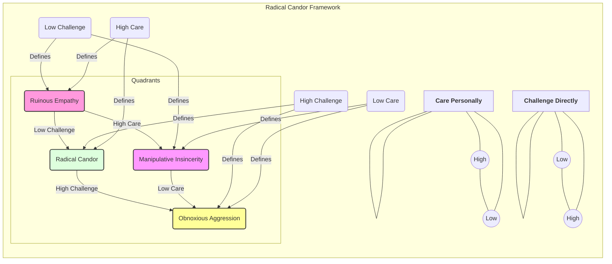

# Appendix B: Templates and Frameworks for Effective Senior Engineering

## Introduction

This appendix provides practical, actionable templates and frameworks referenced throughout this book. Think of these not as rigid prescriptions, but as robust starting points and mental scaffolds. As a Senior Software Engineer, your ability to adapt these tools to your specific context (team, project, company culture) is crucial. Use them to structure your thoughts, facilitate communication, streamline processes, and ultimately amplify your impact.

**How to Use These Templates:**

1.  **Understand the Purpose:** Read the brief introduction accompanying each template to grasp its intended use case and underlying principles.
2.  **Adapt, Don't Just Adopt:** Modify these templates based on the specific needs of the situation. Add, remove, or rephrase sections as necessary.
3.  **Combine and Iterate:** Feel free to combine elements from different templates or iterate on them over time as you discover what works best for you and your team.
4.  **Focus on the Outcome:** The template is a means to an end. The goal is clearer communication, better decisions, constructive feedback, and well-designed systems – not just filling out a form.

---

## Section 1: Meeting Agendas

Effective meetings are crucial for collaboration and decision-making. As a Senior Engineer, you'll often lead or play a key role in various meeting types. A clear agenda, distributed beforehand, is non-negotiable for maximizing value and respecting everyone's time. (See Chapter 5: Running and Participating in High-Value Meetings).

### Template 1: Technical Decision-Making Meeting Agenda

**Purpose:** To collaboratively evaluate technical options and arrive at a well-reasoned decision for a specific problem or design choice.

- **Meeting Title:** Technical Decision: [Specific Problem/Feature, e.g., Choice of Database for Service X]
- **Date & Time:** [Date], [Time] ([Duration, e.g., 60 minutes])
- **Location/Link:** [Conference Room / Video Call Link]
- **Required Attendees:** [List names/roles - Core decision-makers, key stakeholders]
- **Optional Attendees:** [List names/roles - Those who might provide valuable input but aren't core decision-makers]
- **Meeting Goal:** Decide on [Specific outcome, e.g., the primary database technology for Service X] by the end of this meeting.
- **Pre-Reading / Preparation (MUST READ):**
  - [Link to Design Doc/RFC outlining the problem and options] (Due: [Date])
  - [Link to any relevant data, benchmarks, or prior research]
  - **Action:** Come prepared with questions and a preliminary assessment of the options.

---

**Agenda Items:**

1.  **(5 min) Welcome & Goal Recap:**
    - Briefly reiterate the meeting's purpose and desired outcome.
    - Confirm everyone understands the problem context.
2.  **(10 min) Problem Statement & Constraints Review:**
    - Presenter: [Name]
    - Quickly summarize the core problem we're solving.
    - Review key requirements and constraints (technical, business, time, budget).
    - Clarify any misunderstandings.
3.  **(20 min) Option Review & Discussion:**
    - Presenter(s): [Name(s) who researched/propose options]
    - Briefly present each viable option ([Option A], [Option B], [Option C]...).
    - Focus on Pros, Cons, Risks, and Alignment with Constraints for each.
    - _Facilitator Note: Keep discussion focused on comparing options against criteria. Use a whiteboard or shared doc to track key points._
    ```mermaid
    graph TD
        A[Problem Definition] --> B{Decision Criteria};
        B --> C1[Option A];
        B --> C2[Option B];
        B --> C3[Option C];
        C1 --> D1{Pros/Cons/Risks};
        C2 --> D2{Pros/Cons/Risks};
        C3 --> D3{Pros/Cons/Risks};
        D1 --> E[Evaluation];
        D2 --> E;
        D3 --> E;
        E --> F(Decision & Rationale);
    ```
4.  **(15 min) Decision Making:**
    - Facilitator: [Name]
    - Synthesize discussion points.
    - Identify areas of agreement and disagreement.
    - Facilitate voting, consensus building, or escalation path if needed (e.g., using methods like dot voting, Fist of Five, or identifying the designated decision-maker).
    - **Clearly state the final decision.**
5.  **(5 min) Record Decision & Next Steps:**
    - Document the chosen option and the _key rationale_ behind the decision.
    - Identify immediate action items, owners, and deadlines (e.g., Update Design Doc: [Owner], By [Date]; Spike Implementation: [Owner], By [Date]).
6.  **(5 min) Q&A and Wrap-up:**
    - Address any final clarifying questions.
    - Thank participants.

---

- **Post-Meeting:** Share meeting notes, decision record, and action items promptly. Update relevant documentation (Design Doc, RFC, tickets).

### Template 2: Project Kick-off Meeting Agenda

**Purpose:** To align all key stakeholders on the goals, scope, team roles, timeline, and initial plan for a new project or major feature.

- **Meeting Title:** Project Kick-off: [Project/Feature Name]
- **Date & Time:** [Date], [Time] ([Duration, e.g., 90 minutes])
- **Location/Link:** [Conference Room / Video Call Link]
- **Attendees:** [List names/roles - Include Eng, Product, Design, QA, Ops, relevant stakeholders]
- **Meeting Goal:** Achieve shared understanding and alignment on project objectives, scope, roles, and initial plan. Get commitment to move forward.
- **Pre-Reading / Preparation:**
  - [Link to Project Brief / Requirements Doc / One-Pager]
  - [Link to High-Level Design Doc (if available)]
  - **Action:** Familiarize yourself with the project context and goals. Come prepared with initial questions or concerns.

---

**Agenda Items:**

1.  **(5 min) Welcome & Introductions:**
    - Brief introductions if team members don't know each other well.
    - Meeting facilitator states the purpose and goals of the kick-off.
2.  **(15 min) Project Vision & Goals (The "Why"):**
    - Presenter: [Product Manager / Project Sponsor]
    - What problem are we solving? For whom?
    - What are the key business objectives and success metrics?
    - How does this align with broader company/product strategy?
3.  **(20 min) Scope & Deliverables (The "What"):**
    - Presenter: [Product Manager / Tech Lead]
    - Define what is _in_ scope (key features, user stories).
    - Explicitly define what is _out_ of scope for this phase/release.
    - Discuss key deliverables and acceptance criteria.
    - _Facilitator Note: Capture scope clarifications and potential ambiguities._
4.  **(15 min) Roles & Responsibilities (The "Who"):**
    - Presenter: [Tech Lead / Eng Manager]
    - Identify key roles: Tech Lead, Product Owner, Designer, QA Lead, Eng team members, key stakeholders (e.g., Ops, Security, Marketing).
    - Clarify primary responsibilities and points of contact for different areas.
    ```mermaid
    graph TD
        subgraph Project Core Team
            PM[Product Manager]
            TL[Tech Lead]
            Des[Designer]
            Eng1[Engineer 1]
            Eng2[Engineer 2]
            QA[QA Lead]
        end
        subgraph Stakeholders
            Ops[Operations]
            Sec[Security]
            Mkt[Marketing]
            Data[Data Science]
        end
        PM -->|Requirements & Priority| TL;
        TL -->|Technical Direction| Eng1;
        TL -->|Technical Direction| Eng2;
        Des -->|Designs & UX| PM;
        Des -->|Designs & UX| TL;
        Eng1 -->|Implementation| TL;
        Eng2 -->|Implementation| TL;
        QA -->|Testing Strategy| TL;
        QA -->|Test Cases| PM;
        TL -->|Coordination| Ops;
        TL -->|Coordination| Sec;
        PM -->|Updates & Launch| Mkt;
        TL -->|Data Needs| Data;
    ```
5.  **(15 min) High-Level Plan & Timeline (The "When"):**
    - Presenter: [Tech Lead / Eng Manager / PM]
    - Review major milestones and target dates (if known).
    - Discuss development approach (Agile sprints, Kanban, etc.).
    - Outline initial technical approach or key architectural decisions (reference HLD if available).
6.  **(10 min) Risks & Dependencies:**
    - Facilitator: [Anyone, typically Tech Lead or PM]
    - Brainstorm potential risks (technical, resource, timeline, external).
    - Identify key dependencies (other teams, services, data).
    - Assign owners for mitigating risks or managing dependencies where possible.
7.  **(5 min) Communication Plan & Next Steps:**
    - How will the team communicate? (Slack channels, stand-ups, reporting cadence).
    - Where will documentation live? (Wiki, repo READMEs).
    - Confirm immediate next steps, owners, and deadlines (e.g., Set up project board: [Owner], By [Date]; Schedule detailed design sessions: [Owner], By [Date]).
8.  **(5 min) Q&A and Wrap-up:**
    - Open floor for final questions.
    - Confirm alignment and commitment.
    - Thank participants.

---

- **Post-Meeting:** Distribute notes, action items, and links to relevant resources. Set up communication channels and project tracking tools.

### Template 3: Retrospective Meeting Agenda (Agile Context)

**Purpose:** To reflect on a recent period (sprint, project phase, incident) to identify what worked well, what didn't, and determine actionable improvements for the future. Fosters continuous learning and improvement.

- **Meeting Title:** Retrospective: [Sprint X / Project Y / Incident Z]
- **Date & Time:** [Date], [Time] ([Duration, e.g., 60-90 minutes])
- **Location/Link:** [Conference Room / Video Call Link / Retro Board Link]
- **Attendees:** [List names/roles - The core team involved in the period being reviewed]
- **Meeting Goal:** Identify specific, actionable improvements to implement in the next cycle/going forward. Foster psychological safety and open reflection.
- **Preparation:**
  - Facilitator prepares the retro board (physical or virtual).
  - Team members reflect individually beforehand on the period (optional but helpful).

---

**Agenda Items (Example using a common format):**

1.  **(5 min) Set the Stage:**
    - Facilitator: [Name - often Scrum Master, Tech Lead, or rotating role]
    - Welcome and state the goal: Improve our process, not assign blame.
    - Review the retrospective timeframe/scope.
    - Briefly explain the format/activities.
    - Reiterate the Prime Directive (Norman Kerth): _"Regardless of what we discover, we understand and truly believe that everyone did the best job they could, given what they knew at the time, their skills and abilities, the resources available, and the situation at hand."_
2.  **(15-20 min) Gather Data (What happened?):**
    - Facilitator guides silent brainstorming or round-robin.
    - Use prompts like:
      - **Went Well / Liked:** What successes, positive events, or helpful processes occurred?
      - **Learned / Lacked:** What did we learn? What was missing or could have been better?
      - **Longed For / Puzzled:** What challenges arose? What was confusing or unexpected?
      - _(Alternative prompts: Start/Stop/Continue; Mad/Sad/Glad; Sailboat - Anchors/Wind)_
    - Participants add items to respective columns on the board.
3.  **(15-20 min) Generate Insights (Why did it happen?):**
    - Facilitator groups similar items.
    - Team discusses the themes emerging from the data.
    - Ask "Why?" multiple times (5 Whys technique) to understand root causes for key issues or successes.
    - Focus on patterns and systemic issues, not just isolated events.
    ```mermaid
    graph TD
        A[Gather Data: Went Well?] --> B(Group Themes);
        A --> B;
        C[Gather Data: Lacked/Learned?] --> B;
        C --> B;
        D[Gather Data: Puzzled/Longed For?] --> B;
        D --> B;
        B --> E{Discuss Themes & Root Causes};
        E --> F(Identify Key Areas for Improvement);
    ```
4.  **(15-20 min) Decide What to Do (How can we improve?):**
    - Brainstorm potential actions based on the insights.
    - Prioritize: Select 1-3 _specific, measurable, achievable, relevant, time-bound (SMART)_ actions the team can realistically implement. (Dot voting is common here).
    - Assign owners and agree on how to track progress for each action item.
5.  **(5 min) Close the Retrospective:**
    - Facilitator summarizes key takeaways and agreed actions.
    - Thank everyone for their participation and candor.
    - Check out (e.g., quick round-robin: one word describing how you feel leaving the retro).

---

- **Post-Meeting:** Document action items clearly (e.g., in team wiki, project board). Owners follow up on their items. Check progress in the next retrospective or stand-ups.

### Template 4: 1:1 Meeting Agenda (Senior Engineer Focus)

**Purpose:** Regular check-in between a Senior Engineer and their manager (or potentially a mentor/mentee). Focuses on progress, challenges, feedback, growth, and alignment.

- **Meeting Title:** 1:1: [Your Name] <> [Manager's/Mentee's Name]
- **Date & Time:** [Date], [Time] ([Duration, e.g., 30-45 minutes])
- **Location/Link:** [Office / Video Call Link]
- **Attendees:** [You, Your Manager/Mentee]
- **Meeting Goal:** Open communication, feedback exchange, alignment on priorities, support for growth and well-being.
- **Preparation:** Both participants should add agenda items to a shared document beforehand.

---

**Potential Agenda Items (Choose/Adapt as needed - often driven by participant input):**

**(Items You Might Bring Up with Your Manager):**

1.  **(5 min) Quick Check-in:**
    - How are things going generally? Any immediate blockers or urgent issues?
2.  **(10-15 min) Project / Technical Updates & Challenges:**
    - Progress on key initiatives since last 1:1.
    - Discussing complex technical problems or decisions.
    - Highlighting risks, dependencies, or areas needing support/escalation.
    - Seeking feedback on technical approach or design choices.
3.  **(10 min) Feedback (Both Ways):**
    - **Feedback for Manager:** Observations about team dynamics, processes, support needed. (Use SBI/STAR).
    - **Seeking Feedback:** Ask for specific feedback on recent work, leadership, communication, etc. (e.g., "How effectively did I handle the discussion in the X meeting?", "Do you have feedback on my recent design doc for Y?").
4.  **(5-10 min) Career Growth & Development:**
    - Discuss progress towards personal development goals.
    - Explore opportunities for mentorship, learning, or taking on new challenges.
    - Talk about long-term career aspirations and alignment with current role/opportunities.
5.  **(5 min) Team & Org Topics:**
    - Discuss team health, morale, or process improvement ideas.
    - Share relevant information or context from other parts of the organization.
6.  **(Wrap-up) Action Items:**
    - Summarize key takeaways and agreed-upon actions for both participants.

**(Items You Might Discuss as a Mentor with a Mentee - See Chapter 8):**

1.  **(5 min) Check-in & Rapport Building:** How was their week? Any highlights?
2.  **(10-15 min) Mentee's Updates & Challenges:** What are they working on? Where are they stuck? What problems are they trying to solve? (Listen actively, ask guiding questions).
3.  **(10-15 min) Skill Development / Goal Progress:** Discuss specific skills they're working on. Review progress on learning goals. Offer resources, advice, or pair programming opportunities.
4.  **(5-10 min) Navigating Team/Org:** Discuss team dynamics, communication challenges, understanding processes. Offer perspectives based on your experience.
5.  **(5 min) Feedback & Encouragement:** Provide specific, constructive feedback (SBI/STAR). Offer encouragement and recognition for progress.
6.  **(Wrap-up) Next Steps:** Define focus areas or actions before the next session.

---

- **Post-Meeting:** Update shared notes doc. Follow through on action items.

---

## Section 2: Feedback Frameworks

Giving and receiving feedback effectively is a cornerstone of growth, collaboration, and high-performing teams. Frameworks provide structure to ensure feedback is clear, specific, actionable, and kind. (See Chapters 1, 6, 8, 10).

### Framework 1: SBI (Situation-Behavior-Impact)

**Purpose:** To deliver clear, specific behavioral feedback by describing the context, the observable actions, and the consequences of those actions. Excellent for addressing specific instances or patterns.

- **S - Situation:** Describe the specific context. When and where did this occur?
  - _Example:_ "During yesterday's design review meeting for the caching layer..."
  - _Example:_ "When you were reviewing the pull request for the authentication module this morning..."
- **B - Behavior:** Describe the _observable_ behavior. What did the person specifically say or do? Avoid judgments or interpretations.
  - _Example:_ "...you interrupted Alex multiple times while they were explaining their concerns." (Observable) vs. "...you were being disrespectful." (Judgment)
  - _Example:_ "...you provided line-by-line comments suggesting alternative variable names and minor style nits, but didn't comment on the overall algorithm choice." (Observable) vs. "...your code review was nitpicky and unhelpful." (Judgment)
- **I - Impact:** Describe the actual result or impact of the behavior on you, the team, the project, or the customer.
  - _Example:_ "...the impact was that Alex seemed hesitant to share further thoughts, and we may have missed out on valuable insights."
  - _Example:_ "...the impact is that the developer might focus on minor changes without realizing there's a potential architectural issue we need to discuss, potentially delaying the project if a redesign is needed later."

**Putting it Together:**

> "Hey [Name], can I share some feedback? During yesterday's design review for the caching layer (Situation), I noticed you interrupted Alex multiple times while they were explaining their concerns (Behavior). The impact was that Alex seemed hesitant to share further thoughts, and I'm worried we might have missed out on valuable insights for the design (Impact)."

**Tips for Using SBI:**

- **Be Timely:** Deliver feedback as close to the event as possible (while still being appropriate).
- **Focus on Behavior, Not Personality:** Describe what you saw/heard, not character traits.
- **Be Specific:** Vague feedback is unhelpful.
- **Check Intent (Optional but often good):** "What was your thinking process there?" or "Was that your intention?" can open a dialogue.
- **Focus on Future:** Shift towards "In the future, could we try...?"

### Framework 2: STAR (Situation-Task-Action-Result)

**Purpose:** Primarily used for structuring examples during interviews (behavioral questions), performance reviews, or when giving positive feedback highlighting specific accomplishments. It helps provide concrete evidence of skills and outcomes.

- **S - Situation:** Describe the context. What was the situation or challenge you/they faced?
  - _Example:_ "The production deployment for Project Phoenix was blocked last quarter due to unexpected integration failures with the legacy billing system."
- **T - Task:** Describe your/their specific responsibility or goal in that situation. What needed to be done?
  - _Example:_ "My task as the tech lead was to diagnose the root cause of the failures and devise a reliable deployment strategy."
- **A - Action:** Describe the specific actions _you/they_ took to address the task or challenge. Be detailed and focus on individual contributions.
  - _Example:_ "I first set up a dedicated staging environment mimicking production. Then, I systematically tested each integration point, adding detailed logging. I discovered the issue was related to unexpected timeouts under load. I worked with the Ops team to adjust configurations and implemented a circuit breaker pattern in our service. I also documented the findings and the new pre-deployment checklist."
- **R - Result:** Describe the outcome of the actions. What was achieved? Quantify results whenever possible.
  - _Example:_ "As a result, we successfully deployed Project Phoenix the following week with zero integration errors. The new checklist and monitoring prevented similar issues in subsequent releases, reducing deployment failures by 90% for that system."

**Tips for Using STAR:**

- **Be Specific and Concise:** Provide enough detail but avoid rambling.
- **Focus on "I" (or "They"):** Highlight individual actions and contributions.
- **Quantify Results:** Use numbers, percentages, or clear qualitative outcomes.
- **Practice:** Prepare STAR stories for common skills (problem-solving, leadership, collaboration, conflict resolution) before interviews or reviews.

### Framework 3: BOOST (Checklist for Quality Feedback)

**Purpose:** A checklist to evaluate the quality of feedback _before_ delivering it, ensuring it's helpful and well-received.

- **B - Balanced:** Does the feedback consider both strengths and areas for improvement (over time, if not in a single instance)? Is it fair?
- **O - Objective / Observable:** Is the feedback based on specific, observable behaviors or data, rather than assumptions, judgments, or hearsay? (Links closely to the 'Behavior' in SBI).
- **O - Objective (Goal-Oriented):** Is the feedback aligned with team or individual goals? Does it help the receiver understand how their actions relate to desired outcomes?
- **S - Specific:** Is the feedback precise enough for the receiver to understand exactly what is being referred to? Does it include concrete examples? (Avoid vague statements like "Good job" or "Be more proactive").
- **T - Timely:** Is the feedback delivered reasonably close to the event or observation? (Balancing timeliness with finding the right moment/setting).

**How to Use BOOST:** Before giving feedback, mentally review these points. If your planned feedback falls short on any of these, refine it.

### Framework 4: Radical Candor (Conceptual Framework)

**Purpose:** A conceptual model (popularized by Kim Scott) emphasizing that the most effective feedback and relationships stem from balancing **Caring Personally** with **Challenging Directly**. It helps diagnose your feedback style and aim for the ideal quadrant.



- **Radical Candor (High Care, High Challenge):** The ideal. Giving specific, honest feedback (challenging) because you genuinely care about the person's growth and success. _Example: "I'm saying this because I care about your progress: In the presentation, the technical details were great, but the summary didn't clearly connect to the business impact, which confused the VPs. Let's work on refining that connection for next time."_
- **Obnoxious Aggression (Low Care, High Challenge):** Challenging directly but without demonstrating care. Comes across as harsh, arrogant, or bullying. Feedback is often specific but lacks empathy. _Example: "That summary was terrible; obviously the VPs wouldn't get it."_
- **Ruinous Empathy (High Care, Low Challenge):** Caring about the person but failing to challenge them directly. Avoiding difficult conversations to spare feelings, ultimately hindering growth. Offering praise that isn't specific or withholding constructive criticism. _Example: "Great presentation!" (When it wasn't actually effective)._
- **Manipulative Insincerity (Low Care, Low Challenge):** Neither caring nor challenging. Giving dishonest praise or vague, non-committal feedback. Often stems from fear of conflict or a desire to be liked. _Example: "Yeah, the presentation went fine." (Followed by negative comments behind the person's back)._

**How to Use Radical Candor:**

- **Self-Assess:** Where does your feedback typically fall? Where do you tend to land under pressure?
- **Solicit Feedback:** Ask others how your feedback lands for them.
- **Aim for Radical Candor:** Consciously strive to challenge directly while showing you care personally. Use SBI/STAR to structure the "challenge" part effectively.

---

## Section 3: Design Document Outlines

Design documents (including RFCs - Requests for Comments) are critical artifacts for Senior Engineers. They clarify thinking, communicate technical plans, solicit feedback, and serve as a record of decisions. The level of detail varies based on the scope (High-Level vs. Detailed). (See Chapter 3: The Articulate Engineer).

### Template 1: High-Level Design (HLD) / Architecture Overview

**Purpose:** To outline the overall architecture, major components, interactions, technology choices, and key trade-offs for a new system or significant feature, typically before detailed implementation begins. Audience often includes other teams, architects, and leadership.

- **Document Title:** High-Level Design: [System/Feature Name]
- **Author(s):** [Your Name(s)]
- **Reviewer(s):** [Key Stakeholders, Architects, Team Leads]
- **Date:** [Date Created/Updated]
- **Status:** [Draft | In Review | Approved | Obsolete]
- **Related Documents:** [Links to Product Requirements, RFCs, etc.]

---

**Sections:**

1.  **Introduction / Overview:**
    - **Problem Statement:** Briefly describe the problem being solved or the opportunity being addressed. What are the user needs or business goals?
    - **Goals:** What are the primary objectives of this system/feature? (e.g., Improve performance by X%, Support Y concurrent users, Reduce infrastructure cost by Z%).
    - **Non-Goals:** What is explicitly out of scope for this design?
    - **Proposed Solution Summary:** A very brief (1-2 paragraph) summary of the proposed architectural approach.
2.  **Current State (If applicable):**
    - Brief description of the existing system or process this design impacts or replaces.
    - Highlight limitations or problems with the current state.
3.  **Proposed High-Level Architecture:**

    - **Component Diagram:** A visual representation (e.g., using MermaidJS or another tool) showing the main services/modules and their relationships.

    ```mermaid
    graph TD
        subgraph User Facing
            WebApp[Web Application]
            MobileApp[Mobile App]
        end
        subgraph Core Services
            APIGateway[API Gateway]
            AuthService[Authentication Service]
            ProfileService[User Profile Service]
            OrderService[Order Service]
        end
        subgraph Supporting Services
            PaymentGateway[External Payment Gateway]
            NotificationService[Notification Service]
            SearchService[Search Service]
        end
        subgraph Data Stores
            UserDB[(User Database)]
            OrderDB[(Order Database)]
            SearchIndex[(Search Index)]
        end

        WebApp --> APIGateway;
        MobileApp --> APIGateway;
        APIGateway --> AuthService;
        APIGateway --> ProfileService;
        APIGateway --> OrderService;
        APIGateway --> SearchService;
        OrderService --> PaymentGateway;
        OrderService --> NotificationService;
        ProfileService --> UserDB;
        AuthService --> UserDB;
        OrderService --> OrderDB;
        NotificationService --> UserDB; % For user contact info
        SearchService --> SearchIndex;
        OrderService --> SearchIndex; % Update index on order changes
    ```

    - **Key Components & Responsibilities:** Briefly describe each major component and its core function.
    - **Data Flow:** Describe how data moves through the system for key use cases (can be a separate diagram or text).
    - **API Strategy (High Level):** How will components interact? (e.g., REST, gRPC, Async Messaging). Mention key external APIs if relevant.

4.  **Technology Choices:**
    - List key technologies (languages, frameworks, databases, message queues, cloud services).
    - Provide _brief_ justification for major choices, especially if unconventional.
5.  **Data Management:**
    - High-level description of data storage strategy (e.g., relational DB, NoSQL, data warehouse).
    - Data consistency considerations (e.g., eventual consistency, transactions).
    - Data migration strategy (if replacing an existing system).
6.  **Non-Functional Requirements (NFRs) Considerations:**
    - **Scalability:** How will the system handle increased load? (e.g., Horizontal scaling, caching).
    - **Reliability / Availability:** Target uptime? Failure scenarios considered? (e.g., Redundancy, failover).
    - **Performance:** Latency requirements? Throughput targets?
    - **Security:** Key security considerations? (e.g., Authentication, authorization, data encryption).
    - **Maintainability / Operability:** Monitoring? Logging? Deployment strategy?
7.  **Key Trade-offs & Alternatives Considered:**
    - What major design decisions were made? (e.g., Build vs. Buy, Choice of DB type).
    - What alternative approaches were considered and why were they rejected?
    - Explicitly state the trade-offs (e.g., "Chose eventual consistency for higher availability, sacrificing immediate consistency").
8.  **Open Questions / Future Considerations:**
    - List any unresolved questions or areas needing further investigation.
    - Potential future enhancements or scaling challenges to keep in mind.
9.  **Glossary (Optional):** Define key terms or acronyms.

---

### Template 2: Detailed Design Document (DDD) / Request for Comments (RFC)

**Purpose:** To provide a detailed technical specification for a specific component, feature, or significant change. Focuses on _how_ it will be built. Often used to solicit in-depth feedback from peers before implementation.

- **Document Title:** RFC: [Specific Component/Feature/Change, e.g., Implementing Idempotency in Order Service API]
- **Author(s):** [Your Name(s)]
- **Reviewer(s):** [Team Members, Relevant Stakeholders, SMEs]
- **Date:** [Date Created/Updated]
- **Status:** [Draft | In Review | Accepted | Implemented | Rejected]
- **Related Documents:** [Link to HLD, PRD, Tickets, etc.]

---

**Sections:**

1.  **Abstract / Summary:**
    - A brief (1-paragraph) summary of the proposal and the problem it solves. What is changing and why?
2.  **Motivation / Background:**
    - Detailed explanation of the problem. Why is this change needed?
    - Provide context, data, user impact, or technical debt being addressed.
    - Link to relevant incidents, tickets, or user feedback.
3.  **Goals:**
    - Specific, measurable goals for this detailed design. (e.g., "Ensure API requests can be safely retried without side effects", "Reduce P99 latency for endpoint X to < 200ms").
4.  **Non-Goals:**
    - What specific related problems or features are _not_ addressed by this design?
5.  **Proposed Solution / Detailed Design:**

    - **Technical Approach:** Deep dive into the implementation details.
      - **Data Model Changes:** Schema definitions, migrations.
      - **API Contract Changes:** Endpoint definitions, request/response payloads (link to API Design Doc if separate).
      - **Algorithm Details:** Pseudocode or explanations of complex logic.
      - **Key Classes/Modules:** Structure and responsibilities.
      - **Libraries/Dependencies:** New additions or changes.
    - **Diagrams:** Sequence diagrams, state machine diagrams, data models, etc., to illustrate flow and structure.

    ```mermaid
    sequenceDiagram
        participant Client
        participant APIGateway as API GW
        participant OrderService as OS
        participant OrderDB as DB

        Client ->>+ APIGateway: POST /orders (Req, Idempotency-Key: K1)
        APIGateway ->>+ OS: processOrder(Req, Idempotency-Key: K1)
        OS ->>+ DB: checkIdempotencyKey(K1)
        alt Key Not Found or Processed
            DB -->>- OS: Key Not Found / Processed Status
            OS ->>+ DB: saveOrder(OrderData)
            DB -->>- OS: Order Saved (OrderID: 123)
            OS ->>+ DB: saveIdempotencyKey(K1, OrderID: 123)
            DB -->>- OS: Key Saved
            OS -->>- APIGateway: Success (OrderID: 123)
            APIGateway -->>- Client: 201 Created (OrderID: 123)
        else Key Found and Processing/Completed
            DB -->>- OS: Key Found (Status: Processing/Completed, OrderID: 123)
            OS -->>- APIGateway: Success/Conflict (Return existing OrderID: 123)
            APIGateway -->>- Client: 200 OK / 409 Conflict (OrderID: 123)
        end
    ```

    - **Error Handling:** How will failures and edge cases be managed?
    - **Configuration Changes:** Any new settings or environment variables?

6.  **Alternatives Considered:**
    - Describe other viable technical approaches that were explored.
    - Provide a reasoned analysis of why the proposed solution was chosen over the alternatives (pros/cons).
7.  **Testing Strategy:**
    - How will this change be tested? (Unit tests, integration tests, end-to-end tests, performance tests).
    - Specific scenarios or edge cases to cover.
8.  **Rollout & Deployment Plan:**
    - How will this be deployed? (e.g., Canary release, feature flags, blue/green).
    - Monitoring plan: Key metrics to watch during and after rollout.
    - Rollback plan: How can the change be reversed if issues arise?
9.  **Impact Analysis:**
    - **Dependency Impact:** How does this affect other systems or teams?
    - **Performance Impact:** Expected changes in latency, throughput, resource usage.
    - **Security Impact:** Any new security considerations? (Consult security team if needed).
    - **Operational Impact:** Changes to monitoring, alerting, on-call procedures.
    - **Documentation Impact:** What docs need updating? (READMEs, user guides, runbooks).
10. **Open Questions / Discussion Points:**
    - Specific areas where feedback is particularly needed.
    - Unresolved design choices or uncertainties.
11. **Future Work / Follow-ups:**
    - Potential next steps or related work not covered in this RFC.

---

### Template 3: API Design Document

**Purpose:** To define the contract for a new or updated API (REST, gRPC, etc.), ensuring clarity for both producers and consumers.

- **Document Title:** API Design: [API Name / Resource]
- **Author(s):** [Your Name(s)]
- **Reviewer(s):** [API Consumers, Team Members, Platform Team]
- **Date:** [Date Created/Updated]
- **Status:** [Draft | In Review | Approved | Implemented]
- **Related Documents:** [Link to HLD, PRD, Service Docs]
- **Base URL:** [e.g., `/v1/users`]

---

**Sections:**

1.  **Overview:**
    - Purpose of the API / resource.
    - Key use cases.
2.  **Authentication & Authorization:**
    - How are requests authenticated? (e.g., OAuth2, API Keys).
    - What permissions/scopes are required for different operations?
3.  **Common Conventions:**
    - **Naming Conventions:** (e.g., camelCase vs. snake_case for JSON fields).
    - **Standard Headers:** Any required headers (e.g., `Content-Type`, `Accept`, `Idempotency-Key`).
    - **Error Response Format:** Standard structure for error responses (see below).
    - **Pagination Strategy:** (e.g., Limit/offset, cursor-based).
    - **Versioning Strategy:** (e.g., URL path `/v1/`, Accept header).
4.  **Resource Definitions:**
    - Define the core data structures/objects used in the API.
    - Specify data types, required fields, constraints, examples.
    - _(Example: User Resource)_
      - `id`: string (UUID, read-only)
      - `username`: string (required, unique, max 50 chars)
      - `email`: string (required, valid email format)
      - `createdAt`: string (ISO 8601 timestamp, read-only)
      - `updatedAt`: string (ISO 8601 timestamp, read-only)
5.  **Endpoint Definitions:**
    - _(Repeat for each endpoint)_
    - **Endpoint:** `[HTTP Method] [Path]` (e.g., `POST /users`)
    - **Description:** What does this endpoint do?
    - **Request:**
      - **Path Parameters:** (e.g., `{userId}`) - Description, Type.
      - **Query Parameters:** Name, Description, Type, Required/Optional, Example.
      - **Request Body:** Media type (e.g., `application/json`), Schema/Example.
    - **Responses:**
      - **Success (e.g., `200 OK`, `201 Created`):**
        - Description.
        - Response Body: Media type, Schema/Example.
      - **Error (e.g., `400 Bad Request`, `401 Unauthorized`, `404 Not Found`, `500 Internal Server Error`):**
        - Description of when this error occurs.
        - Response Body: Schema/Example (referencing common error format).
    - **Permissions Required:** (e.g., `users:write`).
    - **Idempotency:** Is this operation idempotent? How is it handled?
6.  **Standard Error Response Format:**
    - Define the common structure for all error responses.
    - _(Example JSON Structure)_
      ```json
      {
        "error": {
          "code": "INVALID_INPUT", // Machine-readable error code
          "message": "Username is required.", // Human-readable message
          "target": "username", // Optional: Field related to the error
          "details": [] // Optional: More specific error details
        }
      }
      ```
7.  **Rate Limiting & Quotas:**
    - Describe any rate limits applied to the API.
8.  **Security Considerations:**
    - Specific security measures related to this API (e.g., input validation, preventing injection attacks).
9.  **Open Questions:**
    - Areas needing clarification or further discussion.

---

_This concludes Appendix B. Remember to tailor these templates to fit the unique demands of your projects and organizational context. Consistent use of such structured tools significantly enhances clarity, collaboration, and the overall quality of engineering work._
